## Parallel CRT with baseline period
1. "A common enhancement of a simple parallel CRT is to add an assessment of participants’ outcomes in a baseline period (before randomisation). Even if different participants are assessed at baseline and follow-up [i.e. cross-sectional sampling], the fact that they are sampled from the same cluster allows some control for cluster differences." -> https://www.bmj.com/content/360/bmj.k1121
2. This is illustratively shown in the sample size calculator: https://clusterrcts.shinyapps.io/rshinyapp/ (switch between "Parallel" and "Parallel with baseline measure") -> can yield a substantial increase in power! See last chapter below.

Let's explore this further
* The rationale: The more variability there is in the outcome across clusters, the more difficult to identify the effect.
* On the example of an individual RCT: If we are interested in measuring the impact of an intervention on the quality of life (QOL) across a diverse range of patients, the measurement (which typically ranges from 0 to 1) might vary considerably from person to person, regardless of the intervention. If the intervention has a real but moderate effect of, say, 0.1 points, it could easily get lost if the standard deviation is considerably larger, say 0.25.
* If we collect baseline QOL scores and can “control” for those measurements in some way (by conducting a repeated measures analysis, using ANCOVA, or assessing the difference itself as an outcome), we might be able to reduce the variability and have better chance to pick up the effect. 

Literature:
* https://onlinelibrary.wiley.com/doi/abs/10.1002/sim.5352 
* Hooper Richard et al. Sample size calculation for stepped wedge and other longitudinal cluster randomised trials. Statistics in Medicine. 2016: https://onlinelibrary.wiley.com/doi/10.1002/sim.7028 and 
* Leyrat Clémence et al. Practical considerations for sample size calculation for cluster randomized trials. Journal of Epidemiology and Population Health. 2024: https://www.sciencedirect.com/science/article/pii/S2950433324000090
* Based on "Analysis of cluster randomised trials with an assessment of outcome at baseline": https://www.bmj.com/content/360/bmj.k1121.long

## There are various ways to do it:
1. Analysis of covariance (ANCOVA): Aggregate outcomes at baseline, and adjusts each individual participant at follow-up for the baseline cluster mean
2. Constrained baseline analysis: Treat outcomes collected at baseline and follow-up as longitudinal, and to use a repeated measures analysis to estimate the effect of the intervention being switched on in one of the randomised groups on the second of these occasions, see design matrix in https://clusterrcts.shinyapps.io/rshinyapp/. Unlike a difference of differences analysis, it assumes that there is no systematic difference between the groups at baseline. Similar to a one-period short stepped-wedge CRT.

## Simulation | Continuous outcome
### First, let's start with a simple individual randomized trial

```r
RNGkind("L'Ecuyer-CMRG")
set.seed(19287)
library(simstudy)
library(ggplot2)
library(lmerTest)
library(parallel)
library(data.table)
library(pwr)
library(gtsummary)
library(paletteer)
library(magrittr)
library(dplyr)
library(kableExtra)
library(geepack) # to tackle alternative estimands
```

In case of an individual RCT, the individual-level variance (e.g. say σ = 64 => SD = 8) is the only source of variation. Let's assume the overall effect size (difference in average QoL scores across treatment groups) is 2.4, i.e. a standardized effect size of 2.4 / 8 = 0.3, i.e., the treatment effect of 2.4 is about 0.3 standard deviations large (Cohen's d), which often is referred to as a moderate effect size. 
Let's calculate the sample size for a two-sample t-test (2 groups, independent, only 1 measurement at the end) based on the effect size (Cohen's d) and a power of 80%.

```r
pwr.t.test(d = 0.3, power = 0.80)
```

```
## 
##      Two-sample t test power calculation 
## 
##               n = 175.3847
##               d = 0.3
##       sig.level = 0.05
##           power = 0.8
##     alternative = two.sided
## 
## NOTE: n is number in *each* group
```
We will need 350 participants (175 in each arm) to achieve a power of 80%.

#### Let's generate the data

```r
simple_rct <- function(N) {
  # outcome
  defS <- defData(varname = "rx", formula = "1;1", dist = "trtAssign") # treatment variable, 1:1 allocation, 50% prob to be in a or b
  defS <- defData(defS, varname = "y", formula = "2.4*rx", variance = 64, dist = "normal") # cont outcome, normal distribution
  # If rx = 1 (treatment group) => the outcome will be 2.4*1 = 2.4.
  # If rx = 0 (control group) => the outcome will be 2.4*0 = 0.
  dd <- genData(N, defS)
  
  dd[]
}

dd <- simple_rct(350) # simulate the trial with 350 participants

ggplot(dd, aes(x = factor(rx), y = y, fill = factor(rx))) + 
  geom_violin(trim = FALSE) + 
  geom_jitter(width = 0.15, size = 1, alpha = 0.6, color = "black") +
  stat_summary(fun = "median", geom = "point", shape = 18, size = 3, color = "red") +
  geom_boxplot(width = 0.1, alpha = 0.5, outlier.shape = NA, color = "black") +
  labs(x = "Treatment Group (rx)", y = "Outcome (y)") +
  scale_fill_manual(values = c("skyblue", "salmon")) + 
  theme_minimal() +
  theme(legend.title = element_blank()) +
  ggtitle("Violin Plots, with point estimates incl. median with IQR")
```

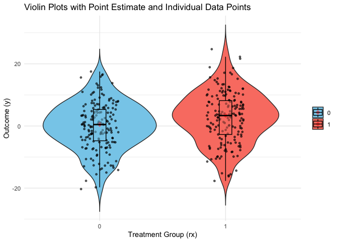<!-- -->

#### Let's estimate the effect size
A simple linear regression model will do

```r
fit1 <- lm(y ~ rx, data = dd)
tbl <- tbl_regression(fit1) %>%
  modify_footnote(ci ~ NA, abbreviation = TRUE)
# Render it as a markdown/kable table
as_kable(tbl)
```

<table>
 <thead>
  <tr>
   <th style="text-align:left;"> **Characteristic** </th>
   <th style="text-align:center;"> **Beta** </th>
   <th style="text-align:center;"> **95% CI** </th>
   <th style="text-align:center;"> **p-value** </th>
  </tr>
 </thead>
<tbody>
  <tr>
   <td style="text-align:left;"> rx </td>
   <td style="text-align:center;"> 2.7 </td>
   <td style="text-align:center;"> 1.0, 4.4 </td>
   <td style="text-align:center;"> 0.002 </td>
  </tr>
</tbody>
</table>

#### Let's confirm the power

```r
replicate <- function() {
  dd <- simple_rct(350)
  fit1 <- lm(y ~  rx, data = dd)
  coef(summary(fit1))["rx", "Pr(>|t|)"]
}

# Estimated power based on 1000 replications.
p_values <- mclapply(1:1000, function(x) replicate(), mc.cores = 8) # I have max. 8 cores for parallel computation

# Calculate the proportion of replications where the p-value is less than 0.05
mean(unlist(p_values) < 0.05)
```

```
## [1] 0.801
```

### Now, let us move to a cluster randomized trial, but same context
If we have a pre-specified number of participants at each site (i.e. no cluster variation), usually we simply figure out a design effect for clustering to multiply with the calculated individual RCT sample size.

The usual: DEFF = 1 + (n − 1) x ICC, whereby n = cluster size
If there is cluster variation, the usual (conservative?) recommendation is: DEFF_cv = 1 + (n x (1 + CV^2) - 1) x ICC, whereby CV is the coefficient of variation (ratio of standard deviation of cluster sizes to mean of cluster sizes), see here: https://pmc.ncbi.nlm.nih.gov/articles/PMC7394950/#sup1

If the ICC (intracluster correlation coefficient, i.e. how correlated participants are within the same cluster in terms of the outcome in question) is higher, then design effect higher => more clusters needed.

In other words: 
Yij = a + bZj + cj + si, where:
Yij is a continuous outcome for participant i in site j,
Zj is the treatment for site j,
b the treatment effect,
cj ~ N(0, σ^2 c) is the site level effect
si ~ N(0, σ^2 s) is the individual-level effect

The correlation of any two participants in a cluster is the ICC or rho = σ^2_c / (σ^2_c + σ^2_s)
If ICC/rho is close to 0, most of the variability is at the individual level.
If ICC/rho is close to 1, most of the variability is at the site level.

We assume an ICC/rho of 0.15, i.e., 15% of the total variance in the outcome is attributable to between-site variability, while the remaining 85% is due to individual-level variability within sites, leading to:
σ^2_c = 9.6
σ^2_s = 54.4

Using the formula above, assuming an ICC/rho of 0.15 and fixed 30 participants per site:

=> New Total Sample Size = 350 x 5.35 = 1872 participants across ca. 64 sites for the same question/effect.

#### Let's generate the data

```r
simple_crt <- function(nsites, n) {
  # defC = cj
  defC <- defData(varname = "rx", formula = "1;1", dist = "trtAssign")
  # cluster variance = 9.6 (see above)
  defC <- defData(defC, varname = "c", formula = "0", variance = 9.6, dist = "normal") # random site effect from normal distribution
  # defS = si
  # individual-level noise/variance = 54.4 (see above)
  defS <- defDataAdd(varname="y", formula="c + 2.4*rx", variance = 54.4, dist="normal")

  # Generate one row per cluster
  # Each row includes: rx and cj
  dc <- genData(nsites, defC, id = "site")

  # Assign n individuals to each site.
  # Add outcome (y) based on cj, rx, and si.
  dd <- genCluster(dc, "site", n, "id")
  dd <- addColumns(defS, dd)
  
  dd[]
}

# E.g. 20 sites, each with 50 individuals.
dd <- simple_crt(20, 50)

# Create violin plot with sites on x-axis and colors for treatment/control
ggplot(dd, aes(x = factor(site), y = y, fill = factor(rx))) +
  geom_violin(trim = FALSE, alpha = 0.5) +
  geom_boxplot(width = 0.2, outlier.shape = NA, color = "black") +
  geom_jitter(shape = 16, position = position_jitter(0.2), alpha = 0.4) +
  scale_fill_manual(values = c("blue", "red"), labels = c("Control", "Treatment")) +
  labs(x = "Site (Cluster)", y = "Outcome (y)", title = "Outcome distribution by site") +
  theme_minimal() +
  theme(legend.title = element_blank(), axis.text.x = element_text(angle = 90, hjust = 1))
```

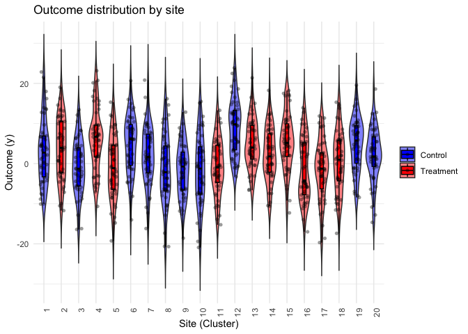<!-- -->

#### Let's estimate the effect size
Use a linear mixed effects model

```r
dd <- simple_crt(200,100)

fit2 <- lmer(y ~  rx + (1|site), data = dd)
tbl <- tbl_regression(fit2, tidy_fun = broom.mixed::tidy) %>% 
  modify_footnote(ci ~ NA, abbreviation = TRUE)

# Render it as a markdown/kable table
as_kable(tbl)
```

<table>
 <thead>
  <tr>
   <th style="text-align:left;"> **Characteristic** </th>
   <th style="text-align:center;"> **Beta** </th>
   <th style="text-align:center;"> **95% CI** </th>
   <th style="text-align:center;"> **p-value** </th>
  </tr>
 </thead>
<tbody>
  <tr>
   <td style="text-align:left;"> rx </td>
   <td style="text-align:center;"> 2.0 </td>
   <td style="text-align:center;"> 1.0, 3.0 </td>
   <td style="text-align:center;"> &lt;0.001 </td>
  </tr>
  <tr>
   <td style="text-align:left;"> site.sd__(Intercept) </td>
   <td style="text-align:center;"> 3.5 </td>
   <td style="text-align:center;">  </td>
   <td style="text-align:center;">  </td>
  </tr>
  <tr>
   <td style="text-align:left;"> Residual.sd__Observation </td>
   <td style="text-align:center;"> 7.4 </td>
   <td style="text-align:center;">  </td>
   <td style="text-align:center;">  </td>
  </tr>
</tbody>
</table>

#### Let's confirm the power
Confirm power and go back to the initial assumption of 64 sites with 30 participants per site, which, remember, is a massive increase from the total sample size of 350 for the individual RCT to 1920 across 64 sites in this simple CRT

```r
replicate <- function() {
  dd <- simple_crt(64, 30)
  fit2 <- lmer(y ~  rx + (1|site), data = dd)
  coef(summary(fit2))["rx", "Pr(>|t|)"]
}

p_values <- mclapply(1:1000, function(x) replicate(), mc.cores = 8)

mean(unlist(p_values) < 0.05)
```

```
## [1] 0.789
```

```r
p_values <- unlist(p_values)

ggplot(data.frame(p_values), aes(x = p_values)) +
  geom_histogram(binwidth = 0.05, fill = "blue", color = "black", alpha = 0.7) +
  geom_vline(xintercept = 0.05, linetype = "dashed", color = "red", linewidth = 1) +
  labs(title = "Distribution of p-values from 1000 simulations",
       x = "p-value",
       y = "Frequency") +
  theme_minimal()
```

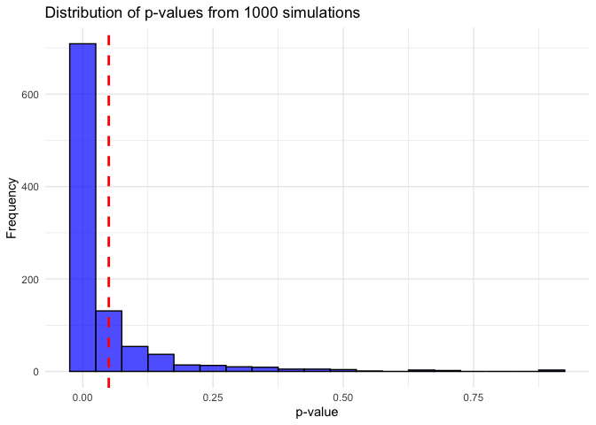<!-- -->

### Third, we move to a CRT with baseline period
The baseline and follow-up measurements can be collected from the same participants (cohort design) or different participants (cross-sectional design), though the impact on the design effect depends on what approach is taken.
The key idea is to measure the same outcome at two different time points to reduce variance and improve statistical power.

In other words: 
Yijk = a0 + a1k + b0Zj + b1kZj + cj + cpjk + sij + spijk, where:

Yijk is a continuous outcome for participant i in site j and measurement/timepoint k (k=0 for baseline and k=1 for follow-up)
Zj is the treatment for site j
a0 is the mean outcome at baseline for participants in the control clusters
a1 is the change from baseline to follow-up in the control arm (i.e. longitudinal change without intervention)
b0 is the difference at baseline between control and treatment (we expect this to be 0 in a randomized trial)  
b1 is the difference at follow-up, i.e. treatment effect
The model has cluster-specific and individual-specific random effects. For both, there can be time-invariant effects and time-varying effects.
Cluster-level effects (between-site variation):
cj ~ N(0, σ^2 c) are time invariant site-specific effects, intrinsic differences between clusters.
cpjk ~ N(0, σ^2 c p) are the site-specific period (time varying) effects. Changes over time within a site.
Individual-level effects (within-site variation):
sij ~ N(0, σ^2_s) are time invariant individual-level effects, stable individual characteristics.
spijk ~ N(0, σ^2_s_p) are the individual-level period (time varying) effects, measurement error or individual change over time.

Since each individual (or site) has two measurements, we can control for their baseline score when estimating the treatment effect.
This reduces residual variance, leading to a lower design effect.
The benefit depends on the ICC and how much baseline values predict follow-up values.

#### Let's generate the data

```r
# Parameters:

# effect: The treatment effect to be used for the formula in the outcome variable.
# nsites: The number of sites (clusters) in the study.
# n: The number of participants at each site.
# s_c, s_cp, s_s, s_sp: The variances of the respective random effects outlined above:
#  s_c: Variance of cluster-level (site-level) time-invariant random effects.
#  s_cp: Variance of cluster-level (site-level) time-varying random effects (due to different periods).
#  s_s: Variance of participant-level time-invariant random effects.
#  s_sp: Variance of participant-level time-varying random effects (due to periods).

crt_base <- function(effect, nsites, n, s_c, s_cp, s_s, s_sp) {
  # defC: represents the time-invariant random effects at the cluster level.
  defC <- defData(varname = "c", formula = 0, variance = "..s_c")
  defC <- defData(defC, varname = "rx", formula = "1;1", dist = "trtAssign")
  # defCP: cluster-level time-varying effects, for example, the different responses between baseline and follow-up at each site.
  defCP <- defDataAdd(varname = "c.p", formula = 0, variance = "..s_cp")
  # defS: individual-level random effects s with variance s_s.
  defS <- defDataAdd(varname = "s", formula = 0, variance = "..s_s")
  # The treatment effect for the interaction between the treatment indicator (rx) and the period (period), which gives the treatment effect over time.
  defSP <- defDataAdd(varname = "y", formula = "..effect * rx * period + c + c.p + s", variance ="..s_sp")
  
  # Cluster-level
  dc <- genData(nsites, defC, id = "site")
  
  # Add 2 periods to each cluster, and the time-varying random effects (c.p)
  dcp <- addPeriods(dc, 2, "site")
  dcp <- addColumns(defCP, dcp)
  dcp <- dcp[, .(site, period, c.p, timeID)]
  
  # Individual-level
  ds <- genCluster(dc, "site", n, "id")
  ds <- addColumns(defS, ds)
  
  # Add 2 periods to each individual
  # This adds two periods (baseline and follow-up) for each individual, creating the "observational ID" for each observation per individual
  dsp <- addPeriods(ds, 2)
  setnames(dsp, "timeID", "obsID")
  
  setkey(dsp, site, period)
  setkey(dcp, site, period)
  
  # Merge the two
  dd <- merge(dsp, dcp)
  dd <- addColumns(defSP, dd)
  setkey(dd, site, id, period)
  
  dd[]
}
```

Design effect for this kind of set-up was derived here: https://onlinelibrary.wiley.com/doi/full/10.1002/sim.5352 

In order to estimate the design effect, we need two more correlations. 
First, the correlation between baseline and follow-up random effects at the cluster level:
rho_c = σ^2_c / (σ^2_c + σ^2_c_p)
Second, the correlation between baseline and follow-up random effects at the individual level:
rho_s = σ^2_s / (σ^2_s + σ^2_s_p)
The overall correlation of two participant measurements in the same cluster and same time period (= ICC = rho):
rho = (σ^2_c + σ^2_c_p) / (σ^2_c + σ^2_c_p + σ^2_s + σ^2_s_p)

So, the overall correlation from baseline to follow-up if the same individual, accounting for all correlations is "r":
r = (n * rho * rho_c + (1-rho) * rho_s) / (1 + (n-1) * rho)

The design effect can be then be defined as follows (slightly adapted from before without baseline measure):
DEFF = (1 + (n -1) * ICC) * (2 * (1 − r))

The first part of the formula is the usual clustering inflation.
The second part of the formula adjusts for the reduction in variance due to the inclusion of baseline measurements in the analysis. The value of rho reflects how strongly the baseline and follow-up measurements correlate at both the cluster and individual levels.
If the correlation between baseline and follow-up measurements is strong (i.e., high ps and high pc), this part of the formula will be closer to 0 => a lower design effect (and thus a lower required sample size).

By collecting baseline measurements, the baseline-to-follow-up correlation reduces the variability in the outcome variable, which allows for more precise estimates of the treatment effect and smaller sample size requirements.


#### Cross-section cohort design
If we collect baseline and follow-up from different cohorts (often done in large-scale CRTs with random sampling before/after)
One measurement at baseline before the intervention is implemented, and one measurement from a different random sample in a second period. In this case, σ^2_s is 0 and ps is 0, so the model reduces to:

Yijk = a0 + a1k + b0Zj + b1kZj + cj + cpjk + spijk

The parameters for this simulation are:
b1 = 2.4 (treatment effect, as defined)
ICC = 0.15, as defined above
σ^2_s_p = 54.4, as defined above (with σ^2_s = 0)
σ^2_c = 6.8 (Cluster-level variance) by assuming that 70% of the between-cluster variance (=9.6, see above) is time-invariant (often assumed for psychological traits or stable health scores)
σ^2_c_p = 2.8 (Cluster-level period variance)
Total variance: σ^2_c + σ^2_c_p + σ^2_s_p = 6.8 + 2.8 + 54.4 = 64


```r
dd <- crt_base(effect = 2.4, nsites = 20, n = 30, s_c = 6.8, s_cp = 2.8, s_s = 0, s_sp = 54.4)

# Create a new column for period names (baseline and follow-up)
dd[, period_label := ifelse(period == 0, "Baseline", "Follow-up")]

# Create a violin plot, faceted by site
ggplot(dd, aes(x = period_label, y = y, fill = factor(rx))) + 
  geom_violin(trim = FALSE, alpha = 0.1) +
  geom_jitter(aes(color = factor(rx)), width = 0.1, alpha = 0.5) +
  geom_boxplot(width = 0.1, color = "black", alpha = 0.3, outlier.shape = NA) + 
  facet_wrap(~site, ncol = 5) +  # 5 columns for 20 sites
  scale_fill_manual(values = c("blue", "red"), labels = c("Control", "Intervention")) +
  scale_color_manual(values = c("blue", "red")) +
  labs(title = "Violin plot, by clusters, and treatment group", 
       x = "Measurement Time", y = "Outcome Value") +
  theme_minimal() + 
  theme(legend.position = "bottom", 
        strip.text = element_text(size = 8), 
        axis.text.x = element_text(angle = 45, hjust = 1))
```

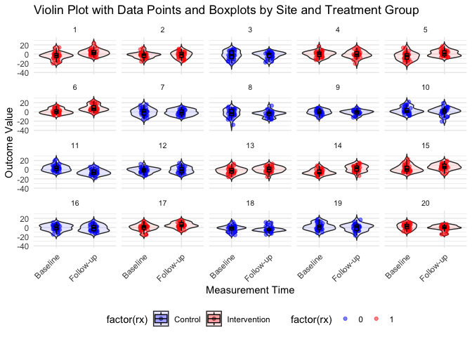<!-- -->

#### Let's estimate the effect size
To estimate the effect size we fit a mixed effect model:

Yijk = a0 + a1k + b0Zj + b1kZj + cj + cpjk + spijk

lmer(y ~ period * rx + (1|timeID:site) + (1|site), data = dd)

a0 + a1k -> Fixed Effects period * rx, which captures the difference between baseline and follow-up, and if the site received treatment or not => the interaction term captures how the treatment effect differs between baseline and follow-up and represents thus the treatment effect b1.

Random Effects:
σ^2_c_p = s_cp = cpjk = (1|timeID:site): A random intercept for each site in each time period (baseline and follow-up). This accounts for the site-specific change/variability over time.
σ^2_c = s_c = cj = (1|site): A random intercept for each site.
σ^2_s_p = s_sp = spijk: Since it's cross-sectional, there's no need for person-specific intercepts (sij) and we thus exclude any individual random effects in the model

```r
dd <- crt_base(effect = 2.4, nsites = 200, n = 100, s_c=6.8, s_cp=2.8, s_s=0, s_sp=54.4)

fit3 <- lmer(y ~ period * rx + (1|timeID:site) + (1|site), data = dd)

tbl <- tbl_regression(fit3, tidy_fun = broom.mixed::tidy)  %>% 
  modify_footnote(ci ~ NA, abbreviation = TRUE)
as_kable(tbl)
```

<table>
 <thead>
  <tr>
   <th style="text-align:left;"> **Characteristic** </th>
   <th style="text-align:center;"> **Beta** </th>
   <th style="text-align:center;"> **95% CI** </th>
   <th style="text-align:center;"> **p-value** </th>
  </tr>
 </thead>
<tbody>
  <tr>
   <td style="text-align:left;"> period </td>
   <td style="text-align:center;"> 0.02 </td>
   <td style="text-align:center;"> -0.50, 0.55 </td>
   <td style="text-align:center;"> &gt;0.9 </td>
  </tr>
  <tr>
   <td style="text-align:left;"> rx </td>
   <td style="text-align:center;"> 0.97 </td>
   <td style="text-align:center;"> 0.11, 1.8 </td>
   <td style="text-align:center;"> 0.027 </td>
  </tr>
  <tr>
   <td style="text-align:left;"> period * rx </td>
   <td style="text-align:center;"> 2.0 </td>
   <td style="text-align:center;"> 1.3, 2.8 </td>
   <td style="text-align:center;"> &lt;0.001 </td>
  </tr>
  <tr>
   <td style="text-align:left;"> timeID:site.sd__(Intercept) </td>
   <td style="text-align:center;"> 1.7 </td>
   <td style="text-align:center;">  </td>
   <td style="text-align:center;">  </td>
  </tr>
  <tr>
   <td style="text-align:left;"> site.sd__(Intercept) </td>
   <td style="text-align:center;"> 2.4 </td>
   <td style="text-align:center;">  </td>
   <td style="text-align:center;">  </td>
  </tr>
  <tr>
   <td style="text-align:left;"> Residual.sd__Observation </td>
   <td style="text-align:center;"> 7.4 </td>
   <td style="text-align:center;">  </td>
   <td style="text-align:center;">  </td>
  </tr>
</tbody>
</table>

#### Let's update the Design Effect

```r
# Based on the variance assumptions, we can update our design effect:
s_c <- 6.8
s_cp <- 2.8
s_s <- 0
s_sp <- 54.4

rho <- (s_c + s_cp)/(s_c + s_cp + s_s + s_sp)
rho_c <- s_c/(s_c + s_cp)
rho_s <- s_s/(s_s + s_sp)

n <- 30

r <- (n * rho * rho_c + (1-rho) * rho_s) / (1 + (n-1) * rho)

(des_effect <- (1 + (n - 1) * rho) * 2 * (1 - r))
```

```
## [1] 4.325
```

```r
des_effect * 350 / n
```

```
## [1] 50.45833
```
We reduced the design effect from 5.35 to 4.3 
=> New Total Sample Size: 350 x 4.3 = 1514 participants across ca. 52 sites
Instead of 350 x 5.35 = 1872 participants across ca. 64 sites

#### Let's confirm the power

```r
replicate <- function() {
  dd <- crt_base(2.4, 52, 30, s_c = 6.8, s_cp = 2.8, s_s = 0, s_sp = 54.4)
  fit3 <- lmer(y ~ period * rx + (1|timeID:site) + (1 | site), data = dd)
  coef(summary(fit3))["period:rx", "Pr(>|t|)"]
}

p_values <- mclapply(1:1000, function(x) replicate(), mc.cores = 8)

mean(unlist(p_values) < 0.05)
```

```
## [1] 0.781
```

#### Closed cohort design
According to the logic, we can reduce further if we measure a single cohort twice and make full use of the model.

Yijk = a0 + a1k + b0Zj + b1kZj + cj + cpjk + sij + spijk

#### Let's generate the data
The parameters for this simulation are:
b1 = 2.4 (treatment effect, as defined)
ICC = 0.15, as defined above
σ^2_c = 6.8 (Cluster-level variance) by assuming that 70% of the between-cluster variance (9.6, see above) is time-invariant/persistent 
σ^2_c_p = 2.8 (Cluster-level period variance)
σ^2_s = 38 (Individual-level variance) by assuming that 70% of individual variance is persistent
σ^2_s_p = 16.4 (Individual-level period variance) 

```r
dd <- crt_base(effect=2.4, nsites=20, n=30, s_c=6.8, s_cp=2.8, s_s=38, s_sp=16.4)

# Visualizing the data (2 time points: baseline and follow-up)
ggplot(dd, aes(x = period, y = y, group = id, color = as.factor(rx))) +
  geom_line() +
  geom_point(aes(shape = as.factor(rx)), size = 3) +
  facet_wrap(~site, ncol = 5) +
  scale_color_manual(values = c("blue", "red")) +
  labs(title = "Repeated Measurements: Outcome by Site and Time",
       x = "Time Period (0 = Baseline, 1 = Follow-up)",
       y = "Outcome (y)",
       color = "Treatment",
       shape = "Treatment") +
  theme_minimal() +
  theme(legend.position = "bottom")
```

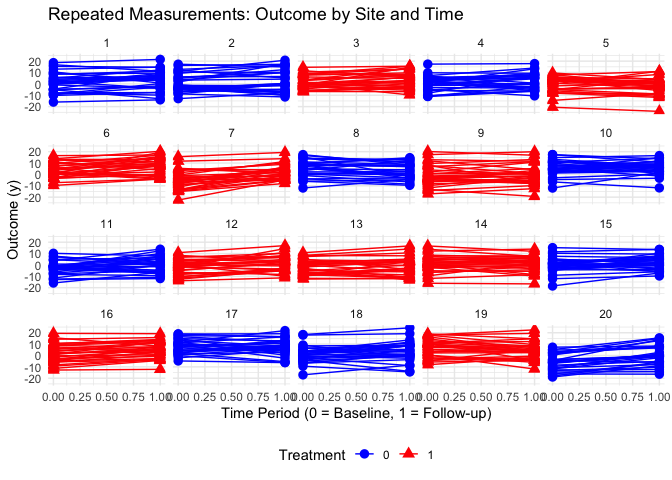<!-- -->

#### Let's estimate the effect size
To estimate the effect size we fit the full mixed effect model:

Yijk = a0 + a1k + b0Zj + b1kZj + cj + cpjk + sij + spijk

lmer(y ~ period * rx + (1|id:site) + (1|timeID:site) + (1|site), data = dd)

I.e. including (1|id:site)

```r
dd <- crt_base(effect = 2.4, nsites = 200, n = 100, 
  s_c = 6.8, s_cp = 2.8, s_s = 38, s_sp = 16.4)

fit4 <- lmer(y ~ period * rx + (1 | id:site) + (1|timeID:site) + (1 | site), data = dd)
tbl <- tbl_regression(fit4, tidy_fun = broom.mixed::tidy)  %>% 
  modify_footnote(ci ~ NA, abbreviation = TRUE)
as_kable(tbl)
```

<table>
 <thead>
  <tr>
   <th style="text-align:left;"> **Characteristic** </th>
   <th style="text-align:center;"> **Beta** </th>
   <th style="text-align:center;"> **95% CI** </th>
   <th style="text-align:center;"> **p-value** </th>
  </tr>
 </thead>
<tbody>
  <tr>
   <td style="text-align:left;"> period </td>
   <td style="text-align:center;"> -0.10 </td>
   <td style="text-align:center;"> -0.63, 0.43 </td>
   <td style="text-align:center;"> 0.7 </td>
  </tr>
  <tr>
   <td style="text-align:left;"> rx </td>
   <td style="text-align:center;"> 0.72 </td>
   <td style="text-align:center;"> -0.21, 1.6 </td>
   <td style="text-align:center;"> 0.13 </td>
  </tr>
  <tr>
   <td style="text-align:left;"> period * rx </td>
   <td style="text-align:center;"> 2.1 </td>
   <td style="text-align:center;"> 1.3, 2.8 </td>
   <td style="text-align:center;"> &lt;0.001 </td>
  </tr>
  <tr>
   <td style="text-align:left;"> id:site.sd__(Intercept) </td>
   <td style="text-align:center;"> 6.2 </td>
   <td style="text-align:center;">  </td>
   <td style="text-align:center;">  </td>
  </tr>
  <tr>
   <td style="text-align:left;"> timeID:site.sd__(Intercept) </td>
   <td style="text-align:center;"> 1.8 </td>
   <td style="text-align:center;">  </td>
   <td style="text-align:center;">  </td>
  </tr>
  <tr>
   <td style="text-align:left;"> site.sd__(Intercept) </td>
   <td style="text-align:center;"> 2.7 </td>
   <td style="text-align:center;">  </td>
   <td style="text-align:center;">  </td>
  </tr>
  <tr>
   <td style="text-align:left;"> Residual.sd__Observation </td>
   <td style="text-align:center;"> 4.1 </td>
   <td style="text-align:center;">  </td>
   <td style="text-align:center;">  </td>
  </tr>
</tbody>
</table>

#### Let's update the Design Effect

```r
# Based on the variance assumptions, we can update our design effect a second time:
s_c <- 6.8
s_cp <- 2.8
s_s <- 38
s_sp <- 16.4

rho <- (s_c + s_cp)/(s_c + s_cp + s_s + s_sp)
rho_c <- s_c/(s_c + s_cp)
rho_s <- s_s/(s_s + s_sp)

n <- 30

r <- (n * rho * rho_c + (1-rho) * rho_s) / (1 + (n-1) * rho)

(des_effect <- (1 + (n - 1) * rho) * 2 * (1 - r))
```

```
## [1] 3.1375
```

```r
des_effect * 350 / n
```

```
## [1] 36.60417
```
We reduced the design effect from 5.35 to 4.3 to 3.14
=> New Total Sample Size: 350 x 3.14 = 1099 participants across ca. 38 sites
Instead of 350 x 4.3 = 1514 participants across ca. 52 sites when baseline period with cross-sectional
Instead of 350 x 5.35 = 1872 participants across ca. 64 sites when no baseline period at all

#### Let's confirm the power

```r
replicate <- function() {
  dd <- crt_base(2.4, 38, 30, s_c = 6.8, s_cp = 2.8, s_s = 38, s_sp = 16.4)
  fit4 <-  lmer(y ~ period*rx + (1 | id:site) + (1|timeID:site) + (1 | site), data = dd)
  coef(summary(fit4))["period:rx", "Pr(>|t|)"]
}

p_values <- mclapply(1:1000, function(x) replicate(), mc.cores = 8)

mean(unlist(p_values) < 0.05)
```

```
## [1] 0.789
```

#### Repeated Measurements - ANCOVA Model
We are able to reduce the number of clusters even further by changing the model so that we are comparing follow-up outcomes of the two treatment arms (as opposed to measuring the differences in changes as we just did). I.e. the usual "baseline-adjusted" model in trials:

Yij(k=1) = a0 + yYij(k=0) + bZj + cj + sij, where
yYij(k=0): Adjustment coefficient of baseline outcome for the same individual


```r
dd <- crt_base(effect = 2.4, nsites = 200, n = 100, 
  s_c = 6.8, s_cp = 2.8, s_s = 38, s_sp = 16.4)

dobs <- dd[, .(site, rx, id, period, timeID, y)]
dobs <- dcast(dobs, site + rx + id ~ period, value.var = "y")

fit5 <- lmer(`1` ~ `0` + rx + (1 | site), data = dobs)
tbl <- tbl_regression(fit5, tidy_fun = broom.mixed::tidy)  %>% 
  modify_footnote(ci ~ NA, abbreviation = TRUE)
as_kable(tbl)
```

<table>
 <thead>
  <tr>
   <th style="text-align:left;"> **Characteristic** </th>
   <th style="text-align:center;"> **Beta** </th>
   <th style="text-align:center;"> **95% CI** </th>
   <th style="text-align:center;"> **p-value** </th>
  </tr>
 </thead>
<tbody>
  <tr>
   <td style="text-align:left;"> 0 </td>
   <td style="text-align:center;"> 0.69 </td>
   <td style="text-align:center;"> 0.68, 0.70 </td>
   <td style="text-align:center;"> &lt;0.001 </td>
  </tr>
  <tr>
   <td style="text-align:left;"> rx </td>
   <td style="text-align:center;"> 2.0 </td>
   <td style="text-align:center;"> 1.3, 2.7 </td>
   <td style="text-align:center;"> &lt;0.001 </td>
  </tr>
  <tr>
   <td style="text-align:left;"> site.sd__(Intercept) </td>
   <td style="text-align:center;"> 2.3 </td>
   <td style="text-align:center;">  </td>
   <td style="text-align:center;">  </td>
  </tr>
  <tr>
   <td style="text-align:left;"> Residual.sd__Observation </td>
   <td style="text-align:center;"> 5.2 </td>
   <td style="text-align:center;">  </td>
   <td style="text-align:center;">  </td>
  </tr>
</tbody>
</table>

#### Let's update the Design Effect
Teerenstra et al. also derived an alternative design effect that is specific to the ANCOVA model:

DEFF = (1 + (n−1) * ICC) * (1 − r^2)
=> this will reduce the design effect further

```r
(des_effect <- (1 + (n - 1) * rho) * (1 - r^2))
```

```
## [1] 2.677504
```

```r
des_effect * 350 / n
```

```
## [1] 31.23755
```
We reduced the design effect from 5.35 to 4.3 to 3.14 to 2.68
=> New Total Sample Size: 350 x 2.68 = 938 participants across ca. 32 sites (when baseline-adjusted)
Instead of 350 x 3.14 = 1099 participants across ca. 38 sites when baseline period with closed cohort
Instead of 350 x 4.3 = 1514 participants across ca. 52 sites when baseline period with cross-sectional
Instead of 350 x 5.35 = 1872 participants across ca. 64 sites when no baseline period at all

#### Let's confirm the power

```r
replicate <- function() {
  dd <- crt_base(2.4, 32, 30, s_c = 6.8, s_cp = 2.8, s_s = 38, s_sp = 16.4)
  dobs <- dd[, .(site, rx, id, period, timeID, y)]
  dobs <- dcast(dobs, site + rx + id ~ period, value.var = "y")
  fit5 <- lmer(`1` ~ `0` + rx + (1 | site), data = dobs)
  coef(summary(fit5))["rx", "Pr(>|t|)"]
}

p_values <- mclapply(1:1000, function(x) replicate(), mc.cores = 8)

mean(unlist(p_values) < 0.05)
```

```
## [1] 0.802
```


## Simulation | Binary outcome
Hypothetical cluster randomized trial (CRT), on the example of MOCA
Interventions on the level of health care workers to reduce antibiotic prescriptions at health facilities

Control: Standard of care
Intervention 1: eHealth tool
Intervention 2: eHealth tool + AMR stewardship clubs

Important features and fixed parameters:
- Max. 39 clusters (health centers) due to feasibility/budget
- Binary outcome: Proportion of patients prescribed an antibiotic at first presentation to care
- Baseline prescription rate at control clusters: 75%, from pilot data
- Delta Control to Intervention 1: 25 percentage points, based on prior studies in similar setting and clinical relevance

- Power min. 80%
- ICC for AB prescription: 0.20, based on previous studies in same setting
- Mean cluster size: 150 (to achieve within 2-3 month per cluster, at the end of the 6m implementation period)
- The ratio of standard deviation of cluster sizes to mean of cluster sizes is about 0.6 -> this would mess up everything
- => We use random sampling to standardize the mean cluster size to 150 across all sites

Design considerations:
- We can argue against multiplicity in this setup
- For now, focus on the main 2-arm comparison: Control to Intervention 1 with a delta of 25%

### First, let's start with a simple individual randomized trial

```r
# Parameters
p_C <- 0.75 # control: Baseline prescription rate
p_I1 <- 0.50 # int 1: 25pp reduction
power <- 0.80 # desired power
alpha <- 0.05 # apply bonferroni correction if adjustment for multiplicity

# Effect sizes
h_I1_C <- ES.h(p1 = p_I1, p2 = p_C)

cat("Cohen's h for I1 vs Control:", round(h_I1_C, 3), "\n")
```

```
## Cohen's h for I1 vs Control: -0.524
```

```r
# => reduction of mind. 25% is a Cohen's h of over 0.5 -> medium to large effect

# Sample size first pair-wise comparison (I1 vs C)
ss_I1_C <- pwr.2p.test(h = h_I1_C, sig.level = alpha, power = power)
cat("Sample size per arm (I1 vs C):", ceiling(ss_I1_C$n), "\n")
```

```
## Sample size per arm (I1 vs C): 58
```

```r
n_per_arm <- ceiling(ss_I1_C$n)
n_total_2arm <- n_per_arm * 2

cat("Total sample size:", n_total_2arm)
```

```
## Total sample size: 116
```
A reduction of at least 25% percentage points is a Cohen's h of over 0.5 => medium effect.

### Now, let's move to a CRT design
We have a binary outcome and will use a logistic model to model the log-odds (logit) of success. We convert the linear predictor into a probability using the inverse logit (logistic function): 
P(Y_ij = 1) = e^ηij / 1 + e^ηij

The probability of success is defined using a logistic model: 
ηij = b1 * rx_j + c_j (the linear predictor for individual i in cluster j)
c_j = the random cluster effect (cluster-specific deviation from the overall average)
b1 = the regression coefficient,
rx_j = the treatment status of cluster j

Let's figure out the ICC:
ICC = Between-site variance / Total variance, whereby the between-site variance represents the clustering. 

In logistic models, the residual (individual-level) variance is fixed at:
π^2 / 3 = 3.29

So, the between-site variance (σ^2_c), i.e. cluster-level noise, is what we need, and is therefore derived as:

ICC = σ^2_c / (σ^2_c + (π^2 / 3))

If ICC is assumed at 0.20, then σ^2_c is ca. 0.822

(If there’s additional within-site variation over time, i.e. baseline period, we include σ^2_c_p, typically as a fraction of σ^2_c -> for a later stage).

#### Let's generate the data, for a simple two-arm CRT with fixed cluster size, according to the parameters above

```r
# with fixed cluster size, simple
crt_binary_twoarm_fixedsize <- function(n_clusters, p0, p1, ICC, cluster_size_mean) {
  
  # Convert proportions to log-odds
  logit_p0 <- log(p0 / (1 - p0))
  logit_p1 <- log(p1 / (1 - p1))
  beta1 <- logit_p1 - logit_p0

  # Define cluster-level treatment assignment and random effect
  defC <- defData(varname = "rx", formula = "1;1", dist = "trtAssign")
  
  # Calculate between-cluster variance to achieve desired ICC
  sigma2_c <- ICC * (pi^2 / 3) / (1 - ICC)
  cat("Between-site variance (σ^2_c):", sigma2_c, "\n")
  defC <- defData(defC, varname = "c", formula = "0", variance = sigma2_c, dist = "normal")

  # Generate clusters
  dc <- genData(n_clusters, defC, id = "site")

  # Use constant cluster size
  cluster_sizes <- rep(cluster_size_mean, n_clusters)
  dd <- genCluster(dc, "site", cluster_sizes, "id")

  # Define the binary outcome with logistic link
  defS <- defDataAdd(
    varname = "y", 
    formula = paste0("c + ", logit_p0, " + ", beta1, " * (rx == 1)"),
    dist = "binary", link = "logit"
  )
  dd <- addColumns(defS, dd)

  return(dd)
}

# with varying cluster size -> for later purposes
crt_binary_twoarm_varsize <- function(n_clusters, p0, p1, ICC, cluster_size_mean, CV) {
  
  logit_p0 <- log(p0 / (1 - p0))
  logit_p1 <- log(p1 / (1 - p1))
  beta1 <- logit_p1 - logit_p0

  # Treatment variable "rx"
  defC <- defData(varname = "rx", formula = "1;1", dist = "trtAssign")
  
  # Varying cluster sizes, two options:
  
  # (1) Normal distribution and calculate SD from CV, as per formula
  # cluster_size_sd <- CV * cluster_size_mean
  # cluster_sizes <- round(rnorm(n_clusters, mean = cluster_size_mean, sd = cluster_size_sd)) # ensure no empty nor negative cluster sizes
  
  # (2) Use a gamma distribution to simulate strictly positive, slightly right-skewed cluster sizes (as common in real data, i.e., few large ones)
  shape <- 1 / CV^2
  scale <- cluster_size_mean * CV^2
  cluster_sizes <- round(rgamma(n_clusters, shape = shape, scale = scale))

  # ICC and cluster-level random effect
  sigma2_c <- ICC * (pi^2 / 3) / (1 - ICC)
  cat("Between-site variance (σ^2c):", sigma2_c, "\n")
  defC <- defData(defC, varname = "c", formula = "0", variance = sigma2_c, dist = "normal")

  # Generate the clusters, variable "site"
  dc <- genData(n_clusters, defC, id = "site")

  # Generate the individuals, variable "id"
  dd <- genCluster(dc, "site", cluster_sizes, "id")

  # Add individual-level noise
  dd <- addColumns(defDataAdd(varname = "noise", formula = "0", variance = 1.0, dist = "normal"), dd)

  # Outcome model, based on individual-level outcomes, variable "y" (y = 1/0)
  defS <- defDataAdd(varname = "y", 
                     formula = paste0("c + noise + ", logit_p0, " + ", beta1, " * (rx == 1)"),
                     dist = "binary", link = "logit")
  dd <- addColumns(defS, dd)

  return(dd)
}

set.seed(342)

dd_sim <- crt_binary_twoarm_fixedsize(
  n_clusters = 26, 
  p0 = 0.75, 
  p1 = 0.50,
  ICC = 0.20, 
  cluster_size_mean = 150
)
```

```
## Between-site variance (σ^2_c): 0.822467
```

```r
## Check the simulated dataset
table(dd_sim$rx, dd_sim$site)
```

```
##    
##       1   2   3   4   5   6   7   8   9  10  11  12  13  14  15  16  17  18  19
##   0 150 150   0   0 150 150 150 150   0   0 150 150   0   0   0   0 150   0 150
##   1   0   0 150 150   0   0   0   0 150 150   0   0 150 150 150 150   0 150   0
##    
##      20  21  22  23  24  25  26
##   0 150   0   0   0 150   0 150
##   1   0 150 150 150   0 150   0
```

```r
table(dd_sim$rx)
```

```
## 
##    0    1 
## 1950 1950
```

```r
# Check the proportions
prop_1 <- mean(dd_sim$y[dd_sim$rx == 0])  
prop_2 <- mean(dd_sim$y[dd_sim$rx == 1])

# Visualize the outcome distribution for each treatment group
ggplot(dd_sim, aes(x = factor(rx), fill = factor(y))) + 
  geom_bar(position = "fill", color = "black") + 
  scale_fill_manual(values = c("gray", "blue"), labels = c("No AB prescribed", "AB prescribed")) +
  labs(x = "Treatment Group", y = "Proportion", fill = "Outcome") +
  theme_minimal() +
  ggtitle("Proportion of reaching outcome by treatment group")
```

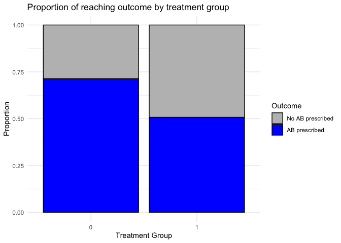<!-- -->

```r
# Visualize the clusters and their variability
cluster_summary <- dd_sim %>%
  group_by(site, rx) %>%
  summarise(cluster_size = n(), .groups = "drop")
mean_sizes <- cluster_summary %>%
  group_by(rx) %>%
  summarise(mean_size = mean(cluster_size))
ggplot(cluster_summary, aes(x = factor(site), y = cluster_size, fill = factor(rx))) +
  geom_bar(stat = "identity", color = "black") +
  geom_hline(data = mean_sizes, aes(yintercept = mean_size, color = factor(rx)), 
             linetype = "dashed", size = 1, show.legend = FALSE) +
  geom_text(data = mean_sizes, aes(x = Inf, y = mean_size, label = paste0("Mean = ", round(mean_size, 1))),
            hjust = 1.1, vjust = -0.5, color = c("skyblue4", "tomato3"), size = 4) +
  scale_fill_manual(values = c("skyblue", "tomato"), labels = c("Control (rx=0)", "Intervention (rx=1)")) +
  scale_color_manual(values = c("skyblue4", "tomato3")) +
  labs(x = "Cluster (Site)", y = "Cluster Size", fill = "Treatment Group") +
  theme_minimal() +
  ggtitle("Cluster size per site") +
  theme(axis.text.x = element_text(angle = 45, hjust = 1))
```

```
## Warning: Using `size` aesthetic for lines was deprecated in ggplot2 3.4.0.
## ℹ Please use `linewidth` instead.
## This warning is displayed once every 8 hours.
## Call `lifecycle::last_lifecycle_warnings()` to see where this warning was
## generated.
```

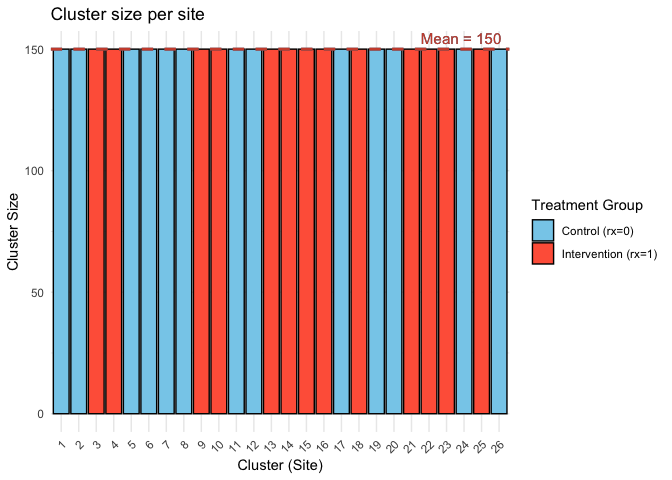<!-- -->

```r
# Compute proportion of outcome = 1 by cluster and treatment group
cluster_outcomes <- dd_sim %>%
  group_by(site, rx) %>%
  summarise(prop_y = mean(y), .groups = "drop")

# Create plot
ggplot(cluster_outcomes, aes(x = factor(site), y = prop_y, fill = factor(rx))) +
  geom_bar(stat = "identity", position = "dodge", color = "black") +
  scale_fill_manual(values = c("skyblue", "tomato"), labels = c("Control (rx=0)", "Intervention (rx=1)")) +
  labs(
    x = "Cluster",
    y = "Proportion being prescribed AB (y = 1)",
    fill = "Treatment Group"
  ) +
  theme_minimal() +
  ggtitle("Proportion being prescribed AB, by cluster and treatment group") +
  theme(axis.text.x = element_text(angle = 45, hjust = 1))
```

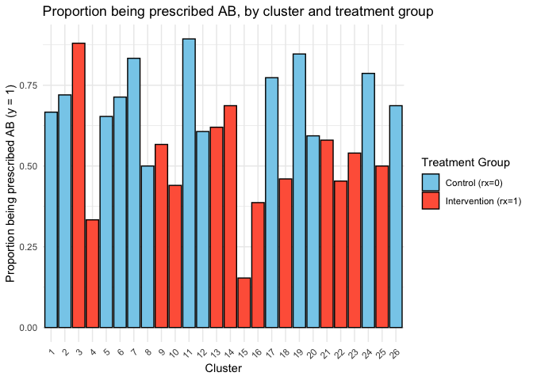<!-- -->

#### Let's generate more data, a two-arm CRT with fixed cluster size, according to the parameters above, but with correlated baseline measure

```r
crt_binary_twoarm_withbaseline <- function(n_clusters, cluster_size, p0, p1, ICC, corr_y0_y1) {
  # helper functions to switch between prop and log odds
  logit <- function(p) log(p / (1 - p))
  inv_logit <- function(x) exp(x) / (1 + exp(x))
  
  # Cluster-level random effect variance
  sigma2_c <- ICC * (pi^2 / 3) / (1 - ICC)
  
  # Individual-level shared effect (v_i): to induce correlation between y0 and y1 within same individual.
  # Binary variables don’t directly support correlation like continuous ones. So, I introduce shared latent random effects in the logit (log-odds) space.
  sigma2_i <- (pi^2 / 3) * corr_y0_y1 / (1 - ICC)
  
  # Treatment effect (log-odds scale)
  beta1 <- logit(p1) - logit(p0)
  
  # Define clusters
  defC <- defData(varname = "rx", formula = "1;1", dist = "trtAssign")
  defC <- defData(defC, varname = "u", formula = 0, variance = sigma2_c) # cluster-level random intercept (mean 0, variance = sigma2_c)
  clusters <- genData(n_clusters, defC, id = "site") # one row per cluster
  
  # Individuals within clusters
  individuals <- genCluster(clusters, "site", cluster_size, "id")
  individuals <- addColumns(defDataAdd(varname = "v", formula = 0, variance = sigma2_i), individuals) # an individual-level shared random effect, used in both y0 and y1 to correlate them

  # Generate latent scores (linear predictors)
  individuals[, eta_y0 := logit(p0) + u + v] # baseline log-odds, same across both trial arms
  individuals[, eta_y1 := logit(p0) + u + v + beta1 * (rx == 1)] # follow-up log-odds, increased (or decreased) by beta1 in the intervention group
  
  # Simulate binary outcomes, drawn from Bernoulli distribution (success probability is the inverse-logit of the linear predictor)
  individuals[, y0 := rbinom(.N, 1, inv_logit(eta_y0))]
  individuals[, y1 := rbinom(.N, 1, inv_logit(eta_y1))]
  
  return(individuals[, .(site, id, rx, y0, y1)])
}

set.seed(1234)
df_crt_b <- crt_binary_twoarm_withbaseline(
  n_clusters = 26,
  cluster_size = 150,
  p0 = 0.75, 
  p1 = 0.50,
  ICC = 0.20, 
  corr_y0_y1 = 0.5
)

## Check the simulated dataset
table(df_crt_b$rx, df_crt_b$site)
```

```
##    
##       1   2   3   4   5   6   7   8   9  10  11  12  13  14  15  16  17  18  19
##   0   0   0 150   0 150 150 150 150   0   0 150   0   0 150 150   0 150   0   0
##   1 150 150   0 150   0   0   0   0 150 150   0 150 150   0   0 150   0 150 150
##    
##      20  21  22  23  24  25  26
##   0 150   0   0   0 150 150 150
##   1   0 150 150 150   0   0   0
```

```r
table(df_crt_b$rx)
```

```
## 
##    0    1 
## 1950 1950
```

```r
# Check the proportions
prop_1 <- mean(df_crt_b$y1[df_crt_b$rx == 0])  
prop_2 <- mean(df_crt_b$y1[df_crt_b$rx == 1])

# Visualize the outcome distribution for each treatment group
ggplot(df_crt_b, aes(x = factor(rx), fill = factor(y1))) + 
  geom_bar(position = "fill", color = "black") + 
  scale_fill_manual(values = c("gray", "blue"), labels = c("No AB prescribed", "AB prescribed")) +
  labs(x = "Treatment Group", y = "Proportion", fill = "Outcome") +
  theme_minimal() +
  ggtitle("Proportion of reaching outcome by treatment group")
```

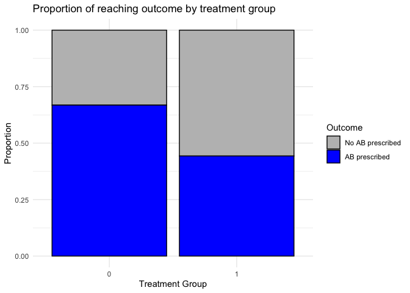<!-- -->

```r
# Visualize the clusters and their variability
cluster_summary <- df_crt_b %>%
  group_by(site, rx) %>%
  summarise(cluster_size = n(), .groups = "drop")
mean_sizes <- cluster_summary %>%
  group_by(rx) %>%
  summarise(mean_size = mean(cluster_size))
ggplot(cluster_summary, aes(x = factor(site), y = cluster_size, fill = factor(rx))) +
  geom_bar(stat = "identity", color = "black") +
  geom_hline(data = mean_sizes, aes(yintercept = mean_size, color = factor(rx)), 
             linetype = "dashed", size = 1, show.legend = FALSE) +
  geom_text(data = mean_sizes, aes(x = Inf, y = mean_size, label = paste0("Mean = ", round(mean_size, 1))),
            hjust = 1.1, vjust = -0.5, color = c("skyblue4", "tomato3"), size = 4) +
  scale_fill_manual(values = c("skyblue", "tomato"), labels = c("Control (rx=0)", "Intervention (rx=1)")) +
  scale_color_manual(values = c("skyblue4", "tomato3")) +
  labs(x = "Cluster (Site)", y = "Cluster Size", fill = "Treatment Group") +
  theme_minimal() +
  ggtitle("Cluster size per site") +
  theme(axis.text.x = element_text(angle = 45, hjust = 1))
```

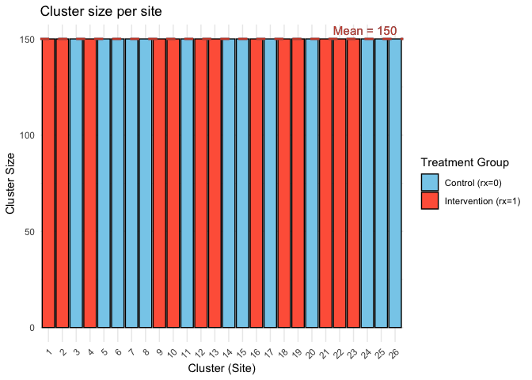<!-- -->

```r
# Compute proportion of outcome = 1 by cluster and treatment group
cluster_outcomes <- df_crt_b %>%
  group_by(site, rx) %>%
  summarise(prop_y = mean(y1), .groups = "drop")

# Create plot
ggplot(cluster_outcomes, aes(x = factor(site), y = prop_y, fill = factor(rx))) +
  geom_bar(stat = "identity", position = "dodge", color = "black") +
  scale_fill_manual(values = c("skyblue", "tomato"), labels = c("Control (rx=0)", "Intervention (rx=1)")) +
  labs(
    x = "Cluster",
    y = "Proportion being prescribed AB (y = 1)",
    fill = "Treatment Group"
  ) +
  theme_minimal() +
  ggtitle("Proportion being prescribed AB, by cluster and treatment group") +
  theme(axis.text.x = element_text(angle = 45, hjust = 1))
```

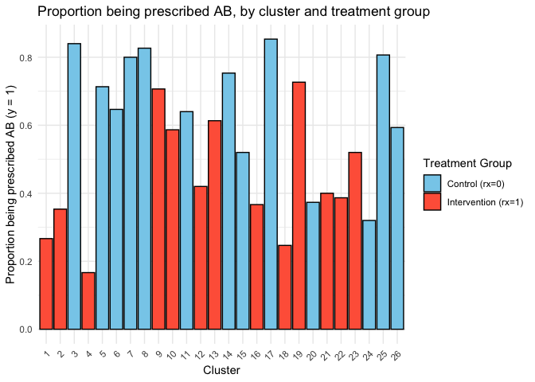<!-- -->

#### Let's estimate the effect size, using a usual GLMM ANCOVA, once unadjusted, once adjusted

```r
# Ensure treatment variable is a factor with "control" as reference
df_crt_b <- df_crt_b %>%
  mutate(rx = factor(rx)) %>%
  mutate(rx = relevel(rx, ref = "0"))

# usual GLMM ANCOVA model, without baseline adjustment
fit_bin_unadj <- glmer(y1 ~ rx + (1 | site), data = df_crt_b, family = binomial)
fit_bin_adj <- glmer(y1 ~ rx + y0 + (1 | site), data = df_crt_b, family = binomial)

tbl_bin_unadj <- tbl_regression(fit_bin_unadj, exponentiate = TRUE, tidy_fun = broom.mixed::tidy)  %>% 
  modify_footnote(ci ~ NA, abbreviation = TRUE)
as_kable(tbl_bin_unadj)
```

<table>
 <thead>
  <tr>
   <th style="text-align:left;"> **Characteristic** </th>
   <th style="text-align:center;"> **OR** </th>
   <th style="text-align:center;"> **95% CI** </th>
   <th style="text-align:center;"> **p-value** </th>
  </tr>
 </thead>
<tbody>
  <tr>
   <td style="text-align:left;"> rx </td>
   <td style="text-align:center;">  </td>
   <td style="text-align:center;">  </td>
   <td style="text-align:center;">  </td>
  </tr>
  <tr>
   <td style="text-align:left;"> 0 </td>
   <td style="text-align:center;"> — </td>
   <td style="text-align:center;"> — </td>
   <td style="text-align:center;">  </td>
  </tr>
  <tr>
   <td style="text-align:left;"> 1 </td>
   <td style="text-align:center;"> 0.35 </td>
   <td style="text-align:center;"> 0.20, 0.64 </td>
   <td style="text-align:center;"> &lt;0.001 </td>
  </tr>
  <tr>
   <td style="text-align:left;"> site.sd__(Intercept) </td>
   <td style="text-align:center;"> 0.75 </td>
   <td style="text-align:center;">  </td>
   <td style="text-align:center;">  </td>
  </tr>
</tbody>
</table>

```r
tbl_bin_adj <- tbl_regression(fit_bin_adj, exponentiate = TRUE, tidy_fun = broom.mixed::tidy)  %>% 
  modify_footnote(ci ~ NA, abbreviation = TRUE)
as_kable(tbl_bin_adj)
```

<table>
 <thead>
  <tr>
   <th style="text-align:left;"> **Characteristic** </th>
   <th style="text-align:center;"> **OR** </th>
   <th style="text-align:center;"> **95% CI** </th>
   <th style="text-align:center;"> **p-value** </th>
  </tr>
 </thead>
<tbody>
  <tr>
   <td style="text-align:left;"> rx </td>
   <td style="text-align:center;">  </td>
   <td style="text-align:center;">  </td>
   <td style="text-align:center;">  </td>
  </tr>
  <tr>
   <td style="text-align:left;"> 0 </td>
   <td style="text-align:center;"> — </td>
   <td style="text-align:center;"> — </td>
   <td style="text-align:center;">  </td>
  </tr>
  <tr>
   <td style="text-align:left;"> 1 </td>
   <td style="text-align:center;"> 0.37 </td>
   <td style="text-align:center;"> 0.23, 0.59 </td>
   <td style="text-align:center;"> &lt;0.001 </td>
  </tr>
  <tr>
   <td style="text-align:left;"> y0 </td>
   <td style="text-align:center;"> 3.45 </td>
   <td style="text-align:center;"> 2.96, 4.01 </td>
   <td style="text-align:center;"> &lt;0.001 </td>
  </tr>
  <tr>
   <td style="text-align:left;"> site.sd__(Intercept) </td>
   <td style="text-align:center;"> 0.60 </td>
   <td style="text-align:center;">  </td>
   <td style="text-align:center;">  </td>
  </tr>
</tbody>
</table>

#### Let's estimate the power, using a usual GLMM ANCOVA, once unadjusted, once adjusted

```r
# UNADJUSTED
set.seed(1234)
replicate <- function() {
  df_crt_b <- crt_binary_twoarm_withbaseline(n_clusters = 26, cluster_size = 150,
                                             p0 = 0.75, p1 = 0.50, ICC = 0.20, corr_y0_y1 = 0.5)
  fit_bin_unadj <- glmer(y1 ~ rx + (1 | site), data = df_crt_b, family = binomial)
  coef(summary(fit_bin_unadj))["rx", "Pr(>|z|)"]
}

p_values <- mclapply(1:1000, function(x) replicate(), mc.cores = 8)
mean(unlist(p_values) < 0.05)
```

```
## [1] 0.85
```

```r
# Create histogram
p_values <- unlist(p_values)  # Convert list to vector
ggplot(data.frame(p_values), aes(x = p_values)) +
  geom_histogram(binwidth = 0.05, fill = "blue", color = "black", alpha = 0.7) +
  geom_vline(xintercept = 0.05, linetype = "dashed", color = "red", linewidth = 1) + # apply bonferroni correction instead?!
  labs(title = "Distribution of p-values from 1000 simulations, unadjusted",
       x = "p-value",
       y = "Frequency") +
  theme_minimal()
```

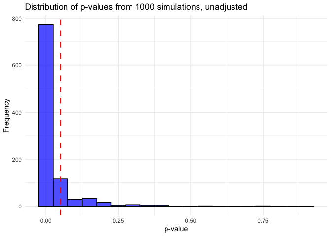<!-- -->

```r
# ADJUSTED
set.seed(1234)
replicate <- function() {
  df_crt_b <- crt_binary_twoarm_withbaseline(n_clusters = 26, cluster_size = 150,
                                             p0 = 0.75, p1 = 0.50, ICC = 0.20, corr_y0_y1 = 0.5)
  fit_bin_adj <- glmer(y1 ~ rx + y0 + (1 | site), data = df_crt_b, family = binomial)
  coef(summary(fit_bin_adj))["rx", "Pr(>|z|)"]
}

p_values <- mclapply(1:1000, function(x) replicate(), mc.cores = 8)
mean(unlist(p_values) < 0.05)
```

```
## [1] 0.978
```

```r
# Create histogram
p_values <- unlist(p_values)  # Convert list to vector
ggplot(data.frame(p_values), aes(x = p_values)) +
  geom_histogram(binwidth = 0.05, fill = "blue", color = "black", alpha = 0.7) +
  geom_vline(xintercept = 0.05, linetype = "dashed", color = "red", linewidth = 1) + # apply bonferroni correction instead?!
  labs(title = "Distribution of p-values from 1000 simulations, adjusted",
       x = "p-value",
       y = "Frequency") +
  theme_minimal()
```

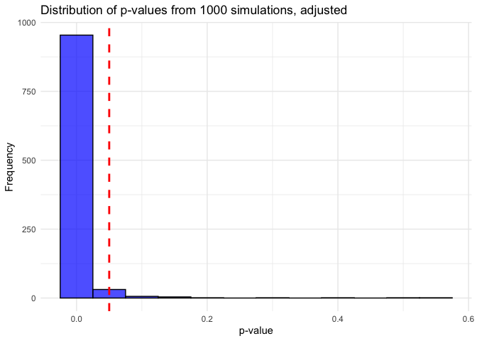<!-- -->

### Let's discuss the different CRT estimands
See https://doi.org/10.1093/ije/dyac131
And https://journals.sagepub.com/doi/10.1177/09622802241254197
And https://journals.sagepub.com/doi/10.1177/17407745231186094

What’s the estimand of interest? This depends on the question we're trying to answer:

1. Participant-average treatment effect
Question: “What is the average effect of the intervention on an individual patient?”
Each patient contributes equally.

2. Cluster-average treatment effect
Question: “What is the average effect of the intervention per facility?”
Each facility contributes equally.

See examples from publications: 
(1) "For instance, if hospitals act as the cluster and the outcome relates to individual participants (e.g. a hospital-level intervention aiming to reduce mortality in presenting patients), then the participant-average treatment effect will be of most interest, as this represents the population impact of switching from the control to intervention."
(2)"In a trial aiming to reduce unnecessary prescribing of antibiotics, in which doctors act as the cluster and outcomes are measured on each participant they treat, then a cluster-average treatment effect may also be of interest, as this provides the intervention’s effect on the clinician’s prescribing habits."
(3) "Consider a trial comparing a quality improvement (QI) intervention to improve outcomes in patients undergoing emergency laparotomy. This intervention involves local QI leads implementing a hospital-wide improvement programme at each cluster. The primary outcome is overall mortality within 90 days and a secondary outcome is whether a senior surgeon is present in the operating theatre (either performing the surgery or supervising a more junior surgeon in doing so). 
For the primary outcome, the interest clearly lies in the intervention effect on individual patients (i.e. how many additional lives can be saved through the QI intervention?). Thus, a participant-average treatment effect is most relevant here.
However, the key secondary outcome (whether a senior surgeon is present) is intended to measure treatment success at the cluster level (i.e. whether the intervention was effective in making hospitals change their practice around emergency laparotomies). Hence, for this outcome, a cluster-average estimand may be the most relevant. We note that for the secondary outcome (whether a senior surgeon is present), both a participant-average and cluster-average treatment effect may be of scientific interest, in which case both could be specified (e.g. with the cluster-average treatment effect designated as the primary). However, including both estimands should only be done if both are indeed of scientific interest."
"In this trial, it is plausible that success in implementing the QI intervention may differ between smaller and larger clusters due to differing resource levels available, resulting in an interaction between treatment effect and cluster size."

A cluster-level analysis involves calculating a summary measure for each cluster (e.g. the mean outcome across participants in that cluster) and then comparing cluster-level summaries. 
An individual-level analysis typically involves analysing participant-level outcomes using a regression model that accounts for correlations between participants from the same cluster.

However, we can also re-weight a cluster-level analysis to give each participant equal weight to target a participant-average treatment effect, by weighting each individual by the inverse number of participants in that cluster.
Similarly, we can re-weight individual-level analyses to give equal weight to each cluster to target a cluster-average treatment effect, by weighting each cluster by the number of participants within that cluster.

Another issue in CRTs is that certain commonly used estimators can be biased when the cluster size is informative. Esp. when using the commonly used mixed-effects models with a random intercept for cluster, but also the generalized estimating equations (GEEs) with an exchangeable working correlation structure as used often in CRTs. Because they do not give equal weight to each participant. Instead, clusters are weighted by their inverse-variance, which is a function of both the cluster size and the ICC. 

Solution: IEE = independence estimating equation. Will be unbiased for the participant-average treatment effect, even if cluster size is informative.
IEEs employ an independence working correlation structure in conjunction with robust standard errors to account for clustering.

IEE can be easily implemented in R by using GEEs with a working independence assumption and robust standard errors or by using a standard regression model estimated by maximum likelihood/least squares with cluster-robust standard errors. 
However, IEEs can be less efficient than mixed-effects models or GEEs with an exchangeable working correlation structure, so the latter could be used if there is a strong reason a priori to believe that the cluster size will not be informative.

#### Let's investigate the participant-average treatment effect first (using participant-level data only)
See formula and R code in publication

```r
# (1) mixed-effects, glmer
model_glmer <- glmer(y1 ~ rx + (1 | site), 
                     data = df_crt_b, 
                     family = binomial)
model_glmer_adj <- glmer(y1 ~ rx + y0 + (1 | site), 
                     data = df_crt_b, 
                     family = binomial)

# (2) GEE
model_gee <- geeglm(y1 ~ rx, id = site, 
                         data = df_crt_b, 
                         family = binomial(link = "logit"), 
                         corstr = "exchangeable")
model_gee_adj <- geeglm(y1 ~ rx + y0, id = site, 
                         data = df_crt_b, 
                         family = binomial(link = "logit"), 
                         corstr = "exchangeable")

# (3) IEE -> different to all above, robust to informative cluster size- but if not CV, then also no ICS => not needed
model_iee <- geeglm(y1 ~ rx, id = site, 
                    data = df_crt_b, 
                    family = binomial(link = "logit"), # can we also use "log" to directly get RR instead of OR?
                    corstr = "independence")
model_iee_adj <- geeglm(y1 ~ rx + y0, id = site, 
                    data = df_crt_b, 
                    family = binomial(link = "logit"),
                    corstr = "independence")

## Extract estimates from all models and compare across
# Mixed-effects model using Wald
wald <- summary(model_glmer)$coefficients
wald_est <- wald["rx1", "Estimate"]
wald_se <- wald["rx1", "Std. Error"]
wald_pval <- wald["rx1", "Pr(>|z|)"]
wald_lower <- wald_est - 1.96 * wald_se
wald_upper <- wald_est + 1.96 * wald_se
wald_adj <- summary(model_glmer_adj)$coefficients
wald_est_adj <- wald_adj["rx1", "Estimate"]
wald_se_adj <- wald_adj["rx1", "Std. Error"]
wald_pval_adj <- wald_adj["rx1", "Pr(>|z|)"]
wald_lower_adj <- wald_est_adj - 1.96 * wald_se_adj
wald_upper_adj <- wald_est_adj + 1.96 * wald_se_adj

# GEE with an exchangeable working correlation structure 
gee_est <- summary(model_gee)$coefficients["rx1", "Estimate"]
gee_se <- summary(model_gee)$coefficients["rx1", "Std.err"]
gee_pval <- summary(model_gee)$coefficients["rx1", "Pr(>|W|)"]
gee_lower <- gee_est - 1.96 * gee_se
gee_upper <- gee_est + 1.96 * gee_se
gee_est_adj <- summary(model_gee_adj)$coefficients["rx1", "Estimate"]
gee_se_adj <- summary(model_gee_adj)$coefficients["rx1", "Std.err"]
gee_pval_adj <- summary(model_gee_adj)$coefficients["rx1", "Pr(>|W|)"]
gee_lower_adj <- gee_est_adj - 1.96 * gee_se_adj
gee_upper_adj <- gee_est_adj + 1.96 * gee_se_adj

# IEE with cluster-robust SEs
iee_est <- summary(model_iee)$coefficients["rx1", "Estimate"]
iee_se <- summary(model_iee)$coefficients["rx1", "Std.err"]
iee_pval <- summary(model_iee)$coefficients["rx1", "Pr(>|W|)"]
iee_lower <- iee_est - 1.96 * iee_se
iee_upper <- iee_est + 1.96 * iee_se
iee_est_adj <- summary(model_iee_adj)$coefficients["rx1", "Estimate"]
iee_se_adj <- summary(model_iee_adj)$coefficients["rx1", "Std.err"]
iee_pval_adj <- summary(model_iee_adj)$coefficients["rx1", "Pr(>|W|)"]
iee_lower_adj <- iee_est_adj - 1.96 * iee_se_adj
iee_upper_adj <- iee_est_adj + 1.96 * iee_se_adj

# Combine
results_table <- tibble(
  Method = c("Mixed-effect Wald (model-based)", "Mixed-effect Wald (model-based), adj", "GEE with exch. corr.", 
             "GEE with exch. corr., adj.", "IEE with robust SE", "IEE with robust SE, adj"),
  Estimate = round(c(wald_est, wald_est_adj, gee_est, gee_est_adj, iee_est, iee_est_adj), 3),
  OR = round(exp(c(wald_est, wald_est_adj, gee_est, gee_est_adj, iee_est, iee_est_adj)), 2),
  CI_Lower = round(exp(c(wald_lower, wald_lower_adj, gee_lower, gee_lower_adj, iee_lower, iee_lower_adj)), 2),
  CI_Upper = round(exp(c(wald_upper, wald_upper_adj, gee_upper, gee_upper_adj, iee_upper, iee_upper_adj)), 2),
  p_value = c(wald_pval, wald_pval_adj, gee_pval, gee_pval_adj, iee_pval, iee_pval_adj)
) %>%
  mutate(
    p_value = ifelse(p_value < 0.001, "<0.001", sprintf("%.3f", p_value))
  )

# Display
results_table %>%
  kable("pipe", col.names = c("Method", "Estimate (log-odds)", "Odds Ratio", "95% CI Lower", "95% CI Upper", "p-value")) %>%
  kable_styling(full_width = FALSE)
```

```
## Warning in kable_styling(., full_width = FALSE): Please specify format in
## kable. kableExtra can customize either HTML or LaTeX outputs. See
## https://haozhu233.github.io/kableExtra/ for details.
```


|Method                               | Estimate (log-odds)| Odds Ratio| 95% CI Lower| 95% CI Upper|p-value |
|:------------------------------------|-------------------:|----------:|------------:|------------:|:-------|
|Mixed-effect Wald (model-based)      |              -1.036|       0.35|         0.20|         0.64|<0.001  |
|Mixed-effect Wald (model-based), adj |              -1.006|       0.37|         0.23|         0.59|<0.001  |
|GEE with exch. corr.                 |              -0.929|       0.40|         0.23|         0.69|0.001   |
|GEE with exch. corr., adj.           |              -0.919|       0.40|         0.25|         0.62|<0.001  |
|IEE with robust SE                   |              -0.929|       0.40|         0.23|         0.69|0.001   |
|IEE with robust SE, adj              |              -0.923|       0.40|         0.26|         0.62|<0.001  |

#### Let's investigate the cluster-average treatment effect (using participant-level data)
Weighted IEE on participant-level data using robust standard errors, with inverse cluster-size weights equal to 1/n_i to give equal weight to each cluster. Think about simpler cluster ATEs in a second step...

```r
# Calculate cluster sizes
cluster_sizes <- table(df_crt_b$site)
df_crt_b$cluster_size <- cluster_sizes[as.character(dd_sim$site)]
df_crt_b$inv_cluster_size <- 1 / df_crt_b$cluster_size

# Similar to IEE for individual ATE, but re-weight for cluster size, using inverse cluster-size weights
model_cluster_iee <- geeglm(y1 ~ rx, id = site, 
                    data = df_crt_b, 
                    weights = inv_cluster_size,
                    family = binomial(link = "logit"),
                    corstr = "independence")
```

```
## Warning in eval(family$initialize): non-integer #successes in a binomial glm!
```

```r
model_cluster_iee_adj <- geeglm(y1 ~ rx + y0, id = site, 
                    data = df_crt_b, 
                    weights = inv_cluster_size,
                    family = binomial(link = "logit"),
                    corstr = "independence")
```

```
## Warning in eval(family$initialize): non-integer #successes in a binomial glm!
```

```r
## Extract estimates from all models and compare across
# IEE for cluster level
c_iee_est <- summary(model_cluster_iee)$coefficients["rx1", "Estimate"]
c_iee_se <- summary(model_cluster_iee)$coefficients["rx1", "Std.err"]
c_iee_pval <- summary(model_cluster_iee)$coefficients["rx1", "Pr(>|W|)"]
c_iee_lower <- c_iee_est - 1.96 * c_iee_se
c_iee_upper <- c_iee_est + 1.96 * c_iee_se
c_iee_est_adj <- summary(model_cluster_iee_adj)$coefficients["rx1", "Estimate"]
c_iee_se_adj <- summary(model_cluster_iee_adj)$coefficients["rx1", "Std.err"]
c_iee_pval_adj <- summary(model_cluster_iee_adj)$coefficients["rx1", "Pr(>|W|)"]
c_iee_lower_adj <- c_iee_est_adj - 1.96 * c_iee_se_adj
c_iee_upper_adj <- c_iee_est_adj + 1.96 * c_iee_se_adj

# Combine
results_table <- tibble(
  Method = c("CLuster-weighted IEE with robust SE", "CLuster-weighted IEE with robust SE, adj"),
  Estimate = round(c(c_iee_est, c_iee_est_adj), 3),
  OR = round(exp(c(c_iee_est, c_iee_est_adj)), 2),
  CI_Lower = round(exp(c(c_iee_lower, c_iee_lower_adj)), 2),
  CI_Upper = round(exp(c(c_iee_upper, c_iee_upper_adj)), 2),
  p_value = c(c_iee_pval, c_iee_pval_adj)
) %>%
  mutate(
    p_value = ifelse(p_value < 0.001, "<0.001", sprintf("%.3f", p_value))
  )

# Display
results_table %>%
  kable("pipe", col.names = c("Method", "Estimate (log-odds)", "Odds Ratio", "95% CI Lower", "95% CI Upper", "p-value")) %>%
  kable_styling(full_width = FALSE)
```

```
## Warning in kable_styling(., full_width = FALSE): Please specify format in
## kable. kableExtra can customize either HTML or LaTeX outputs. See
## https://haozhu233.github.io/kableExtra/ for details.
```


|Method                                   | Estimate (log-odds)| Odds Ratio| 95% CI Lower| 95% CI Upper|p-value |
|:----------------------------------------|-------------------:|----------:|------------:|------------:|:-------|
|CLuster-weighted IEE with robust SE      |              -0.929|        0.4|         0.23|         0.69|0.001   |
|CLuster-weighted IEE with robust SE, adj |              -0.923|        0.4|         0.26|         0.62|<0.001  |

=> No difference between cluster ATE and individual ATE suggests no informative cluster size: "If there is no informative cluster size, the participant-average and cluster-average effects will coincide and mixed-effects models target this common treatment effect." -> since my simulated data does not include CV there can be no ICS - correct.


