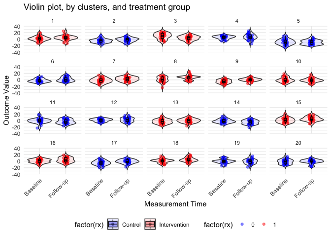

## Parallel CRT with baseline period
1. "A common enhancement of a simple parallel CRT is to add an assessment of participants’ outcomes in a baseline period (before randomisation). Even if different participants are assessed at baseline and follow-up [i.e. cross-sectional sampling], the fact that they are sampled from the same cluster allows some control for cluster differences." -> https://www.bmj.com/content/360/bmj.k1121
2. This is illustratively shown in the sample size calculator: https://clusterrcts.shinyapps.io/rshinyapp/ (switch between "Parallel" and "Parallel with baseline measure") -> can yield a substantial increase in power! See last chapter below.

Let's explore this further
* The rationale: The more variability there is in the outcome across clusters, the more difficult to identify the effect.
* On the example of an individual RCT: If we are interested in measuring the impact of an intervention on the quality of life (QOL) across a diverse range of patients, the measurement (which typically ranges from 0 to 1) might vary considerably from person to person, regardless of the intervention. If the intervention has a real but moderate effect of, say, 0.1 points, it could easily get lost if the standard deviation is considerably larger, say 0.25.
* If we collect baseline QOL scores and can “control” for those measurements in some way (by conducting a repeated measures analysis, using ANCOVA, or assessing the difference itself as an outcome), we might be able to reduce the variability and have better chance to pick up the effect. 

Literature:
* https://onlinelibrary.wiley.com/doi/abs/10.1002/sim.5352 
* Hooper Richard et al. Sample size calculation for stepped wedge and other longitudinal cluster randomised trials. Statistics in Medicine. 2016: https://onlinelibrary.wiley.com/doi/10.1002/sim.7028 and 
* Leyrat Clémence et al. Practical considerations for sample size calculation for cluster randomized trials. Journal of Epidemiology and Population Health. 2024: https://www.sciencedirect.com/science/article/pii/S2950433324000090
* Based on "Analysis of cluster randomised trials with an assessment of outcome at baseline": https://www.bmj.com/content/360/bmj.k1121.long

## There are various ways to do it:
1. Analysis of covariance (ANCOVA): Aggregate outcomes at baseline, and adjusts each individual participant at follow-up for the baseline cluster mean
2. Constrained baseline analysis: Treat outcomes collected at baseline and follow-up as longitudinal, and to use a repeated measures analysis to estimate the effect of the intervention being switched on in one of the randomised groups on the second of these occasions, see design matrix in https://clusterrcts.shinyapps.io/rshinyapp/. Unlike a difference of differences analysis, it assumes that there is no systematic difference between the groups at baseline. Similar to a one-period short stepped-wedge CRT.

## Simulation | Continuous outcome
### First, let's start with a simple individual randomized trial

```r
RNGkind("L'Ecuyer-CMRG")
set.seed(19287)
library(simstudy)
library(ggplot2)
library(lmerTest)
library(parallel)
library(data.table)
library(pwr)
library(gtsummary)
library(paletteer)
library(magrittr)
library(dplyr)
```

In case of an individual RCT, the individual-level variance (e.g. say𝜎= 64 => SD = 8) is the only source of variation. Let's assume the overall effect size (difference in average QoL scores across treatment groups) is 2.4, i.e. a standardized effect size of 2.4 / 8 = 0.3, i.e., the treatment effect of 2.4 is about 0.3 standard deviations large (Cohen's d), which often is referred to as a moderate effect size. 
Let's calculate the sample size for a two-sample t-test (2 groups, independent, only 1 measurement at the end) based on the effect size (Cohen's d) and a power of 80%.

```r
pwr.t.test(d = 0.3, power = 0.80)
```

```
## 
##      Two-sample t test power calculation 
## 
##               n = 175.3847
##               d = 0.3
##       sig.level = 0.05
##           power = 0.8
##     alternative = two.sided
## 
## NOTE: n is number in *each* group
```
We will need 350 participants (175 in each arm) to achieve a power of 80%.

#### Let's generate the data

```r
simple_rct <- function(N) {
  # outcome
  defS <- defData(varname = "rx", formula = "1;1", dist = "trtAssign") # treatment variable, 1:1 allocation, 50% prob to be in a or b
  defS <- defData(defS, varname = "y", formula = "2.4*rx", variance = 64, dist = "normal") # cont outcome, normal distribution
  # If rx = 1 (treatment group) => the outcome will be 2.4*1 = 2.4.
  # If rx = 0 (control group) => the outcome will be 2.4*0 = 0.
  dd <- genData(N, defS)
  
  dd[]
}

dd <- simple_rct(350) # simulate the trial with 350 participants

ggplot(dd, aes(x = factor(rx), y = y, fill = factor(rx))) + 
  geom_violin(trim = FALSE) + 
  geom_jitter(width = 0.15, size = 1, alpha = 0.6, color = "black") +
  stat_summary(fun = "median", geom = "point", shape = 18, size = 3, color = "red") +
  geom_boxplot(width = 0.1, alpha = 0.5, outlier.shape = NA, color = "black") +
  labs(x = "Treatment Group (rx)", y = "Outcome (y)") +
  scale_fill_manual(values = c("skyblue", "salmon")) + 
  theme_minimal() +
  theme(legend.title = element_blank()) +
  ggtitle("Violin Plots, with point estimate, median with IQR")
```

<!-- -->

#### Let's estimate the effect size
A simple linear regression model will do

```r
fit1 <- lm(y ~ rx, data = dd)
tbl <- tbl_regression(fit1) %>%
  modify_footnote(ci ~ NA, abbreviation = TRUE)
# Render it as a markdown/kable table
as_kable(tbl)
```


|**Characteristic** | **Beta** | **95% CI** | **p-value** |
|:------------------|:--------:|:----------:|:-----------:|
|rx                 |   2.7    |  1.0, 4.4  |    0.002    |

#### Let's confirm the power
We can confirm the power by repeatedly generating data sets and fitting models, recording the p-values for each replication.

```r
replicate <- function() {
  dd <- simple_rct(350)
  fit1 <- lm(y ~  rx, data = dd)
  coef(summary(fit1))["rx", "Pr(>|t|)"]
}

p_values <- mclapply(1:1000, function(x) replicate(), mc.cores = 4) # mclapply() is a parallelized version of the lapply() function that applies the replicate() function 1000 times. mc.cores = 4 means the code will use 4 cores for parallel computation, which speeds up the process by running multiple replications simultaneously.

# Estimated power based on 1000 replications.
# Convert the list of p-values into a vector and calculates the proportion of replications where the p-value is less than 0.05
mean(unlist(p_values) < 0.05)
```

```
## [1] 0.791
```

### Second, now move to a cluster randomized trial, but same context
Parallel cluster randomized trial:
𝑌𝑖𝑗=𝛼+𝛿𝑍𝑗+𝑐𝑗+𝑠𝑖

where 𝑌𝑖𝑗 is a continuous outcome for participant 𝑖 in site 𝑗. 𝑍𝑗 is the treatment indicator for site 𝑗. Again, 𝛿 is the treatment effect. 𝑐𝑗∼𝑁(0,𝜎^2𝑐) is a site level effect, and 𝑠𝑖∼𝑁(0,𝜎^2𝑠) is the participant level effect. The correlation of any two participants in a cluster is 𝜌 (the ICC):

𝜌=𝜎^2𝑐/ (𝜎^2𝑐+𝜎^2𝑠)

This tells us how correlated participants are within the same cluster.
If ρ is close to 0, most of the variability is at the individual level.
If ρ is close to 1, most of the variability is at the site level.

If we have a pre-specified number (𝑛) of participants at each site, we can estimate the sample size required in the CRT applying a design effect 1+(𝑛−1)𝜌 to the sample size of an RCT that has the same overall variance.
We know the overall variance (𝜎^2) is 64 and we assume/know the ICC/p is 0.15. That brings us to (using the ICC formula above)

σ^2 c = 9.6 (site-level variance)
σ^2 s = 54.4 (individual-level variance)
ICC (ρ) = 0.15: 15% of the total variability in the outcome is due to differences between sites, while 85% is due to individual differences within sites.

Since individuals in the same cluster are correlated, we need to adjust the sample size using the design effect.
Design Effect = 1+(n−1)ρ; where, n=30 (number of individuals per site), ρ = 0.15
=> Design effect = 5.35
=> New Total Sample Size = 5.35 × 350 = 1872
Since each site includes 30 participants, the number of required sites is: 62.4 => 64

#### Let's generate the data

```r
simple_crt <- function(nsites, n) {
  # treatment assignment, again, 1:1, 50% prob to be in each group
  defC <- defData(varname = "rx", formula = "1;1", dist = "trtAssign")
  # Define Cluster-Level Data (defC)
  # c (Random Site Effect from Normal Distribution)
  # This represents site-level variation. It follows a normal distribution
  # variance = 9.6 is the site-level variance (see above)
  defC <- defData(defC, varname = "c", formula = "0", variance = 9.6, dist = "normal")  
  # Define Individual-Level Outcome (defS)
  # c: Site-level effect (previously defined).
  # 2.4 * rx: Treatment effect for clusters assigned to intervention, see above
  # s_i \sim N(0, 54.4): Individual-level noise, with variance 54.4.
  defS <- defDataAdd(varname="y", formula="c + 2.4*rx", variance = 54.4, dist="normal")

# site/cluster level data
  # Generates nsites rows (one per cluster)
  # Each row includes: rx (treatment assignment for the site) and c (site-specific random effect).
  dc <- genData(nsites, defC, id = "site")

# individual level data
  # Creates individual-level data by assigning n individuals to each site.
  # Adds outcome (y) based on c, rx, and individual-level variance.
  dd <- genCluster(dc, "site", n, "id")
  dd <- addColumns(defS, dd)
  
  dd[]
}
# generating data for 20 sites, each with 50 individuals.
dd <- simple_crt(20, 50)

# Create violin plot with sites on x-axis and colors for treatment/control
ggplot(dd, aes(x = factor(site), y = y, fill = factor(rx))) +
  geom_violin(trim = FALSE, alpha = 0.5) +  # Violin plot with transparency
  geom_boxplot(width = 0.2, outlier.shape = NA, color = "black") +  # Boxplot for central tendency
  geom_jitter(shape = 16, position = position_jitter(0.2), alpha = 0.4) +  # Scatter individual points
  scale_fill_manual(values = c("blue", "red"), labels = c("Control", "Treatment")) +
  labs(x = "Site (Cluster)", y = "Outcome (y)", title = "Outcome Distribution by Site") +
  theme_minimal() +
  theme(legend.title = element_blank(), axis.text.x = element_text(angle = 90, hjust = 1))
```

<!-- -->

#### Let's estimate the effect size
A mixed effects model is used to estimate the effect size.

```r
dd <- simple_crt(200,100)

fit2 <- lmer(y ~  rx + (1|site), data = dd)
tbl_regression(fit2, tidy_fun = broom.mixed::tidy)  %>% 
  modify_footnote(ci ~ NA, abbreviation = TRUE)
```

```{=html}
<div id="rljjahpizj" style="padding-left:0px;padding-right:0px;padding-top:10px;padding-bottom:10px;overflow-x:auto;overflow-y:auto;width:auto;height:auto;">
<style>#rljjahpizj table {
  font-family: system-ui, 'Segoe UI', Roboto, Helvetica, Arial, sans-serif, 'Apple Color Emoji', 'Segoe UI Emoji', 'Segoe UI Symbol', 'Noto Color Emoji';
  -webkit-font-smoothing: antialiased;
  -moz-osx-font-smoothing: grayscale;
}

#rljjahpizj thead, #rljjahpizj tbody, #rljjahpizj tfoot, #rljjahpizj tr, #rljjahpizj td, #rljjahpizj th {
  border-style: none;
}

#rljjahpizj p {
  margin: 0;
  padding: 0;
}

#rljjahpizj .gt_table {
  display: table;
  border-collapse: collapse;
  line-height: normal;
  margin-left: auto;
  margin-right: auto;
  color: #333333;
  font-size: 16px;
  font-weight: normal;
  font-style: normal;
  background-color: #FFFFFF;
  width: auto;
  border-top-style: solid;
  border-top-width: 2px;
  border-top-color: #A8A8A8;
  border-right-style: none;
  border-right-width: 2px;
  border-right-color: #D3D3D3;
  border-bottom-style: solid;
  border-bottom-width: 2px;
  border-bottom-color: #A8A8A8;
  border-left-style: none;
  border-left-width: 2px;
  border-left-color: #D3D3D3;
}

#rljjahpizj .gt_caption {
  padding-top: 4px;
  padding-bottom: 4px;
}

#rljjahpizj .gt_title {
  color: #333333;
  font-size: 125%;
  font-weight: initial;
  padding-top: 4px;
  padding-bottom: 4px;
  padding-left: 5px;
  padding-right: 5px;
  border-bottom-color: #FFFFFF;
  border-bottom-width: 0;
}

#rljjahpizj .gt_subtitle {
  color: #333333;
  font-size: 85%;
  font-weight: initial;
  padding-top: 3px;
  padding-bottom: 5px;
  padding-left: 5px;
  padding-right: 5px;
  border-top-color: #FFFFFF;
  border-top-width: 0;
}

#rljjahpizj .gt_heading {
  background-color: #FFFFFF;
  text-align: center;
  border-bottom-color: #FFFFFF;
  border-left-style: none;
  border-left-width: 1px;
  border-left-color: #D3D3D3;
  border-right-style: none;
  border-right-width: 1px;
  border-right-color: #D3D3D3;
}

#rljjahpizj .gt_bottom_border {
  border-bottom-style: solid;
  border-bottom-width: 2px;
  border-bottom-color: #D3D3D3;
}

#rljjahpizj .gt_col_headings {
  border-top-style: solid;
  border-top-width: 2px;
  border-top-color: #D3D3D3;
  border-bottom-style: solid;
  border-bottom-width: 2px;
  border-bottom-color: #D3D3D3;
  border-left-style: none;
  border-left-width: 1px;
  border-left-color: #D3D3D3;
  border-right-style: none;
  border-right-width: 1px;
  border-right-color: #D3D3D3;
}

#rljjahpizj .gt_col_heading {
  color: #333333;
  background-color: #FFFFFF;
  font-size: 100%;
  font-weight: normal;
  text-transform: inherit;
  border-left-style: none;
  border-left-width: 1px;
  border-left-color: #D3D3D3;
  border-right-style: none;
  border-right-width: 1px;
  border-right-color: #D3D3D3;
  vertical-align: bottom;
  padding-top: 5px;
  padding-bottom: 6px;
  padding-left: 5px;
  padding-right: 5px;
  overflow-x: hidden;
}

#rljjahpizj .gt_column_spanner_outer {
  color: #333333;
  background-color: #FFFFFF;
  font-size: 100%;
  font-weight: normal;
  text-transform: inherit;
  padding-top: 0;
  padding-bottom: 0;
  padding-left: 4px;
  padding-right: 4px;
}

#rljjahpizj .gt_column_spanner_outer:first-child {
  padding-left: 0;
}

#rljjahpizj .gt_column_spanner_outer:last-child {
  padding-right: 0;
}

#rljjahpizj .gt_column_spanner {
  border-bottom-style: solid;
  border-bottom-width: 2px;
  border-bottom-color: #D3D3D3;
  vertical-align: bottom;
  padding-top: 5px;
  padding-bottom: 5px;
  overflow-x: hidden;
  display: inline-block;
  width: 100%;
}

#rljjahpizj .gt_spanner_row {
  border-bottom-style: hidden;
}

#rljjahpizj .gt_group_heading {
  padding-top: 8px;
  padding-bottom: 8px;
  padding-left: 5px;
  padding-right: 5px;
  color: #333333;
  background-color: #FFFFFF;
  font-size: 100%;
  font-weight: initial;
  text-transform: inherit;
  border-top-style: solid;
  border-top-width: 2px;
  border-top-color: #D3D3D3;
  border-bottom-style: solid;
  border-bottom-width: 2px;
  border-bottom-color: #D3D3D3;
  border-left-style: none;
  border-left-width: 1px;
  border-left-color: #D3D3D3;
  border-right-style: none;
  border-right-width: 1px;
  border-right-color: #D3D3D3;
  vertical-align: middle;
  text-align: left;
}

#rljjahpizj .gt_empty_group_heading {
  padding: 0.5px;
  color: #333333;
  background-color: #FFFFFF;
  font-size: 100%;
  font-weight: initial;
  border-top-style: solid;
  border-top-width: 2px;
  border-top-color: #D3D3D3;
  border-bottom-style: solid;
  border-bottom-width: 2px;
  border-bottom-color: #D3D3D3;
  vertical-align: middle;
}

#rljjahpizj .gt_from_md > :first-child {
  margin-top: 0;
}

#rljjahpizj .gt_from_md > :last-child {
  margin-bottom: 0;
}

#rljjahpizj .gt_row {
  padding-top: 8px;
  padding-bottom: 8px;
  padding-left: 5px;
  padding-right: 5px;
  margin: 10px;
  border-top-style: solid;
  border-top-width: 1px;
  border-top-color: #D3D3D3;
  border-left-style: none;
  border-left-width: 1px;
  border-left-color: #D3D3D3;
  border-right-style: none;
  border-right-width: 1px;
  border-right-color: #D3D3D3;
  vertical-align: middle;
  overflow-x: hidden;
}

#rljjahpizj .gt_stub {
  color: #333333;
  background-color: #FFFFFF;
  font-size: 100%;
  font-weight: initial;
  text-transform: inherit;
  border-right-style: solid;
  border-right-width: 2px;
  border-right-color: #D3D3D3;
  padding-left: 5px;
  padding-right: 5px;
}

#rljjahpizj .gt_stub_row_group {
  color: #333333;
  background-color: #FFFFFF;
  font-size: 100%;
  font-weight: initial;
  text-transform: inherit;
  border-right-style: solid;
  border-right-width: 2px;
  border-right-color: #D3D3D3;
  padding-left: 5px;
  padding-right: 5px;
  vertical-align: top;
}

#rljjahpizj .gt_row_group_first td {
  border-top-width: 2px;
}

#rljjahpizj .gt_row_group_first th {
  border-top-width: 2px;
}

#rljjahpizj .gt_summary_row {
  color: #333333;
  background-color: #FFFFFF;
  text-transform: inherit;
  padding-top: 8px;
  padding-bottom: 8px;
  padding-left: 5px;
  padding-right: 5px;
}

#rljjahpizj .gt_first_summary_row {
  border-top-style: solid;
  border-top-color: #D3D3D3;
}

#rljjahpizj .gt_first_summary_row.thick {
  border-top-width: 2px;
}

#rljjahpizj .gt_last_summary_row {
  padding-top: 8px;
  padding-bottom: 8px;
  padding-left: 5px;
  padding-right: 5px;
  border-bottom-style: solid;
  border-bottom-width: 2px;
  border-bottom-color: #D3D3D3;
}

#rljjahpizj .gt_grand_summary_row {
  color: #333333;
  background-color: #FFFFFF;
  text-transform: inherit;
  padding-top: 8px;
  padding-bottom: 8px;
  padding-left: 5px;
  padding-right: 5px;
}

#rljjahpizj .gt_first_grand_summary_row {
  padding-top: 8px;
  padding-bottom: 8px;
  padding-left: 5px;
  padding-right: 5px;
  border-top-style: double;
  border-top-width: 6px;
  border-top-color: #D3D3D3;
}

#rljjahpizj .gt_last_grand_summary_row_top {
  padding-top: 8px;
  padding-bottom: 8px;
  padding-left: 5px;
  padding-right: 5px;
  border-bottom-style: double;
  border-bottom-width: 6px;
  border-bottom-color: #D3D3D3;
}

#rljjahpizj .gt_striped {
  background-color: rgba(128, 128, 128, 0.05);
}

#rljjahpizj .gt_table_body {
  border-top-style: solid;
  border-top-width: 2px;
  border-top-color: #D3D3D3;
  border-bottom-style: solid;
  border-bottom-width: 2px;
  border-bottom-color: #D3D3D3;
}

#rljjahpizj .gt_footnotes {
  color: #333333;
  background-color: #FFFFFF;
  border-bottom-style: none;
  border-bottom-width: 2px;
  border-bottom-color: #D3D3D3;
  border-left-style: none;
  border-left-width: 2px;
  border-left-color: #D3D3D3;
  border-right-style: none;
  border-right-width: 2px;
  border-right-color: #D3D3D3;
}

#rljjahpizj .gt_footnote {
  margin: 0px;
  font-size: 90%;
  padding-top: 4px;
  padding-bottom: 4px;
  padding-left: 5px;
  padding-right: 5px;
}

#rljjahpizj .gt_sourcenotes {
  color: #333333;
  background-color: #FFFFFF;
  border-bottom-style: none;
  border-bottom-width: 2px;
  border-bottom-color: #D3D3D3;
  border-left-style: none;
  border-left-width: 2px;
  border-left-color: #D3D3D3;
  border-right-style: none;
  border-right-width: 2px;
  border-right-color: #D3D3D3;
}

#rljjahpizj .gt_sourcenote {
  font-size: 90%;
  padding-top: 4px;
  padding-bottom: 4px;
  padding-left: 5px;
  padding-right: 5px;
}

#rljjahpizj .gt_left {
  text-align: left;
}

#rljjahpizj .gt_center {
  text-align: center;
}

#rljjahpizj .gt_right {
  text-align: right;
  font-variant-numeric: tabular-nums;
}

#rljjahpizj .gt_font_normal {
  font-weight: normal;
}

#rljjahpizj .gt_font_bold {
  font-weight: bold;
}

#rljjahpizj .gt_font_italic {
  font-style: italic;
}

#rljjahpizj .gt_super {
  font-size: 65%;
}

#rljjahpizj .gt_footnote_marks {
  font-size: 75%;
  vertical-align: 0.4em;
  position: initial;
}

#rljjahpizj .gt_asterisk {
  font-size: 100%;
  vertical-align: 0;
}

#rljjahpizj .gt_indent_1 {
  text-indent: 5px;
}

#rljjahpizj .gt_indent_2 {
  text-indent: 10px;
}

#rljjahpizj .gt_indent_3 {
  text-indent: 15px;
}

#rljjahpizj .gt_indent_4 {
  text-indent: 20px;
}

#rljjahpizj .gt_indent_5 {
  text-indent: 25px;
}
</style>
<table class="gt_table" data-quarto-disable-processing="false" data-quarto-bootstrap="false">
  <thead>
    
    <tr class="gt_col_headings">
      <th class="gt_col_heading gt_columns_bottom_border gt_left" rowspan="1" colspan="1" scope="col" id="&lt;strong&gt;Characteristic&lt;/strong&gt;"><strong>Characteristic</strong></th>
      <th class="gt_col_heading gt_columns_bottom_border gt_center" rowspan="1" colspan="1" scope="col" id="&lt;strong&gt;Beta&lt;/strong&gt;"><strong>Beta</strong></th>
      <th class="gt_col_heading gt_columns_bottom_border gt_center" rowspan="1" colspan="1" scope="col" id="&lt;strong&gt;95% CI&lt;/strong&gt;"><strong>95% CI</strong></th>
      <th class="gt_col_heading gt_columns_bottom_border gt_center" rowspan="1" colspan="1" scope="col" id="&lt;strong&gt;p-value&lt;/strong&gt;"><strong>p-value</strong></th>
    </tr>
  </thead>
  <tbody class="gt_table_body">
    <tr><td headers="label" class="gt_row gt_left">rx</td>
<td headers="estimate" class="gt_row gt_center">2.0</td>
<td headers="ci" class="gt_row gt_center">1.0, 3.0</td>
<td headers="p.value" class="gt_row gt_center"><0.001</td></tr>
    <tr><td headers="label" class="gt_row gt_left">site.sd__(Intercept)</td>
<td headers="estimate" class="gt_row gt_center">3.5</td>
<td headers="ci" class="gt_row gt_center"></td>
<td headers="p.value" class="gt_row gt_center"></td></tr>
    <tr><td headers="label" class="gt_row gt_left">Residual.sd__Observation</td>
<td headers="estimate" class="gt_row gt_center">7.4</td>
<td headers="ci" class="gt_row gt_center"></td>
<td headers="p.value" class="gt_row gt_center"></td></tr>
  </tbody>
  
  
</table>
</div>
```

#### Let's confirm the power
Confirm power and go back to the initial assumption of 64 sites with 30 participants per site, which is a massive increase from total sample size 350 (individual RCT) to 1920 in a simple CRT

```r
replicate <- function() {
  dd <- simple_crt(64, 30)
  fit2 <- lmer(y ~  rx + (1|site), data = dd)
  
  coef(summary(fit2))["rx", "Pr(>|t|)"]
}

p_values <- mclapply(1:1000, function(x) replicate(), mc.cores = 4)

mean(unlist(p_values) < 0.05)
```

```
## [1] 0.805
```

```r
# Run the power analysis simulation
p_values <- unlist(p_values)  # Convert list to vector

# Create histogram
ggplot(data.frame(p_values), aes(x = p_values)) +
  geom_histogram(binwidth = 0.05, fill = "blue", color = "black", alpha = 0.7) +
  geom_vline(xintercept = 0.05, linetype = "dashed", color = "red", linewidth = 1) +
  labs(title = "Distribution of p-values from 1000 Simulations",
       x = "p-value",
       y = "Frequency") +
  theme_minimal()
```

<!-- -->

### Third, we move to a CRT with baseline period
The baseline and follow-up measurements can be collected from the same participants (cohort design) or different participants (cross-sectional design), though the impact on the design effect depends on what approach is taken.
The key idea is to measure the same outcome at two different time points to reduce variance and improve statistical power.

𝑌𝑖𝑗𝑘 = 𝛼0 + 𝛼1𝑘 + 𝛿0𝑍𝑗 + 𝛿1𝑘𝑍𝑗 + 𝑐𝑗 + 𝑐𝑝𝑗𝑘 + 𝑠𝑖𝑗 + 𝑠𝑝𝑖𝑗𝑘

where 𝑌𝑖𝑗𝑘 is a continuous outcome measure for individual 𝑖 in site 𝑗 and measurement 𝑘∈{0,1}. 𝑘=0 for baseline measurement, and 𝑘=1 for the follow-up. 
𝑍𝑗 is the treatment status of cluster 𝑗, 𝑍𝑗∈{0,1}. 
𝛼0 is the mean outcome at baseline for participants in the control cluster. Baseline mean outcome in control clusters.
𝛼1 is the change from baseline to follow-up in the control arm. Change over time in the control arm (i.e., how much the outcome changes naturally without intervention).
𝛿0 is the difference at baseline between control and treatment arms (we would expect this to be 0 in a randomized trial)  
𝛿1 is the difference in the change from baseline to follow-up between the two arms. In a randomized trial, since 𝛿0 should be close to 0, 𝛿1 is the treatment effect. Treatment effect, i.e., the difference in change from baseline to follow-up between treatment and control arms.

The model has cluster-specific and individual-specific random effects. 
For both, there can be time-invariant effects and time-varying effects.
Cluster-level effects (between-site variation):
𝑐𝑗∼𝑁(0,𝜎2𝑐) are time invariant site-specific effects. Intrinsic differences between clusters.
𝑐𝑝𝑗𝑘 ∼𝑁(0,𝜎2𝑐𝑝) are the site-specific period (time varying) effects. Changes over time within a site.
Individual-level effects (within-site variation):
𝑠𝑖𝑗∼𝑁(0,𝜎2𝑠) are time invariant individual-level effects, stable individual characteristics.
𝑠𝑝𝑖𝑗𝑘∼𝑁(0,𝜎2𝑠𝑝) are the individual-level period (time varying) effects, measurement error or individual change over time.

Why Does This Help Reduce Sample Size?
1. Since each individual (or site) has two measurements, we can control for their baseline score when estimating the treatment effect.
2. This reduces residual variance, leading to a lower design effect and a smaller required sample size compared to a standard CRT.
3. The benefit depends on the intra-cluster correlation (ICC) and how much baseline values predict follow-up values.

#### Let's generate the data

```r
# Parameters:

# effect: The treatment effect to be used for the formula in the outcome variable.
# nsites: The number of sites (clusters) in the study.
# n: The number of participants at each site.
# s_c, s_cp, s_s, s_sp: These represent the variances of the respective random effects:
#  s_c: Variance of cluster-level (site-level) time-invariant random effects.
#  s_cp: Variance of cluster-level (site-level) time-varying random effects (due to different periods).
#  s_s: Variance of participant-level time-invariant random effects.
#  s_sp: Variance of participant-level time-varying random effects (due to periods).

crt_base <- function(effect, nsites, n, s_c, s_cp, s_s, s_sp) {
  # Variable c = cluster level, with variance s_c. It represents the time-invariant random effects at the cluster level.
  defC <- defData(varname = "c", formula = 0, variance = "..s_c")
  defC <- defData(defC, varname = "rx", formula = "1;1", dist = "trtAssign")
  # Cluster-Level Time-Varying Effects (defCP)
  # This defines time-varying cluster-level random effects c.p with variance s_cp. This effect captures the change over time within clusters, for example, the different responses between baseline and follow-up at each site.
  defCP <- defDataAdd(varname = "c.p", formula = 0, variance = "..s_cp")
  # This defines the individual-level random effects s with variance s_s. This represents individual individual variability that is constant across time.
  defS <- defDataAdd(varname = "s", formula = 0, variance = "..s_s")
  # The treatment effect (effect) for the interaction between the treatment indicator (rx) and the period (period), which gives the treatment effect over time.
  defSP <- defDataAdd(varname = "y",
    formula = "..effect * rx * period + c + c.p + s", 
    variance ="..s_sp")
  
  dc <- genData(nsites, defC, id = "site")
  
  # Add Periods to Cluster Data (dcp)
  # This adds two periods (baseline and follow-up) to each cluster and adds the time-varying random effects (c.p).
  dcp <- addPeriods(dc, 2, "site")
  dcp <- addColumns(defCP, dcp)
  dcp <- dcp[, .(site, period, c.p, timeID)]
  
  # Generate Individual-Level Data (ds)
  ds <- genCluster(dc, "site", n, "id")
  ds <- addColumns(defS, ds)
  
  # Add Periods to Individual-Level Data (dsp)
  # This adds two periods (baseline and follow-up) for each individual, creating the observational ID obsID.
  dsp <- addPeriods(ds, 2)
  setnames(dsp, "timeID", "obsID")
  
  setkey(dsp, site, period)
  setkey(dcp, site, period)
  
  # Merge Cluster-Level and Individual-Level Data (dd)
  dd <- merge(dsp, dcp)
  dd <- addColumns(defSP, dd)
  setkey(dd, site, id, period)
  
  dd[]
}
```

Design effect

In their paper, Teerenstra et al develop a design effect that takes into account the baseline measurement.

The correlation of two participant measurements in the same cluster and same time period is the ICC or 𝜌, and is:

𝜌 = (𝜎2𝑐 + 𝜎2𝑐𝑝) / (𝜎2𝑐 + 𝜎2𝑐𝑝 + 𝜎2𝑠 + 𝜎2𝑠𝑝)

In order to estimate the design effect, we need two more correlations. 
First, the correlation between baseline and follow-up random effects at the cluster level:

𝜌𝑐 = 𝜎2𝑐/ (𝜎2𝑐 + 𝜎2𝑐𝑝)

Second, the correlation between baseline and follow-up random effects at the individual level:

𝜌𝑠 = 𝜎2𝑠/ (𝜎2𝑠+𝜎2𝑠𝑝)

A value 𝑟 is used to estimate the design effect, and is defined as:

𝑟= (𝑛𝜌𝜌𝑐 + (1−𝜌)𝜌𝑠) / (1 + (𝑛−1)𝜌)

If we are able to collect baseline measurements and our focus is on estimating 𝛿1 from the model, the design effect is slightly modified from before:

(1+(𝑛−1)𝜌) * (2(1−𝑟))

-> Basically, adding the second part with rho. r: The correlation factor, which is a weighted combination of the cluster-level and individual-level correlations.
The first part of the formula is similar to the design effect formula used when baseline data isn't available. It adjusts for the clustering of individuals within sites (clusters), accounting for the intra-cluster correlation.
The second part of the formula adjusts for the reduction in variance due to the inclusion of baseline measurements in the analysis. The value of r reflects how strongly the baseline and follow-up measurements correlate at both the cluster and individual levels.
If the correlation between baseline and follow-up measurements is strong (i.e., high ps and high pc), this part of the formula will be small, implying a lower design effect (and thus a lower required sample size).

By collecting baseline measurements, the baseline-to-follow-up correlation reduces the variability in the outcome variable, which allows for more precise estimates of the treatment effect and smaller sample size requirements. Specifically, reducing noise and allowing you to detect smaller treatment effects with the same sample size.
By using the correlation between baseline and follow-up data, you can "shrink" the variability and make the study more efficient. This is crucial if the cost or effort of data collection is high, as it helps you achieve the same statistical power with a smaller sample.


#### Cross-section cohort design
We may not be able to collect two measurements for each participants at a site, but if we can collect measurements on two different cohorts, one at baseline before the intervention is implemented, and one cohort in a second period (either after the intervention has been implemented or not, depending on the randomization assignment of the cluster), we might be able to reduce the number of clusters.

In this case, 𝜎2𝑠= 0 and 𝜌𝑠= 0, so the general model reduces to:

𝑌𝑖𝑗𝑘 = 𝛼0 + 𝛼1𝑘 + 𝛿0𝑍𝑗 + 𝛿1𝑘𝑍𝑗 + 𝑐𝑗 + 𝑐𝑝𝑗𝑘 + 𝑠𝑝𝑖𝑗𝑘

So, we can drop 𝑠𝑖𝑗 because there is no individual-level correlation (independent participants)

The parameters for this simulation are 
𝛿1= 2.4 (treatment effect, see above)
𝜎2𝑐= 6.8 (Cluster-level variance)
𝜎2𝑐𝑝= 2.8 (Cluster-level period variance)
𝜎2𝑠𝑝= 54.4 (Individual-level period variance) 
Total variance:𝜎2𝑐 + 𝜎2𝑐𝑝 + 𝜎2𝑠𝑝 = 6.8 + 2.8 + 54.4 = 64, as used previously.


```r
dd <- crt_base(effect = 2.4, nsites = 20, n = 30, s_c = 6.8, s_cp = 2.8, s_s = 0, s_sp = 54.4)

# Create a new column for period names (baseline and follow-up)
dd[, period_label := ifelse(period == 0, "Baseline", "Follow-up")]

# Create a violin plot, faceted by site
ggplot(dd, aes(x = period_label, y = y, fill = factor(rx))) + 
  geom_violin(trim = FALSE, alpha = 0.1) +  # Make the violin plot transparent
  geom_jitter(aes(color = factor(rx)), width = 0.1, alpha = 0.5) +  # Add individual data points
  geom_boxplot(width = 0.1, color = "black", alpha = 0.3, outlier.shape = NA) +  # Add boxplots
  facet_wrap(~site, ncol = 5) +  # 5 columns for 20 sites
  scale_fill_manual(values = c("blue", "red"), labels = c("Control", "Intervention")) +
  scale_color_manual(values = c("blue", "red")) +
  labs(title = "Violin Plot with Data Points and Boxplots by Site and Treatment Group", 
       x = "Measurement Time", y = "Outcome Value") +
  theme_minimal() + 
  theme(legend.position = "bottom", 
        strip.text = element_text(size = 8), 
        axis.text.x = element_text(angle = 45, hjust = 1))  # Adjust text angles for clarity
```

<!-- -->

#### Let's estimate the effect size
To estimate the effect size we fit a mixed effect model with cluster-specific effects only (both time invariant and time varying).
Treatment effect under "period*rx" !
Translating the Formula:
Fixed Effects:
Fixed effect for 𝛼1𝑘: This is represented by period in the model, which captures the difference between baseline and follow-up.
Fixed effect for treatment group (rx) 𝛿0𝑍𝑗 : This is represented by rx and captures whether the site received treatment or control.
Interaction of time and treatment (period * rx) 𝛿1𝑘𝑍𝑗 : This interaction term captures how the treatment effect differs between baseline and follow-up.
Random Effects:
(1 | site): 𝑐𝑗 : A random intercept for each site. This accounts for the variability between sites but assumes the variability is constant across time (since it's not tied to the period).
(1 | timeID:site):𝑐𝑝𝑗𝑘: A random intercept for each site in each time period (baseline and follow-up). This accounts for the site-specific changes over time—it captures how variability between sites changes from baseline to follow-up.
s pij is not included in your current model for the cross-sectional design because you are assuming independence between individuals at baseline and follow-up.

```r
dd <- crt_base(effect = 2.4, nsites = 200, n = 100, s_c=6.8, s_cp=2.8, s_s=0, s_sp=54.4)

fit3 <- lmer(y ~ period * rx + (1|timeID:site) + (1 | site), data = dd)
tbl_regression(fit3, tidy_fun = broom.mixed::tidy)  %>% 
  modify_footnote(ci ~ NA, abbreviation = TRUE)
```

```{=html}
<div id="glgybapbqf" style="padding-left:0px;padding-right:0px;padding-top:10px;padding-bottom:10px;overflow-x:auto;overflow-y:auto;width:auto;height:auto;">
<style>#glgybapbqf table {
  font-family: system-ui, 'Segoe UI', Roboto, Helvetica, Arial, sans-serif, 'Apple Color Emoji', 'Segoe UI Emoji', 'Segoe UI Symbol', 'Noto Color Emoji';
  -webkit-font-smoothing: antialiased;
  -moz-osx-font-smoothing: grayscale;
}

#glgybapbqf thead, #glgybapbqf tbody, #glgybapbqf tfoot, #glgybapbqf tr, #glgybapbqf td, #glgybapbqf th {
  border-style: none;
}

#glgybapbqf p {
  margin: 0;
  padding: 0;
}

#glgybapbqf .gt_table {
  display: table;
  border-collapse: collapse;
  line-height: normal;
  margin-left: auto;
  margin-right: auto;
  color: #333333;
  font-size: 16px;
  font-weight: normal;
  font-style: normal;
  background-color: #FFFFFF;
  width: auto;
  border-top-style: solid;
  border-top-width: 2px;
  border-top-color: #A8A8A8;
  border-right-style: none;
  border-right-width: 2px;
  border-right-color: #D3D3D3;
  border-bottom-style: solid;
  border-bottom-width: 2px;
  border-bottom-color: #A8A8A8;
  border-left-style: none;
  border-left-width: 2px;
  border-left-color: #D3D3D3;
}

#glgybapbqf .gt_caption {
  padding-top: 4px;
  padding-bottom: 4px;
}

#glgybapbqf .gt_title {
  color: #333333;
  font-size: 125%;
  font-weight: initial;
  padding-top: 4px;
  padding-bottom: 4px;
  padding-left: 5px;
  padding-right: 5px;
  border-bottom-color: #FFFFFF;
  border-bottom-width: 0;
}

#glgybapbqf .gt_subtitle {
  color: #333333;
  font-size: 85%;
  font-weight: initial;
  padding-top: 3px;
  padding-bottom: 5px;
  padding-left: 5px;
  padding-right: 5px;
  border-top-color: #FFFFFF;
  border-top-width: 0;
}

#glgybapbqf .gt_heading {
  background-color: #FFFFFF;
  text-align: center;
  border-bottom-color: #FFFFFF;
  border-left-style: none;
  border-left-width: 1px;
  border-left-color: #D3D3D3;
  border-right-style: none;
  border-right-width: 1px;
  border-right-color: #D3D3D3;
}

#glgybapbqf .gt_bottom_border {
  border-bottom-style: solid;
  border-bottom-width: 2px;
  border-bottom-color: #D3D3D3;
}

#glgybapbqf .gt_col_headings {
  border-top-style: solid;
  border-top-width: 2px;
  border-top-color: #D3D3D3;
  border-bottom-style: solid;
  border-bottom-width: 2px;
  border-bottom-color: #D3D3D3;
  border-left-style: none;
  border-left-width: 1px;
  border-left-color: #D3D3D3;
  border-right-style: none;
  border-right-width: 1px;
  border-right-color: #D3D3D3;
}

#glgybapbqf .gt_col_heading {
  color: #333333;
  background-color: #FFFFFF;
  font-size: 100%;
  font-weight: normal;
  text-transform: inherit;
  border-left-style: none;
  border-left-width: 1px;
  border-left-color: #D3D3D3;
  border-right-style: none;
  border-right-width: 1px;
  border-right-color: #D3D3D3;
  vertical-align: bottom;
  padding-top: 5px;
  padding-bottom: 6px;
  padding-left: 5px;
  padding-right: 5px;
  overflow-x: hidden;
}

#glgybapbqf .gt_column_spanner_outer {
  color: #333333;
  background-color: #FFFFFF;
  font-size: 100%;
  font-weight: normal;
  text-transform: inherit;
  padding-top: 0;
  padding-bottom: 0;
  padding-left: 4px;
  padding-right: 4px;
}

#glgybapbqf .gt_column_spanner_outer:first-child {
  padding-left: 0;
}

#glgybapbqf .gt_column_spanner_outer:last-child {
  padding-right: 0;
}

#glgybapbqf .gt_column_spanner {
  border-bottom-style: solid;
  border-bottom-width: 2px;
  border-bottom-color: #D3D3D3;
  vertical-align: bottom;
  padding-top: 5px;
  padding-bottom: 5px;
  overflow-x: hidden;
  display: inline-block;
  width: 100%;
}

#glgybapbqf .gt_spanner_row {
  border-bottom-style: hidden;
}

#glgybapbqf .gt_group_heading {
  padding-top: 8px;
  padding-bottom: 8px;
  padding-left: 5px;
  padding-right: 5px;
  color: #333333;
  background-color: #FFFFFF;
  font-size: 100%;
  font-weight: initial;
  text-transform: inherit;
  border-top-style: solid;
  border-top-width: 2px;
  border-top-color: #D3D3D3;
  border-bottom-style: solid;
  border-bottom-width: 2px;
  border-bottom-color: #D3D3D3;
  border-left-style: none;
  border-left-width: 1px;
  border-left-color: #D3D3D3;
  border-right-style: none;
  border-right-width: 1px;
  border-right-color: #D3D3D3;
  vertical-align: middle;
  text-align: left;
}

#glgybapbqf .gt_empty_group_heading {
  padding: 0.5px;
  color: #333333;
  background-color: #FFFFFF;
  font-size: 100%;
  font-weight: initial;
  border-top-style: solid;
  border-top-width: 2px;
  border-top-color: #D3D3D3;
  border-bottom-style: solid;
  border-bottom-width: 2px;
  border-bottom-color: #D3D3D3;
  vertical-align: middle;
}

#glgybapbqf .gt_from_md > :first-child {
  margin-top: 0;
}

#glgybapbqf .gt_from_md > :last-child {
  margin-bottom: 0;
}

#glgybapbqf .gt_row {
  padding-top: 8px;
  padding-bottom: 8px;
  padding-left: 5px;
  padding-right: 5px;
  margin: 10px;
  border-top-style: solid;
  border-top-width: 1px;
  border-top-color: #D3D3D3;
  border-left-style: none;
  border-left-width: 1px;
  border-left-color: #D3D3D3;
  border-right-style: none;
  border-right-width: 1px;
  border-right-color: #D3D3D3;
  vertical-align: middle;
  overflow-x: hidden;
}

#glgybapbqf .gt_stub {
  color: #333333;
  background-color: #FFFFFF;
  font-size: 100%;
  font-weight: initial;
  text-transform: inherit;
  border-right-style: solid;
  border-right-width: 2px;
  border-right-color: #D3D3D3;
  padding-left: 5px;
  padding-right: 5px;
}

#glgybapbqf .gt_stub_row_group {
  color: #333333;
  background-color: #FFFFFF;
  font-size: 100%;
  font-weight: initial;
  text-transform: inherit;
  border-right-style: solid;
  border-right-width: 2px;
  border-right-color: #D3D3D3;
  padding-left: 5px;
  padding-right: 5px;
  vertical-align: top;
}

#glgybapbqf .gt_row_group_first td {
  border-top-width: 2px;
}

#glgybapbqf .gt_row_group_first th {
  border-top-width: 2px;
}

#glgybapbqf .gt_summary_row {
  color: #333333;
  background-color: #FFFFFF;
  text-transform: inherit;
  padding-top: 8px;
  padding-bottom: 8px;
  padding-left: 5px;
  padding-right: 5px;
}

#glgybapbqf .gt_first_summary_row {
  border-top-style: solid;
  border-top-color: #D3D3D3;
}

#glgybapbqf .gt_first_summary_row.thick {
  border-top-width: 2px;
}

#glgybapbqf .gt_last_summary_row {
  padding-top: 8px;
  padding-bottom: 8px;
  padding-left: 5px;
  padding-right: 5px;
  border-bottom-style: solid;
  border-bottom-width: 2px;
  border-bottom-color: #D3D3D3;
}

#glgybapbqf .gt_grand_summary_row {
  color: #333333;
  background-color: #FFFFFF;
  text-transform: inherit;
  padding-top: 8px;
  padding-bottom: 8px;
  padding-left: 5px;
  padding-right: 5px;
}

#glgybapbqf .gt_first_grand_summary_row {
  padding-top: 8px;
  padding-bottom: 8px;
  padding-left: 5px;
  padding-right: 5px;
  border-top-style: double;
  border-top-width: 6px;
  border-top-color: #D3D3D3;
}

#glgybapbqf .gt_last_grand_summary_row_top {
  padding-top: 8px;
  padding-bottom: 8px;
  padding-left: 5px;
  padding-right: 5px;
  border-bottom-style: double;
  border-bottom-width: 6px;
  border-bottom-color: #D3D3D3;
}

#glgybapbqf .gt_striped {
  background-color: rgba(128, 128, 128, 0.05);
}

#glgybapbqf .gt_table_body {
  border-top-style: solid;
  border-top-width: 2px;
  border-top-color: #D3D3D3;
  border-bottom-style: solid;
  border-bottom-width: 2px;
  border-bottom-color: #D3D3D3;
}

#glgybapbqf .gt_footnotes {
  color: #333333;
  background-color: #FFFFFF;
  border-bottom-style: none;
  border-bottom-width: 2px;
  border-bottom-color: #D3D3D3;
  border-left-style: none;
  border-left-width: 2px;
  border-left-color: #D3D3D3;
  border-right-style: none;
  border-right-width: 2px;
  border-right-color: #D3D3D3;
}

#glgybapbqf .gt_footnote {
  margin: 0px;
  font-size: 90%;
  padding-top: 4px;
  padding-bottom: 4px;
  padding-left: 5px;
  padding-right: 5px;
}

#glgybapbqf .gt_sourcenotes {
  color: #333333;
  background-color: #FFFFFF;
  border-bottom-style: none;
  border-bottom-width: 2px;
  border-bottom-color: #D3D3D3;
  border-left-style: none;
  border-left-width: 2px;
  border-left-color: #D3D3D3;
  border-right-style: none;
  border-right-width: 2px;
  border-right-color: #D3D3D3;
}

#glgybapbqf .gt_sourcenote {
  font-size: 90%;
  padding-top: 4px;
  padding-bottom: 4px;
  padding-left: 5px;
  padding-right: 5px;
}

#glgybapbqf .gt_left {
  text-align: left;
}

#glgybapbqf .gt_center {
  text-align: center;
}

#glgybapbqf .gt_right {
  text-align: right;
  font-variant-numeric: tabular-nums;
}

#glgybapbqf .gt_font_normal {
  font-weight: normal;
}

#glgybapbqf .gt_font_bold {
  font-weight: bold;
}

#glgybapbqf .gt_font_italic {
  font-style: italic;
}

#glgybapbqf .gt_super {
  font-size: 65%;
}

#glgybapbqf .gt_footnote_marks {
  font-size: 75%;
  vertical-align: 0.4em;
  position: initial;
}

#glgybapbqf .gt_asterisk {
  font-size: 100%;
  vertical-align: 0;
}

#glgybapbqf .gt_indent_1 {
  text-indent: 5px;
}

#glgybapbqf .gt_indent_2 {
  text-indent: 10px;
}

#glgybapbqf .gt_indent_3 {
  text-indent: 15px;
}

#glgybapbqf .gt_indent_4 {
  text-indent: 20px;
}

#glgybapbqf .gt_indent_5 {
  text-indent: 25px;
}
</style>
<table class="gt_table" data-quarto-disable-processing="false" data-quarto-bootstrap="false">
  <thead>
    
    <tr class="gt_col_headings">
      <th class="gt_col_heading gt_columns_bottom_border gt_left" rowspan="1" colspan="1" scope="col" id="&lt;strong&gt;Characteristic&lt;/strong&gt;"><strong>Characteristic</strong></th>
      <th class="gt_col_heading gt_columns_bottom_border gt_center" rowspan="1" colspan="1" scope="col" id="&lt;strong&gt;Beta&lt;/strong&gt;"><strong>Beta</strong></th>
      <th class="gt_col_heading gt_columns_bottom_border gt_center" rowspan="1" colspan="1" scope="col" id="&lt;strong&gt;95% CI&lt;/strong&gt;"><strong>95% CI</strong></th>
      <th class="gt_col_heading gt_columns_bottom_border gt_center" rowspan="1" colspan="1" scope="col" id="&lt;strong&gt;p-value&lt;/strong&gt;"><strong>p-value</strong></th>
    </tr>
  </thead>
  <tbody class="gt_table_body">
    <tr><td headers="label" class="gt_row gt_left">period</td>
<td headers="estimate" class="gt_row gt_center">-0.26</td>
<td headers="ci" class="gt_row gt_center">-0.78, 0.27</td>
<td headers="p.value" class="gt_row gt_center">0.3</td></tr>
    <tr><td headers="label" class="gt_row gt_left">rx</td>
<td headers="estimate" class="gt_row gt_center">-0.51</td>
<td headers="ci" class="gt_row gt_center">-1.4, 0.36</td>
<td headers="p.value" class="gt_row gt_center">0.2</td></tr>
    <tr><td headers="label" class="gt_row gt_left">period * rx</td>
<td headers="estimate" class="gt_row gt_center">2.6</td>
<td headers="ci" class="gt_row gt_center">1.8, 3.3</td>
<td headers="p.value" class="gt_row gt_center"><0.001</td></tr>
    <tr><td headers="label" class="gt_row gt_left">timeID:site.sd__(Intercept)</td>
<td headers="estimate" class="gt_row gt_center">1.7</td>
<td headers="ci" class="gt_row gt_center"></td>
<td headers="p.value" class="gt_row gt_center"></td></tr>
    <tr><td headers="label" class="gt_row gt_left">site.sd__(Intercept)</td>
<td headers="estimate" class="gt_row gt_center">2.5</td>
<td headers="ci" class="gt_row gt_center"></td>
<td headers="p.value" class="gt_row gt_center"></td></tr>
    <tr><td headers="label" class="gt_row gt_left">Residual.sd__Observation</td>
<td headers="estimate" class="gt_row gt_center">7.4</td>
<td headers="ci" class="gt_row gt_center"></td>
<td headers="p.value" class="gt_row gt_center"></td></tr>
  </tbody>
  
  
</table>
</div>
```

#### Let's update the Design Effect

```r
# Based on the variance assumptions, we can update our design effect:
s_c <- 6.8
s_cp <- 2.8
s_s <- 0
s_sp <- 54.4

rho <- (s_c + s_cp)/(s_c + s_cp + s_s + s_sp)
rho_c <- s_c/(s_c + s_cp)
rho_s <- s_s/(s_s + s_sp)

n <- 30

r <- (n * rho * rho_c + (1-rho) * rho_s) / (1 + (n-1) * rho)

# The design effect for the CRT without any baseline measurement was 5.35. With the two-cohort design, the design effect is reduced slightly:
(des_effect <- (1 + (n - 1) * rho) * 2 * (1 - r))
```

```
## [1] 4.325
```

```r
## [1] 4.3

# and thus leaves us with:
des_effect * 350 / n
```

```
## [1] 50.45833
```

```r
## [1] 50

# The desired number of sites is over 50, so rounding up to the next even number gives us 52
```

#### Let's confirm the power
After calculating the design effect, we run a simulation to confirm the statistical power based on the specified number of sites (52) and participants per site (30). The goal is to check whether the p-value for the treatment effect (period*rx) is statistically significant in at least 80% of simulations.

```r
replicate <- function() {
  dd <- crt_base(2.4, 52, 30, s_c = 6.8, s_cp = 2.8, s_s = 0, s_sp = 54.4)
  fit3 <- lmer(y ~ period * rx + (1|timeID:site) + (1 | site), data = dd)
  
  coef(summary(fit3))["period:rx", "Pr(>|t|)"]
}

p_values <- mclapply(1:1000, function(x) replicate(), mc.cores = 4)

mean(unlist(p_values) < 0.05)
```

```
## [1] 0.78
```

#### Closed cohort design
We can reduce the number of clusters further if instead of measuring one cohort prior to the intervention and another after the intervention, we measure a single cohort twice - once at baseline and once at follow-up. Now we use the full model that decomposes the participant level variance into a time invariant effect (𝑐𝑗) and a time varying effect (𝑐𝑝𝑗𝑘):

𝑌𝑖𝑗𝑘 = 𝛼0 + 𝛼1𝑘 + 𝛿0𝑍𝑗 + 𝛿1𝑘𝑍𝑗 + 𝑐𝑗 + 𝑐𝑝𝑗𝑘 + 𝑠𝑖𝑗 + 𝑠𝑝𝑖𝑗𝑘

#### Let's generate the data
The parameters for this simulation are 
𝛿1 = 2.4 (treatment effect, see above)
𝜎2𝑐 = 6.8 (Cluster-level variance)
𝜎2𝑐𝑝 = 2.8 (Cluster-level period variance)
𝜎𝑠 = 38 (Individual-level variance) 
𝜎2𝑠𝑝 = 16.4 (Individual-level period variance) 
Total variance = 64, as used previously.

```r
dd <- crt_base(effect=2.4, nsites=20, n=30, s_c=6.8, s_cp=2.8, s_s=38, s_sp=16.4)

# Visualizing the data (2 time points: baseline and follow-up)
ggplot(dd, aes(x = period, y = y, group = id, color = as.factor(rx))) +
  geom_line() +
  geom_point(aes(shape = as.factor(rx)), size = 3) +
  facet_wrap(~site, ncol = 5) +
  scale_color_manual(values = c("blue", "red")) +
  labs(title = "Repeated Measurements: Outcome by Site and Time",
       x = "Time Period (0 = Baseline, 1 = Follow-up)",
       y = "Outcome (y)",
       color = "Treatment",
       shape = "Treatment") +
  theme_minimal() +
  theme(legend.position = "bottom")
```

<!-- -->

#### Let's estimate the effect size
The mixed effect model includes cluster-specific effects only (both time invariant and time varying), as well as subject level effects. 

```r
dd <- crt_base(effect = 2.4, nsites = 200, n = 100, 
  s_c = 6.8, s_cp = 2.8, s_s = 38, s_sp = 16.4)

fit4 <- lmer(y ~ period*rx + (1 | id:site) + (1|timeID:site) + (1 | site), data = dd)
```

```
## Warning in checkConv(attr(opt, "derivs"), opt$par, ctrl = control$checkConv, :
## Model failed to converge with max|grad| = 0.00239105 (tol = 0.002, component 1)
```

```r
tbl_regression(fit4, tidy_fun = broom.mixed::tidy)  %>% 
  modify_footnote(ci ~ NA, abbreviation = TRUE)
```

```{=html}
<div id="xagpbsrbgq" style="padding-left:0px;padding-right:0px;padding-top:10px;padding-bottom:10px;overflow-x:auto;overflow-y:auto;width:auto;height:auto;">
<style>#xagpbsrbgq table {
  font-family: system-ui, 'Segoe UI', Roboto, Helvetica, Arial, sans-serif, 'Apple Color Emoji', 'Segoe UI Emoji', 'Segoe UI Symbol', 'Noto Color Emoji';
  -webkit-font-smoothing: antialiased;
  -moz-osx-font-smoothing: grayscale;
}

#xagpbsrbgq thead, #xagpbsrbgq tbody, #xagpbsrbgq tfoot, #xagpbsrbgq tr, #xagpbsrbgq td, #xagpbsrbgq th {
  border-style: none;
}

#xagpbsrbgq p {
  margin: 0;
  padding: 0;
}

#xagpbsrbgq .gt_table {
  display: table;
  border-collapse: collapse;
  line-height: normal;
  margin-left: auto;
  margin-right: auto;
  color: #333333;
  font-size: 16px;
  font-weight: normal;
  font-style: normal;
  background-color: #FFFFFF;
  width: auto;
  border-top-style: solid;
  border-top-width: 2px;
  border-top-color: #A8A8A8;
  border-right-style: none;
  border-right-width: 2px;
  border-right-color: #D3D3D3;
  border-bottom-style: solid;
  border-bottom-width: 2px;
  border-bottom-color: #A8A8A8;
  border-left-style: none;
  border-left-width: 2px;
  border-left-color: #D3D3D3;
}

#xagpbsrbgq .gt_caption {
  padding-top: 4px;
  padding-bottom: 4px;
}

#xagpbsrbgq .gt_title {
  color: #333333;
  font-size: 125%;
  font-weight: initial;
  padding-top: 4px;
  padding-bottom: 4px;
  padding-left: 5px;
  padding-right: 5px;
  border-bottom-color: #FFFFFF;
  border-bottom-width: 0;
}

#xagpbsrbgq .gt_subtitle {
  color: #333333;
  font-size: 85%;
  font-weight: initial;
  padding-top: 3px;
  padding-bottom: 5px;
  padding-left: 5px;
  padding-right: 5px;
  border-top-color: #FFFFFF;
  border-top-width: 0;
}

#xagpbsrbgq .gt_heading {
  background-color: #FFFFFF;
  text-align: center;
  border-bottom-color: #FFFFFF;
  border-left-style: none;
  border-left-width: 1px;
  border-left-color: #D3D3D3;
  border-right-style: none;
  border-right-width: 1px;
  border-right-color: #D3D3D3;
}

#xagpbsrbgq .gt_bottom_border {
  border-bottom-style: solid;
  border-bottom-width: 2px;
  border-bottom-color: #D3D3D3;
}

#xagpbsrbgq .gt_col_headings {
  border-top-style: solid;
  border-top-width: 2px;
  border-top-color: #D3D3D3;
  border-bottom-style: solid;
  border-bottom-width: 2px;
  border-bottom-color: #D3D3D3;
  border-left-style: none;
  border-left-width: 1px;
  border-left-color: #D3D3D3;
  border-right-style: none;
  border-right-width: 1px;
  border-right-color: #D3D3D3;
}

#xagpbsrbgq .gt_col_heading {
  color: #333333;
  background-color: #FFFFFF;
  font-size: 100%;
  font-weight: normal;
  text-transform: inherit;
  border-left-style: none;
  border-left-width: 1px;
  border-left-color: #D3D3D3;
  border-right-style: none;
  border-right-width: 1px;
  border-right-color: #D3D3D3;
  vertical-align: bottom;
  padding-top: 5px;
  padding-bottom: 6px;
  padding-left: 5px;
  padding-right: 5px;
  overflow-x: hidden;
}

#xagpbsrbgq .gt_column_spanner_outer {
  color: #333333;
  background-color: #FFFFFF;
  font-size: 100%;
  font-weight: normal;
  text-transform: inherit;
  padding-top: 0;
  padding-bottom: 0;
  padding-left: 4px;
  padding-right: 4px;
}

#xagpbsrbgq .gt_column_spanner_outer:first-child {
  padding-left: 0;
}

#xagpbsrbgq .gt_column_spanner_outer:last-child {
  padding-right: 0;
}

#xagpbsrbgq .gt_column_spanner {
  border-bottom-style: solid;
  border-bottom-width: 2px;
  border-bottom-color: #D3D3D3;
  vertical-align: bottom;
  padding-top: 5px;
  padding-bottom: 5px;
  overflow-x: hidden;
  display: inline-block;
  width: 100%;
}

#xagpbsrbgq .gt_spanner_row {
  border-bottom-style: hidden;
}

#xagpbsrbgq .gt_group_heading {
  padding-top: 8px;
  padding-bottom: 8px;
  padding-left: 5px;
  padding-right: 5px;
  color: #333333;
  background-color: #FFFFFF;
  font-size: 100%;
  font-weight: initial;
  text-transform: inherit;
  border-top-style: solid;
  border-top-width: 2px;
  border-top-color: #D3D3D3;
  border-bottom-style: solid;
  border-bottom-width: 2px;
  border-bottom-color: #D3D3D3;
  border-left-style: none;
  border-left-width: 1px;
  border-left-color: #D3D3D3;
  border-right-style: none;
  border-right-width: 1px;
  border-right-color: #D3D3D3;
  vertical-align: middle;
  text-align: left;
}

#xagpbsrbgq .gt_empty_group_heading {
  padding: 0.5px;
  color: #333333;
  background-color: #FFFFFF;
  font-size: 100%;
  font-weight: initial;
  border-top-style: solid;
  border-top-width: 2px;
  border-top-color: #D3D3D3;
  border-bottom-style: solid;
  border-bottom-width: 2px;
  border-bottom-color: #D3D3D3;
  vertical-align: middle;
}

#xagpbsrbgq .gt_from_md > :first-child {
  margin-top: 0;
}

#xagpbsrbgq .gt_from_md > :last-child {
  margin-bottom: 0;
}

#xagpbsrbgq .gt_row {
  padding-top: 8px;
  padding-bottom: 8px;
  padding-left: 5px;
  padding-right: 5px;
  margin: 10px;
  border-top-style: solid;
  border-top-width: 1px;
  border-top-color: #D3D3D3;
  border-left-style: none;
  border-left-width: 1px;
  border-left-color: #D3D3D3;
  border-right-style: none;
  border-right-width: 1px;
  border-right-color: #D3D3D3;
  vertical-align: middle;
  overflow-x: hidden;
}

#xagpbsrbgq .gt_stub {
  color: #333333;
  background-color: #FFFFFF;
  font-size: 100%;
  font-weight: initial;
  text-transform: inherit;
  border-right-style: solid;
  border-right-width: 2px;
  border-right-color: #D3D3D3;
  padding-left: 5px;
  padding-right: 5px;
}

#xagpbsrbgq .gt_stub_row_group {
  color: #333333;
  background-color: #FFFFFF;
  font-size: 100%;
  font-weight: initial;
  text-transform: inherit;
  border-right-style: solid;
  border-right-width: 2px;
  border-right-color: #D3D3D3;
  padding-left: 5px;
  padding-right: 5px;
  vertical-align: top;
}

#xagpbsrbgq .gt_row_group_first td {
  border-top-width: 2px;
}

#xagpbsrbgq .gt_row_group_first th {
  border-top-width: 2px;
}

#xagpbsrbgq .gt_summary_row {
  color: #333333;
  background-color: #FFFFFF;
  text-transform: inherit;
  padding-top: 8px;
  padding-bottom: 8px;
  padding-left: 5px;
  padding-right: 5px;
}

#xagpbsrbgq .gt_first_summary_row {
  border-top-style: solid;
  border-top-color: #D3D3D3;
}

#xagpbsrbgq .gt_first_summary_row.thick {
  border-top-width: 2px;
}

#xagpbsrbgq .gt_last_summary_row {
  padding-top: 8px;
  padding-bottom: 8px;
  padding-left: 5px;
  padding-right: 5px;
  border-bottom-style: solid;
  border-bottom-width: 2px;
  border-bottom-color: #D3D3D3;
}

#xagpbsrbgq .gt_grand_summary_row {
  color: #333333;
  background-color: #FFFFFF;
  text-transform: inherit;
  padding-top: 8px;
  padding-bottom: 8px;
  padding-left: 5px;
  padding-right: 5px;
}

#xagpbsrbgq .gt_first_grand_summary_row {
  padding-top: 8px;
  padding-bottom: 8px;
  padding-left: 5px;
  padding-right: 5px;
  border-top-style: double;
  border-top-width: 6px;
  border-top-color: #D3D3D3;
}

#xagpbsrbgq .gt_last_grand_summary_row_top {
  padding-top: 8px;
  padding-bottom: 8px;
  padding-left: 5px;
  padding-right: 5px;
  border-bottom-style: double;
  border-bottom-width: 6px;
  border-bottom-color: #D3D3D3;
}

#xagpbsrbgq .gt_striped {
  background-color: rgba(128, 128, 128, 0.05);
}

#xagpbsrbgq .gt_table_body {
  border-top-style: solid;
  border-top-width: 2px;
  border-top-color: #D3D3D3;
  border-bottom-style: solid;
  border-bottom-width: 2px;
  border-bottom-color: #D3D3D3;
}

#xagpbsrbgq .gt_footnotes {
  color: #333333;
  background-color: #FFFFFF;
  border-bottom-style: none;
  border-bottom-width: 2px;
  border-bottom-color: #D3D3D3;
  border-left-style: none;
  border-left-width: 2px;
  border-left-color: #D3D3D3;
  border-right-style: none;
  border-right-width: 2px;
  border-right-color: #D3D3D3;
}

#xagpbsrbgq .gt_footnote {
  margin: 0px;
  font-size: 90%;
  padding-top: 4px;
  padding-bottom: 4px;
  padding-left: 5px;
  padding-right: 5px;
}

#xagpbsrbgq .gt_sourcenotes {
  color: #333333;
  background-color: #FFFFFF;
  border-bottom-style: none;
  border-bottom-width: 2px;
  border-bottom-color: #D3D3D3;
  border-left-style: none;
  border-left-width: 2px;
  border-left-color: #D3D3D3;
  border-right-style: none;
  border-right-width: 2px;
  border-right-color: #D3D3D3;
}

#xagpbsrbgq .gt_sourcenote {
  font-size: 90%;
  padding-top: 4px;
  padding-bottom: 4px;
  padding-left: 5px;
  padding-right: 5px;
}

#xagpbsrbgq .gt_left {
  text-align: left;
}

#xagpbsrbgq .gt_center {
  text-align: center;
}

#xagpbsrbgq .gt_right {
  text-align: right;
  font-variant-numeric: tabular-nums;
}

#xagpbsrbgq .gt_font_normal {
  font-weight: normal;
}

#xagpbsrbgq .gt_font_bold {
  font-weight: bold;
}

#xagpbsrbgq .gt_font_italic {
  font-style: italic;
}

#xagpbsrbgq .gt_super {
  font-size: 65%;
}

#xagpbsrbgq .gt_footnote_marks {
  font-size: 75%;
  vertical-align: 0.4em;
  position: initial;
}

#xagpbsrbgq .gt_asterisk {
  font-size: 100%;
  vertical-align: 0;
}

#xagpbsrbgq .gt_indent_1 {
  text-indent: 5px;
}

#xagpbsrbgq .gt_indent_2 {
  text-indent: 10px;
}

#xagpbsrbgq .gt_indent_3 {
  text-indent: 15px;
}

#xagpbsrbgq .gt_indent_4 {
  text-indent: 20px;
}

#xagpbsrbgq .gt_indent_5 {
  text-indent: 25px;
}
</style>
<table class="gt_table" data-quarto-disable-processing="false" data-quarto-bootstrap="false">
  <thead>
    
    <tr class="gt_col_headings">
      <th class="gt_col_heading gt_columns_bottom_border gt_left" rowspan="1" colspan="1" scope="col" id="&lt;strong&gt;Characteristic&lt;/strong&gt;"><strong>Characteristic</strong></th>
      <th class="gt_col_heading gt_columns_bottom_border gt_center" rowspan="1" colspan="1" scope="col" id="&lt;strong&gt;Beta&lt;/strong&gt;"><strong>Beta</strong></th>
      <th class="gt_col_heading gt_columns_bottom_border gt_center" rowspan="1" colspan="1" scope="col" id="&lt;strong&gt;95% CI&lt;/strong&gt;"><strong>95% CI</strong></th>
      <th class="gt_col_heading gt_columns_bottom_border gt_center" rowspan="1" colspan="1" scope="col" id="&lt;strong&gt;p-value&lt;/strong&gt;"><strong>p-value</strong></th>
    </tr>
  </thead>
  <tbody class="gt_table_body">
    <tr><td headers="label" class="gt_row gt_left">period</td>
<td headers="estimate" class="gt_row gt_center">-0.09</td>
<td headers="ci" class="gt_row gt_center">-0.59, 0.41</td>
<td headers="p.value" class="gt_row gt_center">0.7</td></tr>
    <tr><td headers="label" class="gt_row gt_left">rx</td>
<td headers="estimate" class="gt_row gt_center">-0.73</td>
<td headers="ci" class="gt_row gt_center">-1.7, 0.20</td>
<td headers="p.value" class="gt_row gt_center">0.13</td></tr>
    <tr><td headers="label" class="gt_row gt_left">period * rx</td>
<td headers="estimate" class="gt_row gt_center">3.0</td>
<td headers="ci" class="gt_row gt_center">2.2, 3.7</td>
<td headers="p.value" class="gt_row gt_center"><0.001</td></tr>
    <tr><td headers="label" class="gt_row gt_left">id:site.sd__(Intercept)</td>
<td headers="estimate" class="gt_row gt_center">6.2</td>
<td headers="ci" class="gt_row gt_center"></td>
<td headers="p.value" class="gt_row gt_center"></td></tr>
    <tr><td headers="label" class="gt_row gt_left">timeID:site.sd__(Intercept)</td>
<td headers="estimate" class="gt_row gt_center">1.8</td>
<td headers="ci" class="gt_row gt_center"></td>
<td headers="p.value" class="gt_row gt_center"></td></tr>
    <tr><td headers="label" class="gt_row gt_left">site.sd__(Intercept)</td>
<td headers="estimate" class="gt_row gt_center">2.7</td>
<td headers="ci" class="gt_row gt_center"></td>
<td headers="p.value" class="gt_row gt_center"></td></tr>
    <tr><td headers="label" class="gt_row gt_left">Residual.sd__Observation</td>
<td headers="estimate" class="gt_row gt_center">4.1</td>
<td headers="ci" class="gt_row gt_center"></td>
<td headers="p.value" class="gt_row gt_center"></td></tr>
  </tbody>
  
  
</table>
</div>
```

#### Let's update the Design Effect

```r
# Based on the variance assumptions, we can update our design effect a second time:
s_c <- 6.8
s_cp <- 2.8
s_s <- 38
s_sp <- 16.4

rho <- (s_c + s_cp)/(s_c + s_cp + s_s + s_sp)
rho_c <- s_c/(s_c + s_cp)
rho_s <- s_s/(s_s + s_sp)

n <- 30

r <- (n * rho * rho_c + (1-rho) * rho_s) / (1 + (n-1) * rho)

# And again, the design effect (and sample size requirement) is reduced:
(des_effect <- (1 + (n - 1) * rho) * 2 * (1 - r))
```

```
## [1] 3.1375
```

```r
## [1] 3.1
des_effect * 350 / n
```

```
## [1] 36.60417
```

```r
## [1] 37

# The desired number of sites is over 36, so I will round up to 38
```

#### Let's confirm the power
After calculating the design effect, we run a simulation to confirm the statistical power based on the specified number of sites (52) and participants per site (30). The goal is to check whether the p-value for the treatment effect (period*rx) is statistically significant in at least 80% of simulations.

```r
replicate <- function() {
  dd <- crt_base(2.4, 38, 30, s_c = 6.8, s_cp = 2.8, s_s = 38, s_sp = 16.4)
  fit4 <-  lmer(y ~ period*rx + (1 | id:site) + (1|timeID:site) + (1 | site), data = dd)
  
  coef(summary(fit4))["period:rx", "Pr(>|t|)"]
}

p_values <- mclapply(1:50, function(x) replicate(), mc.cores = 4) # increase once more computational capacity

mean(unlist(p_values) < 0.05)
```

```
## [1] 0.76
```

```r
## [1] 0.79
```

#### Repeated Measurements - ANCOVA Model
We may be able to reduce the number of clusters even further by changing the model so that we are comparing follow-up outcomes of the two treatment arms (as opposed to measuring the differences in changes as we just did). This model is

𝑌𝑖𝑗1 = 𝛼0 + 𝛾𝑌𝑖𝑗0 + 𝛿𝑍𝑗 + 𝑐𝑗 + 𝑠𝑖𝑗

𝑌𝑖𝑗0: Baseline outcome for the same individual
𝛾 = Adjustment coefficient for baseline values (typically close to 1 if baseline and follow-up outcomes are highly correlated).
𝑍𝑗: Treatment assignment (0 = control, 1 = intervention). 
𝛿:Treatment effect of interest.
𝑐𝑗: Cluster-level random effect.
𝑠𝑖𝑗: Subject-level random effect.


Even though the estimation model has changed, I am using the exact same data generation process as before, with the same effect size and variance assumptions:

```r
dd <- crt_base(effect = 2.4, nsites = 200, n = 100, 
  s_c = 6.8, s_cp = 2.8, s_s = 38, s_sp = 16.4)

dobs <- dd[, .(site, rx, id, period, timeID, y)]
dobs <- dcast(dobs, site + rx + id ~ period, value.var = "y")

fit5 <- lmer(`1` ~ `0` + rx + (1 | site), data = dobs)
tbl_regression(fit5, tidy_fun = broom.mixed::tidy)  %>% 
  modify_footnote(ci ~ NA, abbreviation = TRUE)
```

```{=html}
<div id="ppymuatefz" style="padding-left:0px;padding-right:0px;padding-top:10px;padding-bottom:10px;overflow-x:auto;overflow-y:auto;width:auto;height:auto;">
<style>#ppymuatefz table {
  font-family: system-ui, 'Segoe UI', Roboto, Helvetica, Arial, sans-serif, 'Apple Color Emoji', 'Segoe UI Emoji', 'Segoe UI Symbol', 'Noto Color Emoji';
  -webkit-font-smoothing: antialiased;
  -moz-osx-font-smoothing: grayscale;
}

#ppymuatefz thead, #ppymuatefz tbody, #ppymuatefz tfoot, #ppymuatefz tr, #ppymuatefz td, #ppymuatefz th {
  border-style: none;
}

#ppymuatefz p {
  margin: 0;
  padding: 0;
}

#ppymuatefz .gt_table {
  display: table;
  border-collapse: collapse;
  line-height: normal;
  margin-left: auto;
  margin-right: auto;
  color: #333333;
  font-size: 16px;
  font-weight: normal;
  font-style: normal;
  background-color: #FFFFFF;
  width: auto;
  border-top-style: solid;
  border-top-width: 2px;
  border-top-color: #A8A8A8;
  border-right-style: none;
  border-right-width: 2px;
  border-right-color: #D3D3D3;
  border-bottom-style: solid;
  border-bottom-width: 2px;
  border-bottom-color: #A8A8A8;
  border-left-style: none;
  border-left-width: 2px;
  border-left-color: #D3D3D3;
}

#ppymuatefz .gt_caption {
  padding-top: 4px;
  padding-bottom: 4px;
}

#ppymuatefz .gt_title {
  color: #333333;
  font-size: 125%;
  font-weight: initial;
  padding-top: 4px;
  padding-bottom: 4px;
  padding-left: 5px;
  padding-right: 5px;
  border-bottom-color: #FFFFFF;
  border-bottom-width: 0;
}

#ppymuatefz .gt_subtitle {
  color: #333333;
  font-size: 85%;
  font-weight: initial;
  padding-top: 3px;
  padding-bottom: 5px;
  padding-left: 5px;
  padding-right: 5px;
  border-top-color: #FFFFFF;
  border-top-width: 0;
}

#ppymuatefz .gt_heading {
  background-color: #FFFFFF;
  text-align: center;
  border-bottom-color: #FFFFFF;
  border-left-style: none;
  border-left-width: 1px;
  border-left-color: #D3D3D3;
  border-right-style: none;
  border-right-width: 1px;
  border-right-color: #D3D3D3;
}

#ppymuatefz .gt_bottom_border {
  border-bottom-style: solid;
  border-bottom-width: 2px;
  border-bottom-color: #D3D3D3;
}

#ppymuatefz .gt_col_headings {
  border-top-style: solid;
  border-top-width: 2px;
  border-top-color: #D3D3D3;
  border-bottom-style: solid;
  border-bottom-width: 2px;
  border-bottom-color: #D3D3D3;
  border-left-style: none;
  border-left-width: 1px;
  border-left-color: #D3D3D3;
  border-right-style: none;
  border-right-width: 1px;
  border-right-color: #D3D3D3;
}

#ppymuatefz .gt_col_heading {
  color: #333333;
  background-color: #FFFFFF;
  font-size: 100%;
  font-weight: normal;
  text-transform: inherit;
  border-left-style: none;
  border-left-width: 1px;
  border-left-color: #D3D3D3;
  border-right-style: none;
  border-right-width: 1px;
  border-right-color: #D3D3D3;
  vertical-align: bottom;
  padding-top: 5px;
  padding-bottom: 6px;
  padding-left: 5px;
  padding-right: 5px;
  overflow-x: hidden;
}

#ppymuatefz .gt_column_spanner_outer {
  color: #333333;
  background-color: #FFFFFF;
  font-size: 100%;
  font-weight: normal;
  text-transform: inherit;
  padding-top: 0;
  padding-bottom: 0;
  padding-left: 4px;
  padding-right: 4px;
}

#ppymuatefz .gt_column_spanner_outer:first-child {
  padding-left: 0;
}

#ppymuatefz .gt_column_spanner_outer:last-child {
  padding-right: 0;
}

#ppymuatefz .gt_column_spanner {
  border-bottom-style: solid;
  border-bottom-width: 2px;
  border-bottom-color: #D3D3D3;
  vertical-align: bottom;
  padding-top: 5px;
  padding-bottom: 5px;
  overflow-x: hidden;
  display: inline-block;
  width: 100%;
}

#ppymuatefz .gt_spanner_row {
  border-bottom-style: hidden;
}

#ppymuatefz .gt_group_heading {
  padding-top: 8px;
  padding-bottom: 8px;
  padding-left: 5px;
  padding-right: 5px;
  color: #333333;
  background-color: #FFFFFF;
  font-size: 100%;
  font-weight: initial;
  text-transform: inherit;
  border-top-style: solid;
  border-top-width: 2px;
  border-top-color: #D3D3D3;
  border-bottom-style: solid;
  border-bottom-width: 2px;
  border-bottom-color: #D3D3D3;
  border-left-style: none;
  border-left-width: 1px;
  border-left-color: #D3D3D3;
  border-right-style: none;
  border-right-width: 1px;
  border-right-color: #D3D3D3;
  vertical-align: middle;
  text-align: left;
}

#ppymuatefz .gt_empty_group_heading {
  padding: 0.5px;
  color: #333333;
  background-color: #FFFFFF;
  font-size: 100%;
  font-weight: initial;
  border-top-style: solid;
  border-top-width: 2px;
  border-top-color: #D3D3D3;
  border-bottom-style: solid;
  border-bottom-width: 2px;
  border-bottom-color: #D3D3D3;
  vertical-align: middle;
}

#ppymuatefz .gt_from_md > :first-child {
  margin-top: 0;
}

#ppymuatefz .gt_from_md > :last-child {
  margin-bottom: 0;
}

#ppymuatefz .gt_row {
  padding-top: 8px;
  padding-bottom: 8px;
  padding-left: 5px;
  padding-right: 5px;
  margin: 10px;
  border-top-style: solid;
  border-top-width: 1px;
  border-top-color: #D3D3D3;
  border-left-style: none;
  border-left-width: 1px;
  border-left-color: #D3D3D3;
  border-right-style: none;
  border-right-width: 1px;
  border-right-color: #D3D3D3;
  vertical-align: middle;
  overflow-x: hidden;
}

#ppymuatefz .gt_stub {
  color: #333333;
  background-color: #FFFFFF;
  font-size: 100%;
  font-weight: initial;
  text-transform: inherit;
  border-right-style: solid;
  border-right-width: 2px;
  border-right-color: #D3D3D3;
  padding-left: 5px;
  padding-right: 5px;
}

#ppymuatefz .gt_stub_row_group {
  color: #333333;
  background-color: #FFFFFF;
  font-size: 100%;
  font-weight: initial;
  text-transform: inherit;
  border-right-style: solid;
  border-right-width: 2px;
  border-right-color: #D3D3D3;
  padding-left: 5px;
  padding-right: 5px;
  vertical-align: top;
}

#ppymuatefz .gt_row_group_first td {
  border-top-width: 2px;
}

#ppymuatefz .gt_row_group_first th {
  border-top-width: 2px;
}

#ppymuatefz .gt_summary_row {
  color: #333333;
  background-color: #FFFFFF;
  text-transform: inherit;
  padding-top: 8px;
  padding-bottom: 8px;
  padding-left: 5px;
  padding-right: 5px;
}

#ppymuatefz .gt_first_summary_row {
  border-top-style: solid;
  border-top-color: #D3D3D3;
}

#ppymuatefz .gt_first_summary_row.thick {
  border-top-width: 2px;
}

#ppymuatefz .gt_last_summary_row {
  padding-top: 8px;
  padding-bottom: 8px;
  padding-left: 5px;
  padding-right: 5px;
  border-bottom-style: solid;
  border-bottom-width: 2px;
  border-bottom-color: #D3D3D3;
}

#ppymuatefz .gt_grand_summary_row {
  color: #333333;
  background-color: #FFFFFF;
  text-transform: inherit;
  padding-top: 8px;
  padding-bottom: 8px;
  padding-left: 5px;
  padding-right: 5px;
}

#ppymuatefz .gt_first_grand_summary_row {
  padding-top: 8px;
  padding-bottom: 8px;
  padding-left: 5px;
  padding-right: 5px;
  border-top-style: double;
  border-top-width: 6px;
  border-top-color: #D3D3D3;
}

#ppymuatefz .gt_last_grand_summary_row_top {
  padding-top: 8px;
  padding-bottom: 8px;
  padding-left: 5px;
  padding-right: 5px;
  border-bottom-style: double;
  border-bottom-width: 6px;
  border-bottom-color: #D3D3D3;
}

#ppymuatefz .gt_striped {
  background-color: rgba(128, 128, 128, 0.05);
}

#ppymuatefz .gt_table_body {
  border-top-style: solid;
  border-top-width: 2px;
  border-top-color: #D3D3D3;
  border-bottom-style: solid;
  border-bottom-width: 2px;
  border-bottom-color: #D3D3D3;
}

#ppymuatefz .gt_footnotes {
  color: #333333;
  background-color: #FFFFFF;
  border-bottom-style: none;
  border-bottom-width: 2px;
  border-bottom-color: #D3D3D3;
  border-left-style: none;
  border-left-width: 2px;
  border-left-color: #D3D3D3;
  border-right-style: none;
  border-right-width: 2px;
  border-right-color: #D3D3D3;
}

#ppymuatefz .gt_footnote {
  margin: 0px;
  font-size: 90%;
  padding-top: 4px;
  padding-bottom: 4px;
  padding-left: 5px;
  padding-right: 5px;
}

#ppymuatefz .gt_sourcenotes {
  color: #333333;
  background-color: #FFFFFF;
  border-bottom-style: none;
  border-bottom-width: 2px;
  border-bottom-color: #D3D3D3;
  border-left-style: none;
  border-left-width: 2px;
  border-left-color: #D3D3D3;
  border-right-style: none;
  border-right-width: 2px;
  border-right-color: #D3D3D3;
}

#ppymuatefz .gt_sourcenote {
  font-size: 90%;
  padding-top: 4px;
  padding-bottom: 4px;
  padding-left: 5px;
  padding-right: 5px;
}

#ppymuatefz .gt_left {
  text-align: left;
}

#ppymuatefz .gt_center {
  text-align: center;
}

#ppymuatefz .gt_right {
  text-align: right;
  font-variant-numeric: tabular-nums;
}

#ppymuatefz .gt_font_normal {
  font-weight: normal;
}

#ppymuatefz .gt_font_bold {
  font-weight: bold;
}

#ppymuatefz .gt_font_italic {
  font-style: italic;
}

#ppymuatefz .gt_super {
  font-size: 65%;
}

#ppymuatefz .gt_footnote_marks {
  font-size: 75%;
  vertical-align: 0.4em;
  position: initial;
}

#ppymuatefz .gt_asterisk {
  font-size: 100%;
  vertical-align: 0;
}

#ppymuatefz .gt_indent_1 {
  text-indent: 5px;
}

#ppymuatefz .gt_indent_2 {
  text-indent: 10px;
}

#ppymuatefz .gt_indent_3 {
  text-indent: 15px;
}

#ppymuatefz .gt_indent_4 {
  text-indent: 20px;
}

#ppymuatefz .gt_indent_5 {
  text-indent: 25px;
}
</style>
<table class="gt_table" data-quarto-disable-processing="false" data-quarto-bootstrap="false">
  <thead>
    
    <tr class="gt_col_headings">
      <th class="gt_col_heading gt_columns_bottom_border gt_left" rowspan="1" colspan="1" scope="col" id="&lt;strong&gt;Characteristic&lt;/strong&gt;"><strong>Characteristic</strong></th>
      <th class="gt_col_heading gt_columns_bottom_border gt_center" rowspan="1" colspan="1" scope="col" id="&lt;strong&gt;Beta&lt;/strong&gt;"><strong>Beta</strong></th>
      <th class="gt_col_heading gt_columns_bottom_border gt_center" rowspan="1" colspan="1" scope="col" id="&lt;strong&gt;95% CI&lt;/strong&gt;"><strong>95% CI</strong></th>
      <th class="gt_col_heading gt_columns_bottom_border gt_center" rowspan="1" colspan="1" scope="col" id="&lt;strong&gt;p-value&lt;/strong&gt;"><strong>p-value</strong></th>
    </tr>
  </thead>
  <tbody class="gt_table_body">
    <tr><td headers="label" class="gt_row gt_left">0</td>
<td headers="estimate" class="gt_row gt_center">0.69</td>
<td headers="ci" class="gt_row gt_center">0.68, 0.70</td>
<td headers="p.value" class="gt_row gt_center"><0.001</td></tr>
    <tr><td headers="label" class="gt_row gt_left">rx</td>
<td headers="estimate" class="gt_row gt_center">2.1</td>
<td headers="ci" class="gt_row gt_center">1.5, 2.8</td>
<td headers="p.value" class="gt_row gt_center"><0.001</td></tr>
    <tr><td headers="label" class="gt_row gt_left">site.sd__(Intercept)</td>
<td headers="estimate" class="gt_row gt_center">2.2</td>
<td headers="ci" class="gt_row gt_center"></td>
<td headers="p.value" class="gt_row gt_center"></td></tr>
    <tr><td headers="label" class="gt_row gt_left">Residual.sd__Observation</td>
<td headers="estimate" class="gt_row gt_center">5.2</td>
<td headers="ci" class="gt_row gt_center"></td>
<td headers="p.value" class="gt_row gt_center"></td></tr>
  </tbody>
  
  
</table>
</div>
```

#### Let's update the Design Effect
Teerenstra et al derived an alternative design effect that is specific to the ANCOVA model:

(1+(𝑛−1)𝜌)(1−𝑟2)

where 𝑟 is the same as before. Since (1−𝑟2) < 2(1−𝑟), 0≤𝑟<1, this will be a reduction from the earlier model.

```r
(des_effect <- (1 + (n - 1) * rho) * (1 - r^2))
```

```
## [1] 2.677504
```

```r
## [1] 2.7
des_effect * 350 / n
```

```
## [1] 31.23755
```

```r
## [1] 31
```

#### Let's confirm the power

```r
replicate <- function() {
  
  dd <- crt_base(2.4, 32, 30, s_c = 6.8, s_cp = 2.8, s_s = 38, s_sp = 16.4)
  dobs <- dd[, .(site, rx, id, period, timeID, y)]
  dobs <- dcast(dobs, site + rx + id ~ period, value.var = "y")

  fit5 <- lmer(`1` ~ `0` + rx + (1 | site), data = dobs)
  coef(summary(fit5))["rx", "Pr(>|t|)"]
}

p_values <- mclapply(1:1000, function(x) replicate(), mc.cores = 4)

mean(unlist(p_values) < 0.05)
```

```
## [1] 0.78
```

```r
## [1] 0.78
```


## Simulation | Binary outcome
### First, start with a simple individual randomized trial
Requirements:
power: 80%
alpha: 5%
Baseline uptake PrEP: 30% (see survey data)
Increase in uptake through intervention: 10%


```r
# First, calculate the sample size for this individual RCT, using pwr, two-sided (effect could go either way)
alpha <- 0.05 # alpha level
power <- 0.80 # power
p_cont <- 0.30 # Proportion of outcome in the control group
p_int <- 0.40 # Proportion of outcome in the intervention group

power.prop.test(p1 = p_cont, p2 = p_int, power = power, sig.level = alpha)
```

```
## 
##      Two-sample comparison of proportions power calculation 
## 
##               n = 355.9428
##              p1 = 0.3
##              p2 = 0.4
##       sig.level = 0.05
##           power = 0.8
##     alternative = two.sided
## 
## NOTE: n is number in *each* group
```

```r
ss_ind_1arm <- pwr.2p.test(h = ES.h(p_int, p_cont), 
                           sig.level = alpha, 
                           power = power)
ss_ind <- ss_ind_1arm$n * 2
cat("Total sample size individual RCT, pwr:", round(ss_ind, 0))
```

```
## Total sample size individual RCT, pwr: 711
```

```r
## As a comparison, use "manual" formula instead of pwr package
Z_alpha_half <- qnorm(1 - alpha / 2) # translate into Z-distribution -> equals 0.975 (95% CI)
Z_beta <- qnorm(power)
ss_ind_1arm_man <- ((Z_alpha_half + Z_beta)^2 * (p_int * (1 - p_int) + p_cont * (1 - p_cont))) / (p_int - p_cont)^2

ss_ind_man <- ss_ind_1arm_man * 2
# cat("Total sample size individual RCT, manual:", ss_ind_man) # total sample size
# => very similar result, use pwr result going forward

cat("Total sample size individual RCT, manual:", round(ss_ind_man, 0))
```

```
## Total sample size individual RCT, manual: 706
```

#### Let's generate the data

```r
simple_rct_binary_probs <- function(N, p0, p1) {
  
  # Step 1: Assign treatment randomly (1:1 allocation)
  defS <- defData(varname = "rx", formula = "1;1", dist = "trtAssign")
  dd <- genData(N, defS)
  
  # Step 2: Assign binary outcome (success/failure) for each group using Bernoulli distribution
  # Control group (rx == 0)
  dd[rx == 0, y := rbinom(sum(rx == 0), 1, p0)]
  # Treatment group (rx == 1)
  dd[rx == 1, y := rbinom(sum(rx == 1), 1, p1)]
  
  return(dd)
}

# Generate data
dd_binary <- simple_rct_binary_probs(1000, p0 = 0.3, p1 = 0.4)

# Check the proportions
prop_control <- mean(dd_binary$y[dd_binary$rx == 0])  
prop_treatment <- mean(dd_binary$y[dd_binary$rx == 1])

cat("Observed control success rate:", prop_control, "\n")
```

```
## Observed control success rate: 0.318
```

```r
cat("Observed treatment success rate:", prop_treatment, "\n")
```

```
## Observed treatment success rate: 0.404
```

```r
# Visualizing Binary Outcome Distribution
ggplot(dd_binary, aes(x = factor(rx), fill = factor(y))) + 
  geom_bar(position = "fill", color = "black") +  # Stacked bar plot showing proportion of successes (y=1)
  scale_fill_manual(values = c("gray", "blue"), labels = c("No PrEP", "PrEP Uptake")) +
  labs(x = "Treatment Group", y = "Proportion", fill = "Outcome") +
  theme_minimal() +
  ggtitle("Proportion of PrEP Uptake by Treatment Group")
```

<!-- -->

#### Let's estimate the effect size

```r
fit_logit <- glm(y ~ rx, data = dd_binary, family = binomial)
tbl_regression(fit_logit) %>% 
  modify_footnote(ci ~ NA, abbreviation = TRUE)
```

```{=html}
<div id="akjkmiwvfq" style="padding-left:0px;padding-right:0px;padding-top:10px;padding-bottom:10px;overflow-x:auto;overflow-y:auto;width:auto;height:auto;">
<style>#akjkmiwvfq table {
  font-family: system-ui, 'Segoe UI', Roboto, Helvetica, Arial, sans-serif, 'Apple Color Emoji', 'Segoe UI Emoji', 'Segoe UI Symbol', 'Noto Color Emoji';
  -webkit-font-smoothing: antialiased;
  -moz-osx-font-smoothing: grayscale;
}

#akjkmiwvfq thead, #akjkmiwvfq tbody, #akjkmiwvfq tfoot, #akjkmiwvfq tr, #akjkmiwvfq td, #akjkmiwvfq th {
  border-style: none;
}

#akjkmiwvfq p {
  margin: 0;
  padding: 0;
}

#akjkmiwvfq .gt_table {
  display: table;
  border-collapse: collapse;
  line-height: normal;
  margin-left: auto;
  margin-right: auto;
  color: #333333;
  font-size: 16px;
  font-weight: normal;
  font-style: normal;
  background-color: #FFFFFF;
  width: auto;
  border-top-style: solid;
  border-top-width: 2px;
  border-top-color: #A8A8A8;
  border-right-style: none;
  border-right-width: 2px;
  border-right-color: #D3D3D3;
  border-bottom-style: solid;
  border-bottom-width: 2px;
  border-bottom-color: #A8A8A8;
  border-left-style: none;
  border-left-width: 2px;
  border-left-color: #D3D3D3;
}

#akjkmiwvfq .gt_caption {
  padding-top: 4px;
  padding-bottom: 4px;
}

#akjkmiwvfq .gt_title {
  color: #333333;
  font-size: 125%;
  font-weight: initial;
  padding-top: 4px;
  padding-bottom: 4px;
  padding-left: 5px;
  padding-right: 5px;
  border-bottom-color: #FFFFFF;
  border-bottom-width: 0;
}

#akjkmiwvfq .gt_subtitle {
  color: #333333;
  font-size: 85%;
  font-weight: initial;
  padding-top: 3px;
  padding-bottom: 5px;
  padding-left: 5px;
  padding-right: 5px;
  border-top-color: #FFFFFF;
  border-top-width: 0;
}

#akjkmiwvfq .gt_heading {
  background-color: #FFFFFF;
  text-align: center;
  border-bottom-color: #FFFFFF;
  border-left-style: none;
  border-left-width: 1px;
  border-left-color: #D3D3D3;
  border-right-style: none;
  border-right-width: 1px;
  border-right-color: #D3D3D3;
}

#akjkmiwvfq .gt_bottom_border {
  border-bottom-style: solid;
  border-bottom-width: 2px;
  border-bottom-color: #D3D3D3;
}

#akjkmiwvfq .gt_col_headings {
  border-top-style: solid;
  border-top-width: 2px;
  border-top-color: #D3D3D3;
  border-bottom-style: solid;
  border-bottom-width: 2px;
  border-bottom-color: #D3D3D3;
  border-left-style: none;
  border-left-width: 1px;
  border-left-color: #D3D3D3;
  border-right-style: none;
  border-right-width: 1px;
  border-right-color: #D3D3D3;
}

#akjkmiwvfq .gt_col_heading {
  color: #333333;
  background-color: #FFFFFF;
  font-size: 100%;
  font-weight: normal;
  text-transform: inherit;
  border-left-style: none;
  border-left-width: 1px;
  border-left-color: #D3D3D3;
  border-right-style: none;
  border-right-width: 1px;
  border-right-color: #D3D3D3;
  vertical-align: bottom;
  padding-top: 5px;
  padding-bottom: 6px;
  padding-left: 5px;
  padding-right: 5px;
  overflow-x: hidden;
}

#akjkmiwvfq .gt_column_spanner_outer {
  color: #333333;
  background-color: #FFFFFF;
  font-size: 100%;
  font-weight: normal;
  text-transform: inherit;
  padding-top: 0;
  padding-bottom: 0;
  padding-left: 4px;
  padding-right: 4px;
}

#akjkmiwvfq .gt_column_spanner_outer:first-child {
  padding-left: 0;
}

#akjkmiwvfq .gt_column_spanner_outer:last-child {
  padding-right: 0;
}

#akjkmiwvfq .gt_column_spanner {
  border-bottom-style: solid;
  border-bottom-width: 2px;
  border-bottom-color: #D3D3D3;
  vertical-align: bottom;
  padding-top: 5px;
  padding-bottom: 5px;
  overflow-x: hidden;
  display: inline-block;
  width: 100%;
}

#akjkmiwvfq .gt_spanner_row {
  border-bottom-style: hidden;
}

#akjkmiwvfq .gt_group_heading {
  padding-top: 8px;
  padding-bottom: 8px;
  padding-left: 5px;
  padding-right: 5px;
  color: #333333;
  background-color: #FFFFFF;
  font-size: 100%;
  font-weight: initial;
  text-transform: inherit;
  border-top-style: solid;
  border-top-width: 2px;
  border-top-color: #D3D3D3;
  border-bottom-style: solid;
  border-bottom-width: 2px;
  border-bottom-color: #D3D3D3;
  border-left-style: none;
  border-left-width: 1px;
  border-left-color: #D3D3D3;
  border-right-style: none;
  border-right-width: 1px;
  border-right-color: #D3D3D3;
  vertical-align: middle;
  text-align: left;
}

#akjkmiwvfq .gt_empty_group_heading {
  padding: 0.5px;
  color: #333333;
  background-color: #FFFFFF;
  font-size: 100%;
  font-weight: initial;
  border-top-style: solid;
  border-top-width: 2px;
  border-top-color: #D3D3D3;
  border-bottom-style: solid;
  border-bottom-width: 2px;
  border-bottom-color: #D3D3D3;
  vertical-align: middle;
}

#akjkmiwvfq .gt_from_md > :first-child {
  margin-top: 0;
}

#akjkmiwvfq .gt_from_md > :last-child {
  margin-bottom: 0;
}

#akjkmiwvfq .gt_row {
  padding-top: 8px;
  padding-bottom: 8px;
  padding-left: 5px;
  padding-right: 5px;
  margin: 10px;
  border-top-style: solid;
  border-top-width: 1px;
  border-top-color: #D3D3D3;
  border-left-style: none;
  border-left-width: 1px;
  border-left-color: #D3D3D3;
  border-right-style: none;
  border-right-width: 1px;
  border-right-color: #D3D3D3;
  vertical-align: middle;
  overflow-x: hidden;
}

#akjkmiwvfq .gt_stub {
  color: #333333;
  background-color: #FFFFFF;
  font-size: 100%;
  font-weight: initial;
  text-transform: inherit;
  border-right-style: solid;
  border-right-width: 2px;
  border-right-color: #D3D3D3;
  padding-left: 5px;
  padding-right: 5px;
}

#akjkmiwvfq .gt_stub_row_group {
  color: #333333;
  background-color: #FFFFFF;
  font-size: 100%;
  font-weight: initial;
  text-transform: inherit;
  border-right-style: solid;
  border-right-width: 2px;
  border-right-color: #D3D3D3;
  padding-left: 5px;
  padding-right: 5px;
  vertical-align: top;
}

#akjkmiwvfq .gt_row_group_first td {
  border-top-width: 2px;
}

#akjkmiwvfq .gt_row_group_first th {
  border-top-width: 2px;
}

#akjkmiwvfq .gt_summary_row {
  color: #333333;
  background-color: #FFFFFF;
  text-transform: inherit;
  padding-top: 8px;
  padding-bottom: 8px;
  padding-left: 5px;
  padding-right: 5px;
}

#akjkmiwvfq .gt_first_summary_row {
  border-top-style: solid;
  border-top-color: #D3D3D3;
}

#akjkmiwvfq .gt_first_summary_row.thick {
  border-top-width: 2px;
}

#akjkmiwvfq .gt_last_summary_row {
  padding-top: 8px;
  padding-bottom: 8px;
  padding-left: 5px;
  padding-right: 5px;
  border-bottom-style: solid;
  border-bottom-width: 2px;
  border-bottom-color: #D3D3D3;
}

#akjkmiwvfq .gt_grand_summary_row {
  color: #333333;
  background-color: #FFFFFF;
  text-transform: inherit;
  padding-top: 8px;
  padding-bottom: 8px;
  padding-left: 5px;
  padding-right: 5px;
}

#akjkmiwvfq .gt_first_grand_summary_row {
  padding-top: 8px;
  padding-bottom: 8px;
  padding-left: 5px;
  padding-right: 5px;
  border-top-style: double;
  border-top-width: 6px;
  border-top-color: #D3D3D3;
}

#akjkmiwvfq .gt_last_grand_summary_row_top {
  padding-top: 8px;
  padding-bottom: 8px;
  padding-left: 5px;
  padding-right: 5px;
  border-bottom-style: double;
  border-bottom-width: 6px;
  border-bottom-color: #D3D3D3;
}

#akjkmiwvfq .gt_striped {
  background-color: rgba(128, 128, 128, 0.05);
}

#akjkmiwvfq .gt_table_body {
  border-top-style: solid;
  border-top-width: 2px;
  border-top-color: #D3D3D3;
  border-bottom-style: solid;
  border-bottom-width: 2px;
  border-bottom-color: #D3D3D3;
}

#akjkmiwvfq .gt_footnotes {
  color: #333333;
  background-color: #FFFFFF;
  border-bottom-style: none;
  border-bottom-width: 2px;
  border-bottom-color: #D3D3D3;
  border-left-style: none;
  border-left-width: 2px;
  border-left-color: #D3D3D3;
  border-right-style: none;
  border-right-width: 2px;
  border-right-color: #D3D3D3;
}

#akjkmiwvfq .gt_footnote {
  margin: 0px;
  font-size: 90%;
  padding-top: 4px;
  padding-bottom: 4px;
  padding-left: 5px;
  padding-right: 5px;
}

#akjkmiwvfq .gt_sourcenotes {
  color: #333333;
  background-color: #FFFFFF;
  border-bottom-style: none;
  border-bottom-width: 2px;
  border-bottom-color: #D3D3D3;
  border-left-style: none;
  border-left-width: 2px;
  border-left-color: #D3D3D3;
  border-right-style: none;
  border-right-width: 2px;
  border-right-color: #D3D3D3;
}

#akjkmiwvfq .gt_sourcenote {
  font-size: 90%;
  padding-top: 4px;
  padding-bottom: 4px;
  padding-left: 5px;
  padding-right: 5px;
}

#akjkmiwvfq .gt_left {
  text-align: left;
}

#akjkmiwvfq .gt_center {
  text-align: center;
}

#akjkmiwvfq .gt_right {
  text-align: right;
  font-variant-numeric: tabular-nums;
}

#akjkmiwvfq .gt_font_normal {
  font-weight: normal;
}

#akjkmiwvfq .gt_font_bold {
  font-weight: bold;
}

#akjkmiwvfq .gt_font_italic {
  font-style: italic;
}

#akjkmiwvfq .gt_super {
  font-size: 65%;
}

#akjkmiwvfq .gt_footnote_marks {
  font-size: 75%;
  vertical-align: 0.4em;
  position: initial;
}

#akjkmiwvfq .gt_asterisk {
  font-size: 100%;
  vertical-align: 0;
}

#akjkmiwvfq .gt_indent_1 {
  text-indent: 5px;
}

#akjkmiwvfq .gt_indent_2 {
  text-indent: 10px;
}

#akjkmiwvfq .gt_indent_3 {
  text-indent: 15px;
}

#akjkmiwvfq .gt_indent_4 {
  text-indent: 20px;
}

#akjkmiwvfq .gt_indent_5 {
  text-indent: 25px;
}
</style>
<table class="gt_table" data-quarto-disable-processing="false" data-quarto-bootstrap="false">
  <thead>
    
    <tr class="gt_col_headings">
      <th class="gt_col_heading gt_columns_bottom_border gt_left" rowspan="1" colspan="1" scope="col" id="&lt;strong&gt;Characteristic&lt;/strong&gt;"><strong>Characteristic</strong></th>
      <th class="gt_col_heading gt_columns_bottom_border gt_center" rowspan="1" colspan="1" scope="col" id="&lt;strong&gt;log(OR)&lt;/strong&gt;&lt;span class=&quot;gt_footnote_marks&quot; style=&quot;white-space:nowrap;font-style:italic;font-weight:normal;&quot;&gt;&lt;sup&gt;1&lt;/sup&gt;&lt;/span&gt;"><strong>log(OR)</strong><span class="gt_footnote_marks" style="white-space:nowrap;font-style:italic;font-weight:normal;"><sup>1</sup></span></th>
      <th class="gt_col_heading gt_columns_bottom_border gt_center" rowspan="1" colspan="1" scope="col" id="&lt;strong&gt;95% CI&lt;/strong&gt;"><strong>95% CI</strong></th>
      <th class="gt_col_heading gt_columns_bottom_border gt_center" rowspan="1" colspan="1" scope="col" id="&lt;strong&gt;p-value&lt;/strong&gt;"><strong>p-value</strong></th>
    </tr>
  </thead>
  <tbody class="gt_table_body">
    <tr><td headers="label" class="gt_row gt_left">rx</td>
<td headers="estimate" class="gt_row gt_center">0.37</td>
<td headers="ci" class="gt_row gt_center">0.12, 0.63</td>
<td headers="p.value" class="gt_row gt_center">0.005</td></tr>
  </tbody>
  
  <tfoot class="gt_footnotes">
    <tr>
      <td class="gt_footnote" colspan="4"><span class="gt_footnote_marks" style="white-space:nowrap;font-style:italic;font-weight:normal;"><sup>1</sup></span> OR = Odds Ratio</td>
    </tr>
  </tfoot>
</table>
</div>
```

```r
# Get the exp coefficient (i.e. OR) and exp confidence intervals
# coef_summary <- exp(summary(fit_logit)$coefficients)
```

#### Let's confirm the power

```r
replicate <- function() {
  dd_binary <- simple_rct_binary_probs(710, p0 = 0.3, p1 = 0.4)
  fit_logit <- glm(y ~ rx, data = dd_binary, family = binomial)
  
  coef(summary(fit_logit))["rx", "Pr(>|z|)"]
}

p_values <- mclapply(1:1000, function(x) replicate(), mc.cores = 4)

# Estimated power based on 1000 replications.
mean(unlist(p_values) < 0.05)
```

```
## [1] 0.819
```

### Second, now move to a cluster randomized trial, but same context
#### Sample size calculation
ICC: 0.15 (this is rather conservative, according to guidance from CDC guidance re ICC for PrEP uptake as outcome [https://www.cdc.gov/hiv/pdf/research/interventionresearch/compendium/prep/PrEP_Chapter_EBI_Criteria.pdf] and see data from SEARCH [https://www.ncbi.nlm.nih.gov/pmc/articles/PMC9169331/], and realistic for a behavioral intervention)
Cluster size: 50
Since individuals in the same cluster are correlated, we need to adjust the sample size using the design effect.
Design Effect = 1+(n−1)ρ; where, n=50 (number of individuals per site), ρ = 0.15
=> Design effect = 8.35

```r
cluster_size <- 50  # Average cluster size, i.e. participants per cluster
icc <- 0.15
deff_c <- 1 + (cluster_size - 1) * icc # design effect due to cluster randomization

ss_crt_standard <- ss_ind * deff_c
cat("Total sample size CRT, standard:", ss_crt_standard) # total sample size for a standard CRT
```

```
## Total sample size CRT, standard: 5935.502
```

```r
n_clus_crt_standard <- ss_crt_standard / cluster_size
cat("Total N clusters CRT, standard:", n_clus_crt_standard) # total number of clusters for a standard CRT (divide by arm or sequence/steps if SWCRT)
```

```
## Total N clusters CRT, standard: 118.71
```

#### Let's generate the data
Use a logistic model: Instead of y being normally distributed, we model the log-odds (logit) of success.
Convert the linear predictor into a probability: Use the inverse logit (logistic function):
P(Y ij = 1) = e ηij / 1 + e ηij
ηij = cj + β⋅rxj
Simulate binary outcomes: Draw y from a Bernoulli distribution based on the computed probabilities.

Since you’ve estimated an intraclass correlation coefficient (ICC) of 0.10 for PrEP uptake, we can now determine reasonable variance parameters for your binary outcome model.
In logistic models, the ICC is the proportion of total variance explained by between-site variation (i.e., clustering).

ICC = Between-site variance / Total variance

The total variance in a logistic model is fixed at π^2 / 3 = 3.29 for the residual level (individual variation).
The between-site variance (σ^2c) is what we need to determine.

The ICC formula for a logistic model is:

ICC = σ^2c / σ^2c + (π^2 / 3)

If there’s additional within-site variation over time, we include σ^2cp.

Typically, this is a fraction of σ^2c, e.g., half the site-level variance.

```r
simple_crt_binary <- function(nsites, n, p_cont, p_int, ICC) {
  # Convert the proportions to log-odds
  logit_cont <- log(p_cont / (1 - p_cont))  # Log-odds for control group
  logit_int <- log(p_int / (1 - p_int))    # Log-odds for intervention group
  
  # Calculate the treatment effect (log-odds difference)
  log_OR <- logit_int - logit_cont  # Difference in log-odds
  
  # Calculate the between-cluster variance (σ^2c) from ICC
  sigma2_c <- ICC * (pi^2 / 3) / (1 - ICC)  # Between-site variance
  cat("Between-site variance (σ^2c):", sigma2_c, "\n")
  
  # Treatment assignment (1:1 randomization)
  defC <- defData(varname = "rx", formula = "1;1", dist = "trtAssign")
  
  # Define Site-Level Random Effect (c) with variance σ^2c
  defC <- defData(defC, varname = "c", formula = "0", variance = sigma2_c, dist = "normal")
  
  # Define Individual-Level Outcome (logit model)
  defS <- defDataAdd(varname = "y", 
                     formula = paste0("c + ", logit_cont, " + ", log_OR, " * rx"), 
                     dist = "binary", link = "logit")
  
  # Generate site-level data
  dc <- genData(nsites, defC, id = "site")
  
  # Generate individual-level data (n participants per site)
  dd <- genCluster(dc, "site", n, "id")
  dd <- addColumns(defS, dd)
  
  return(dd)
}

# Example: Simulating the data
p_cont <- 0.30  # Proportion of outcome in the control group
p_int <- 0.40   # Proportion of outcome in the intervention group
ICC <- 0.15     # Intraclass correlation coefficient (low ICC)
n <- 50          # Number of participants per site
nsites <- 118    # Number of sites (clusters)

# Simulate the data
dd_binary <- simple_crt_binary(nsites = nsites, n = n, p_cont = p_cont, p_int = p_int, ICC = ICC)
```

```
## Between-site variance (σ^2c): 0.580565
```

```r
# Calculate the success rate for each treatment group
dd_binary_summary <- dd_binary %>%
  group_by(rx) %>%
  summarise(success_rate = mean(y))

# View the summary
print(dd_binary_summary)
```

```
## # A tibble: 2 × 2
##      rx success_rate
##   <int>        <dbl>
## 1     0        0.302
## 2     1        0.429
```

```r
# Create violin plot with sites on x-axis and colors for treatment/control
ggplot(dd_binary, aes(x = factor(site), y = y, fill = factor(rx))) +
  geom_violin(trim = FALSE, alpha = 0.5) +  # Violin plot with transparency
  geom_jitter(shape = 16, position = position_jitter(0.2), alpha = 0.4, size = 2) +  # Scatter individual points
  scale_fill_manual(values = c("blue", "red"), labels = c("Control", "Treatment")) +
  labs(x = "Site (Cluster)", y = "Outcome (y)", title = "Binary Outcome Distribution by Site") +
  theme_minimal() +
  theme(legend.title = element_blank(), axis.text.x = element_text(angle = 90, hjust = 1))
```

<!-- -->

```r
# Check the distribution of treatment and control groups within each site
addmargins(table(dd_binary$rx, dd_binary$site))
```

```
##      
##          1    2    3    4    5    6    7    8    9   10   11   12   13   14
##   0     50   50    0    0   50   50   50    0   50    0   50    0    0   50
##   1      0    0   50   50    0    0    0   50    0   50    0   50   50    0
##   Sum   50   50   50   50   50   50   50   50   50   50   50   50   50   50
##      
##         15   16   17   18   19   20   21   22   23   24   25   26   27   28
##   0     50   50    0   50    0   50   50    0    0    0    0    0   50   50
##   1      0    0   50    0   50    0    0   50   50   50   50   50    0    0
##   Sum   50   50   50   50   50   50   50   50   50   50   50   50   50   50
##      
##         29   30   31   32   33   34   35   36   37   38   39   40   41   42
##   0      0    0    0    0   50   50    0   50    0   50   50    0   50    0
##   1     50   50   50   50    0    0   50    0   50    0    0   50    0   50
##   Sum   50   50   50   50   50   50   50   50   50   50   50   50   50   50
##      
##         43   44   45   46   47   48   49   50   51   52   53   54   55   56
##   0      0    0    0    0   50   50   50   50   50   50   50   50   50   50
##   1     50   50   50   50    0    0    0    0    0    0    0    0    0    0
##   Sum   50   50   50   50   50   50   50   50   50   50   50   50   50   50
##      
##         57   58   59   60   61   62   63   64   65   66   67   68   69   70
##   0     50   50    0    0    0   50    0    0   50    0   50    0    0    0
##   1      0    0   50   50   50    0   50   50    0   50    0   50   50   50
##   Sum   50   50   50   50   50   50   50   50   50   50   50   50   50   50
##      
##         71   72   73   74   75   76   77   78   79   80   81   82   83   84
##   0      0    0   50   50   50   50    0    0    0   50    0   50    0    0
##   1     50   50    0    0    0    0   50   50   50    0   50    0   50   50
##   Sum   50   50   50   50   50   50   50   50   50   50   50   50   50   50
##      
##         85   86   87   88   89   90   91   92   93   94   95   96   97   98
##   0     50    0    0    0   50   50   50   50   50    0   50   50    0   50
##   1      0   50   50   50    0    0    0    0    0   50    0    0   50    0
##   Sum   50   50   50   50   50   50   50   50   50   50   50   50   50   50
##      
##         99  100  101  102  103  104  105  106  107  108  109  110  111  112
##   0     50    0    0    0    0    0   50   50   50   50    0   50    0    0
##   1      0   50   50   50   50   50    0    0    0    0   50    0   50   50
##   Sum   50   50   50   50   50   50   50   50   50   50   50   50   50   50
##      
##        113  114  115  116  117  118  Sum
##   0     50    0    0   50    0    0 2950
##   1      0   50   50    0   50   50 2950
##   Sum   50   50   50   50   50   50 5900
```

```r
# Define probabilities
p_cont <- 0.30  # Proportion of outcome in the control group
p_int <- 0.40   # Proportion of outcome in the intervention group

# Calculate log-odds for control and intervention groups
logit_cont <- log(p_cont / (1 - p_cont))  # Log-odds for control group
logit_int <- log(p_int / (1 - p_int))    # Log-odds for intervention group

# Calculate the treatment effect as the difference in log-odds
log_OR <- logit_int - logit_cont  # Difference in log-odds (treatment effect)

# Calculate the odds ratio (OR)
OR <- (p_int / (1 - p_int)) / (p_cont / (1 - p_cont))  # Odds ratio

# Calculate the log of the odds ratio (log-OR)
log_OR_from_OR <- log(OR)  # Log of odds ratio

# Print the results
cat("Log-odds for Control Group:", logit_cont, "\n")
```

```
## Log-odds for Control Group: -0.8472979
```

```r
cat("Log-odds for Intervention Group:", logit_int, "\n")
```

```
## Log-odds for Intervention Group: -0.4054651
```

```r
cat("Treatment Effect (Log-Odds Difference):", log_OR, "\n")
```

```
## Treatment Effect (Log-Odds Difference): 0.4418328
```

```r
cat("Odds Ratio (OR):", OR, "\n")
```

```
## Odds Ratio (OR): 1.555556
```

```r
cat("Log-Odds Ratio (log(OR)):", log_OR_from_OR, "\n") # same as treatment effect, but both on log
```

```
## Log-Odds Ratio (log(OR)): 0.4418328
```

#### Let's estimate the effect size
A logistic mixed effects model with random intercept is used to estimate the effect size.

```r
dd_binary <- simple_crt_binary(nsites = nsites, n = n, p_cont = p_cont, p_int = p_int, ICC = ICC)
```

```
## Between-site variance (σ^2c): 0.580565
```

```r
# Fit a logistic mixed-effects model with random intercepts for site
fit_logistic <- glmer(y ~ rx + (1 | site), data = dd_binary, family = binomial)

tbl_regression(fit_logistic, tidy_fun = broom.mixed::tidy)  %>% 
  modify_footnote(ci ~ NA, abbreviation = TRUE)
```

```{=html}
<div id="wattamuvsw" style="padding-left:0px;padding-right:0px;padding-top:10px;padding-bottom:10px;overflow-x:auto;overflow-y:auto;width:auto;height:auto;">
<style>#wattamuvsw table {
  font-family: system-ui, 'Segoe UI', Roboto, Helvetica, Arial, sans-serif, 'Apple Color Emoji', 'Segoe UI Emoji', 'Segoe UI Symbol', 'Noto Color Emoji';
  -webkit-font-smoothing: antialiased;
  -moz-osx-font-smoothing: grayscale;
}

#wattamuvsw thead, #wattamuvsw tbody, #wattamuvsw tfoot, #wattamuvsw tr, #wattamuvsw td, #wattamuvsw th {
  border-style: none;
}

#wattamuvsw p {
  margin: 0;
  padding: 0;
}

#wattamuvsw .gt_table {
  display: table;
  border-collapse: collapse;
  line-height: normal;
  margin-left: auto;
  margin-right: auto;
  color: #333333;
  font-size: 16px;
  font-weight: normal;
  font-style: normal;
  background-color: #FFFFFF;
  width: auto;
  border-top-style: solid;
  border-top-width: 2px;
  border-top-color: #A8A8A8;
  border-right-style: none;
  border-right-width: 2px;
  border-right-color: #D3D3D3;
  border-bottom-style: solid;
  border-bottom-width: 2px;
  border-bottom-color: #A8A8A8;
  border-left-style: none;
  border-left-width: 2px;
  border-left-color: #D3D3D3;
}

#wattamuvsw .gt_caption {
  padding-top: 4px;
  padding-bottom: 4px;
}

#wattamuvsw .gt_title {
  color: #333333;
  font-size: 125%;
  font-weight: initial;
  padding-top: 4px;
  padding-bottom: 4px;
  padding-left: 5px;
  padding-right: 5px;
  border-bottom-color: #FFFFFF;
  border-bottom-width: 0;
}

#wattamuvsw .gt_subtitle {
  color: #333333;
  font-size: 85%;
  font-weight: initial;
  padding-top: 3px;
  padding-bottom: 5px;
  padding-left: 5px;
  padding-right: 5px;
  border-top-color: #FFFFFF;
  border-top-width: 0;
}

#wattamuvsw .gt_heading {
  background-color: #FFFFFF;
  text-align: center;
  border-bottom-color: #FFFFFF;
  border-left-style: none;
  border-left-width: 1px;
  border-left-color: #D3D3D3;
  border-right-style: none;
  border-right-width: 1px;
  border-right-color: #D3D3D3;
}

#wattamuvsw .gt_bottom_border {
  border-bottom-style: solid;
  border-bottom-width: 2px;
  border-bottom-color: #D3D3D3;
}

#wattamuvsw .gt_col_headings {
  border-top-style: solid;
  border-top-width: 2px;
  border-top-color: #D3D3D3;
  border-bottom-style: solid;
  border-bottom-width: 2px;
  border-bottom-color: #D3D3D3;
  border-left-style: none;
  border-left-width: 1px;
  border-left-color: #D3D3D3;
  border-right-style: none;
  border-right-width: 1px;
  border-right-color: #D3D3D3;
}

#wattamuvsw .gt_col_heading {
  color: #333333;
  background-color: #FFFFFF;
  font-size: 100%;
  font-weight: normal;
  text-transform: inherit;
  border-left-style: none;
  border-left-width: 1px;
  border-left-color: #D3D3D3;
  border-right-style: none;
  border-right-width: 1px;
  border-right-color: #D3D3D3;
  vertical-align: bottom;
  padding-top: 5px;
  padding-bottom: 6px;
  padding-left: 5px;
  padding-right: 5px;
  overflow-x: hidden;
}

#wattamuvsw .gt_column_spanner_outer {
  color: #333333;
  background-color: #FFFFFF;
  font-size: 100%;
  font-weight: normal;
  text-transform: inherit;
  padding-top: 0;
  padding-bottom: 0;
  padding-left: 4px;
  padding-right: 4px;
}

#wattamuvsw .gt_column_spanner_outer:first-child {
  padding-left: 0;
}

#wattamuvsw .gt_column_spanner_outer:last-child {
  padding-right: 0;
}

#wattamuvsw .gt_column_spanner {
  border-bottom-style: solid;
  border-bottom-width: 2px;
  border-bottom-color: #D3D3D3;
  vertical-align: bottom;
  padding-top: 5px;
  padding-bottom: 5px;
  overflow-x: hidden;
  display: inline-block;
  width: 100%;
}

#wattamuvsw .gt_spanner_row {
  border-bottom-style: hidden;
}

#wattamuvsw .gt_group_heading {
  padding-top: 8px;
  padding-bottom: 8px;
  padding-left: 5px;
  padding-right: 5px;
  color: #333333;
  background-color: #FFFFFF;
  font-size: 100%;
  font-weight: initial;
  text-transform: inherit;
  border-top-style: solid;
  border-top-width: 2px;
  border-top-color: #D3D3D3;
  border-bottom-style: solid;
  border-bottom-width: 2px;
  border-bottom-color: #D3D3D3;
  border-left-style: none;
  border-left-width: 1px;
  border-left-color: #D3D3D3;
  border-right-style: none;
  border-right-width: 1px;
  border-right-color: #D3D3D3;
  vertical-align: middle;
  text-align: left;
}

#wattamuvsw .gt_empty_group_heading {
  padding: 0.5px;
  color: #333333;
  background-color: #FFFFFF;
  font-size: 100%;
  font-weight: initial;
  border-top-style: solid;
  border-top-width: 2px;
  border-top-color: #D3D3D3;
  border-bottom-style: solid;
  border-bottom-width: 2px;
  border-bottom-color: #D3D3D3;
  vertical-align: middle;
}

#wattamuvsw .gt_from_md > :first-child {
  margin-top: 0;
}

#wattamuvsw .gt_from_md > :last-child {
  margin-bottom: 0;
}

#wattamuvsw .gt_row {
  padding-top: 8px;
  padding-bottom: 8px;
  padding-left: 5px;
  padding-right: 5px;
  margin: 10px;
  border-top-style: solid;
  border-top-width: 1px;
  border-top-color: #D3D3D3;
  border-left-style: none;
  border-left-width: 1px;
  border-left-color: #D3D3D3;
  border-right-style: none;
  border-right-width: 1px;
  border-right-color: #D3D3D3;
  vertical-align: middle;
  overflow-x: hidden;
}

#wattamuvsw .gt_stub {
  color: #333333;
  background-color: #FFFFFF;
  font-size: 100%;
  font-weight: initial;
  text-transform: inherit;
  border-right-style: solid;
  border-right-width: 2px;
  border-right-color: #D3D3D3;
  padding-left: 5px;
  padding-right: 5px;
}

#wattamuvsw .gt_stub_row_group {
  color: #333333;
  background-color: #FFFFFF;
  font-size: 100%;
  font-weight: initial;
  text-transform: inherit;
  border-right-style: solid;
  border-right-width: 2px;
  border-right-color: #D3D3D3;
  padding-left: 5px;
  padding-right: 5px;
  vertical-align: top;
}

#wattamuvsw .gt_row_group_first td {
  border-top-width: 2px;
}

#wattamuvsw .gt_row_group_first th {
  border-top-width: 2px;
}

#wattamuvsw .gt_summary_row {
  color: #333333;
  background-color: #FFFFFF;
  text-transform: inherit;
  padding-top: 8px;
  padding-bottom: 8px;
  padding-left: 5px;
  padding-right: 5px;
}

#wattamuvsw .gt_first_summary_row {
  border-top-style: solid;
  border-top-color: #D3D3D3;
}

#wattamuvsw .gt_first_summary_row.thick {
  border-top-width: 2px;
}

#wattamuvsw .gt_last_summary_row {
  padding-top: 8px;
  padding-bottom: 8px;
  padding-left: 5px;
  padding-right: 5px;
  border-bottom-style: solid;
  border-bottom-width: 2px;
  border-bottom-color: #D3D3D3;
}

#wattamuvsw .gt_grand_summary_row {
  color: #333333;
  background-color: #FFFFFF;
  text-transform: inherit;
  padding-top: 8px;
  padding-bottom: 8px;
  padding-left: 5px;
  padding-right: 5px;
}

#wattamuvsw .gt_first_grand_summary_row {
  padding-top: 8px;
  padding-bottom: 8px;
  padding-left: 5px;
  padding-right: 5px;
  border-top-style: double;
  border-top-width: 6px;
  border-top-color: #D3D3D3;
}

#wattamuvsw .gt_last_grand_summary_row_top {
  padding-top: 8px;
  padding-bottom: 8px;
  padding-left: 5px;
  padding-right: 5px;
  border-bottom-style: double;
  border-bottom-width: 6px;
  border-bottom-color: #D3D3D3;
}

#wattamuvsw .gt_striped {
  background-color: rgba(128, 128, 128, 0.05);
}

#wattamuvsw .gt_table_body {
  border-top-style: solid;
  border-top-width: 2px;
  border-top-color: #D3D3D3;
  border-bottom-style: solid;
  border-bottom-width: 2px;
  border-bottom-color: #D3D3D3;
}

#wattamuvsw .gt_footnotes {
  color: #333333;
  background-color: #FFFFFF;
  border-bottom-style: none;
  border-bottom-width: 2px;
  border-bottom-color: #D3D3D3;
  border-left-style: none;
  border-left-width: 2px;
  border-left-color: #D3D3D3;
  border-right-style: none;
  border-right-width: 2px;
  border-right-color: #D3D3D3;
}

#wattamuvsw .gt_footnote {
  margin: 0px;
  font-size: 90%;
  padding-top: 4px;
  padding-bottom: 4px;
  padding-left: 5px;
  padding-right: 5px;
}

#wattamuvsw .gt_sourcenotes {
  color: #333333;
  background-color: #FFFFFF;
  border-bottom-style: none;
  border-bottom-width: 2px;
  border-bottom-color: #D3D3D3;
  border-left-style: none;
  border-left-width: 2px;
  border-left-color: #D3D3D3;
  border-right-style: none;
  border-right-width: 2px;
  border-right-color: #D3D3D3;
}

#wattamuvsw .gt_sourcenote {
  font-size: 90%;
  padding-top: 4px;
  padding-bottom: 4px;
  padding-left: 5px;
  padding-right: 5px;
}

#wattamuvsw .gt_left {
  text-align: left;
}

#wattamuvsw .gt_center {
  text-align: center;
}

#wattamuvsw .gt_right {
  text-align: right;
  font-variant-numeric: tabular-nums;
}

#wattamuvsw .gt_font_normal {
  font-weight: normal;
}

#wattamuvsw .gt_font_bold {
  font-weight: bold;
}

#wattamuvsw .gt_font_italic {
  font-style: italic;
}

#wattamuvsw .gt_super {
  font-size: 65%;
}

#wattamuvsw .gt_footnote_marks {
  font-size: 75%;
  vertical-align: 0.4em;
  position: initial;
}

#wattamuvsw .gt_asterisk {
  font-size: 100%;
  vertical-align: 0;
}

#wattamuvsw .gt_indent_1 {
  text-indent: 5px;
}

#wattamuvsw .gt_indent_2 {
  text-indent: 10px;
}

#wattamuvsw .gt_indent_3 {
  text-indent: 15px;
}

#wattamuvsw .gt_indent_4 {
  text-indent: 20px;
}

#wattamuvsw .gt_indent_5 {
  text-indent: 25px;
}
</style>
<table class="gt_table" data-quarto-disable-processing="false" data-quarto-bootstrap="false">
  <thead>
    
    <tr class="gt_col_headings">
      <th class="gt_col_heading gt_columns_bottom_border gt_left" rowspan="1" colspan="1" scope="col" id="&lt;strong&gt;Characteristic&lt;/strong&gt;"><strong>Characteristic</strong></th>
      <th class="gt_col_heading gt_columns_bottom_border gt_center" rowspan="1" colspan="1" scope="col" id="&lt;strong&gt;log(OR)&lt;/strong&gt;&lt;span class=&quot;gt_footnote_marks&quot; style=&quot;white-space:nowrap;font-style:italic;font-weight:normal;&quot;&gt;&lt;sup&gt;1&lt;/sup&gt;&lt;/span&gt;"><strong>log(OR)</strong><span class="gt_footnote_marks" style="white-space:nowrap;font-style:italic;font-weight:normal;"><sup>1</sup></span></th>
      <th class="gt_col_heading gt_columns_bottom_border gt_center" rowspan="1" colspan="1" scope="col" id="&lt;strong&gt;95% CI&lt;/strong&gt;"><strong>95% CI</strong></th>
      <th class="gt_col_heading gt_columns_bottom_border gt_center" rowspan="1" colspan="1" scope="col" id="&lt;strong&gt;p-value&lt;/strong&gt;"><strong>p-value</strong></th>
    </tr>
  </thead>
  <tbody class="gt_table_body">
    <tr><td headers="label" class="gt_row gt_left">rx</td>
<td headers="estimate" class="gt_row gt_center">0.23</td>
<td headers="ci" class="gt_row gt_center">-0.06, 0.53</td>
<td headers="p.value" class="gt_row gt_center">0.12</td></tr>
    <tr><td headers="label" class="gt_row gt_left">site.sd__(Intercept)</td>
<td headers="estimate" class="gt_row gt_center">0.76</td>
<td headers="ci" class="gt_row gt_center"></td>
<td headers="p.value" class="gt_row gt_center"></td></tr>
  </tbody>
  
  <tfoot class="gt_footnotes">
    <tr>
      <td class="gt_footnote" colspan="4"><span class="gt_footnote_marks" style="white-space:nowrap;font-style:italic;font-weight:normal;"><sup>1</sup></span> OR = Odds Ratio</td>
    </tr>
  </tfoot>
</table>
</div>
```

```r
# Get the exp coefficient (i.e. OR) and exp confidence intervals
coef_summary <- exp(summary(fit_logistic)$coefficients)
```

#### Let's confirm the power

```r
replicate <- function() {
  dd_binary <- simple_crt_binary(nsites = nsites, n = n, p_cont = p_cont, p_int = p_int, ICC = ICC)
  fit_logistic <- glmer(y ~ rx + (1 | site), data = dd_binary, family = binomial)
  
  coef(summary(fit_logistic))["rx", "Pr(>|z|)"]
}

p_values <- mclapply(1:100, function(x) replicate(), mc.cores = 4)

mean(unlist(p_values) < 0.05)
```

```
## [1] 0.88
```

```r
p_values <- unlist(p_values)  # Convert list to vector

# Create histogram
ggplot(data.frame(p_values), aes(x = p_values)) +
  geom_histogram(binwidth = 0.05, fill = "blue", color = "black", alpha = 0.7) +
  geom_vline(xintercept = 0.05, linetype = "dashed", color = "red", linewidth = 1) +
  labs(title = "Distribution of p-values from xxx Simulations",
       x = "p-value",
       y = "Frequency") +
  theme_minimal()
```

<!-- -->


